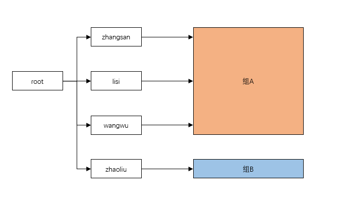
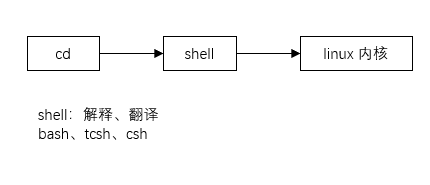

## 用户管理

### 一、基本介绍

Linux 系统是一个多用户多任务的操作系统，任何一个要使用系统资源的用户，都必须首先向系统管理员申请一个
账号，然后以这个账号的身份进入系统


### 二、添加用户

#### 2.1 基本语法

```bash
# 添加用户
useradd 用户名
```


#### 2.2 说明

1. 当创建用户成功后，会自动的创建和用户同名的家目录，默认该用户的家目录在 `/home/用户名`

2. 可以通过 `useradd -d 指定目录 新的用户名`，给新创建的用户指定家目录

   ```bash
   # 添加用户并指定其家目录，如果指定目录不存在，会自动创建（只能创建单层目录）
   useradd -d 指定目录 新的用户名
   ```

3. 当使用该用户登录时，会自动切换到该用户的家目录


### 三、指定、修改密码

#### 3.1 基本语法

```bash
# 指定、修改密码
passwd 用户名

# 显示用户当前所在目录
pwd
```


### 四、删除用户 

#### 4.1 基本语法

```bash
# 删除用户，保留家目录
userdel 用户名

# 删除用户及其家目录
userdel -r 用户名
```


#### 4.2 说明

建议保留家目录


### 五、查询用户信息

#### 5.1 基本语法

```bash
# 查询用户信息。当用户名不存在时，返回无此用户
id 用户名

[root@wn ~]# id zwj
uid=1004(zwj) gid=1004(wudang) 组=1004(wudang)
```


### 六、切换用户

#### 6.1 介绍

在操作 Linux 中，如果当前用户的权限不够，可以通过 `su -` 指令，切换到高权限用户，比如 root


#### 6.2 基本语法

```bash
# 切换用户
su - 用户名

# 退出当前用户
logout/exit
```


#### 6.3 说明

1. 从权限高的用户切换到权限低的用户，不需要输入密码，反之需要
2. 当需要返回到原来的用户时，使用 `exit/logout` 命令


### 七、查看当前用户信息

#### 7.1 基本语法

```bash
# 查看当前用户信息
whoami
# 查询登录用户信息
who am i

[jack@wn ~]$ whoami
jack
[jack@wn ~]$ who am i
root     pts/0        2022-04-24 15:43
```


```bash
[root@wndexx log]# who
root     pts/0        2022-05-04 10:27 (pc)

[root@wndexx log]# who am i
root     pts/0        2022-05-04 10:27 (pc)

[root@wndexx log]# w
 11:24:12 up 57 min,  1 user,  load average: 0.00, 0.01, 0.05
USER     TTY      FROM             LOGIN@   IDLE   JCPU   PCPU WHAT
root     pts/0    pc               10:27    4.00s  0.18s  0.03s w

[root@wndexx log]# users
root

[root@wndexx log]# whoami
root    !!!!!!!!!!!!!!!!!!!!!!


[root@wndexx log]# su tom

[tom@wndexx log]$ who
root     pts/0        2022-05-04 10:27 (pc)

[tom@wndexx log]$ who am i
root     pts/0        2022-05-04 10:27 (pc)

[tom@wndexx log]$ w
 11:25:08 up 58 min,  1 user,  load average: 0.00, 0.01, 0.05
USER     TTY      FROM             LOGIN@   IDLE   JCPU   PCPU WHAT
root     pts/0    pc               10:27    4.00s  0.24s  0.01s w

[tom@wndexx log]$ users
root

[tom@wndexx log]$ whoami
tom     !!!!!!!!!!!!!!!!!!       
```


### 八、用户组

#### 8.1 介绍

类似于角色，系统可以对有共性的多个用户进行统一的分组



#### 8.2 新增组

```bash
# 新增组
groupadd 组名
```


#### 8.3 删除组

```bash
# 删除组
groupdel 组名
```


#### 8.4 增加用户时直接加上组

```bash
# 增加用户时直接加上组
# 如果在增加用户没有指定组，会默认生成一个和用户同名的组，并将该用户加入组中
useradd -g 用户组 用户名
```


#### 8.5 修改用户的组

```bash
# 修改用户的组
usermod -g 用户组 用户名
```


### 九、用户和组相关文件

#### 9.1 /etc/passwd 文件

用户（user）的配置文件，记录用户的各种信息

每行的含义：`用户名:口令:用户标识号:组标识号:注释性描述:主目录:登录 Shell`




#### 9.2 /etc/shadow 文件

口令（密码）的配置文件

每行的含义：`登录名:加密口令:最后一次修改时间:最小时间间隔:最大时间间隔:警告时间:不活动时间:失效时间:标志`


#### 9.3 /etc/group 文件

组(group)的配置文件，记录 Linux 包含的组的信息

每行含义：`组名:口令:组标识号:组内用户列表`


