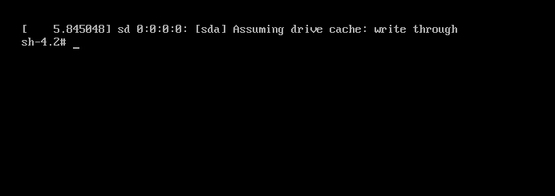

## 找回 root 密码

#### 步骤：

1. 启动系统，进入开机界面，在界面中按 "e" 进入编辑界面

   

2. 进入编辑界面，使用键盘上的上下键把光标往下移动，找到以 "linux16" 开头内容所在的行数，在行的最后面输入：`init=/bin/sh`

   

3. 输入完成后，直接按快捷键：Ctrl+x 进入**单用户模式**

   

4. 在光标闪烁的位置中输入：`mount -o remount,rw /`（注意：各个单词间有空格），完成后按键盘的回车键（Enter）。

   

5. 在新的一行最后面输入：`passwd`， 完成后按键盘的回车键（Enter）。输入密码，然后再次确认密码即可(密码长度最好8位以上,但不是必须的), 密码修改成功后，会显示passwd.....的样式，说明密码修改成功

   

6. 接着，在鼠标闪烁的位置中（最后一行中）输入：`touch /.autorelabel`（注意：touch与 /后面有一个空格），完成后按键盘的回车键（Enter）

   

7. 继续在光标闪烁的位置中，输入：`exec /sbin/init`（注意：exec与 /后面有一个空格），完成后按键盘的回车键（Enter）,等待系统自动修改密码(这个过程时间可能有点长，耐心等待)，完成后，系统会自动重启,新的密码生效了

   

