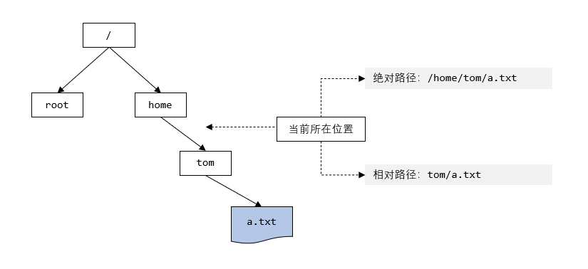

## 文件目录类 

### 一、pwd 指令

#### 1.1 基本语法

```bash
pwd
```


#### 1.2 功能描述

显示当前工作目录的**绝对路径**


### 二、ls 指令

#### 2.1 基本语法

```bash
ls [选项] [目录或文件]
```


#### 2.2 常用选项

```bash
# -a 显示当前目录所有的文件和目录，包括隐藏文件
# -l 以列表的方式显示信息
```


### 三、cd 指令

#### 3.1 基本语法

```bash
# 切换到指定目录
cd [参数]

# 回到家目录
cd ~/cd 

# 回到当前目录的上一级目录
cd..
```


#### 3.2 应用实例

```bash
# 使用绝对路径切换到 root 目录 
cd /root
# 使用相对路径到/root 目录, 比如在 /home/tom 
cd ../../root
# 表示回到当前目录的上一级目录 
cd ..
# 回到家目录 
cd ~
```


#### 3.3 补充：绝对路径和相对路径



### 四、mkdir 指令

#### 4.1 基本语法

```bash
# 创建目录
mkdir [选项] 要创建的目录
```


#### 4.2 常用选项

```bash
# -p 创建多级目录
```


#### 4.3 应用实例

```bash
# 创建一个目录 /home/dog
mkdir /home/dog

# 创建多级目录 /home/animal/tiger
mkdir -p /home/animal/tiger
```


### 五、rmdir 指令

#### 5.1 基本语法

```bash
# 删除空目录
rmdir [选项] 要删除的空目录
```


#### 5.2 应用实例

```bash
# 删除一个目录 /home/dog
rmdir /home/dog
```


#### 5.3 说明

`rmdir` 删除的是空目录，如果目录下有内容无法删除

如果需要删除非空目录，使用 `rm -rf 要删除的目录`

```bash
# 删除非空目录，rf recursion force
rm -rf 要删除的目录
```


### 六、touch 指令

#### 6.1 基本语法

```bash
# 创建空文件
touch 文件名称
```


#### 6.2 应用实例

```bash
# 在 /home 目录下创建一个空文件 hello.txt
touch /home/hello.txt
```


### 七、cp 指令

#### 7.1 基本语法

```bash
# 拷贝文件到指定目录
cp [选项] src dest
```


#### 7.2 常用选项

```bash
# -r 递归复制整个文件夹
```


#### 7.3 应用实例

```bash
# 将 /home/hello/txt 拷贝到 /home/bbb 目录下
mkdir bbb
cp hello.txt /home/bbb/

# 递归复制整个文件夹，将 home/bbb 整个目录，拷贝到 /opt
cp -r /home/bbb /opt/
```


#### 7.4 说明

强制覆盖不提示的方法 `\cp`

```bash
# 强制覆盖不提示
\cp -r /home/bbb /opt/
```


### 八、rm 指令

#### 8.1 基本语法

```bash
# 删除文件或目录，rmdir 只能删除目录
rm [选项] 要删除的文件或目录
```


#### 8.2 常用选项

```bash
# -r 递归删除整个文件夹
# -f 强制删除不提示
```


#### 8.3 应用实例

```bash
# 将 /home/hello.txt 删除
rm /home/hello.txt
# 递归删除整个文件夹 /home/bbb
rm -r /home/bbb
rm -rf /home/bbb # 不提示
```


### 九、mv 指令

#### 9.1 基本语法

```bash
# 重命名
mv oldNameFile newNameFile

# 移动文件
mv /srcFolder/oldNameFile /targetFolder

# 移动文件并重命名
mv /srcFolder/oldNameFile /targetFolder/newNameFile
```


#### 9.2 应用实例

```bash
# 将 /home/cat.txt 文件重新命名为 pig.txt
mv /home/cat.txt /home/pig.txt

# 将 /home/pig.txt 文件移动到 /root 目录下
mv /home/pig.txt /root

# 移动整个目录，比如将 /opt/bbb 移动到 /home/
mv /opt/bbb /home/
mv /opt/bbb /home/uuu # 移动并重命名
```


### 十、cat 指令

#### 10.1 基本语法

```bash
# 查看文件（不能修改）
cat [选项] 要查看的文件
```


#### 10.2 常用选项

```bash
# -n：显示行号
```


#### 10.3 应用实例

```bash
# 查看 /etc/profile 文件内容，并显示行号
cat -n /etc/profile
```


#### 10.4 使用细节

`cat` 只能浏览文件，而不能修改文件，为了浏览方便，一般都会带上管道命令 `| more`

管道命令类似于将前面的结果交给下一个指令进行处理 `| command`

```bash
cat -n /etc/profile | more [进行交互：逐行查看 enter，翻页查看 space]
```


### 十一、more 指令

`more` 指令是一个基于 Vi 编辑器的文本过滤器，它以全屏幕的方式按页显示文本文件的内容。

`more` 指令中内置了若干快捷键（交互指令）

| 操作         | 功能说明                                                  |
| ------------ | --------------------------------------------------------- |
| [Space]      | 显示 接下来的 k 行文本. 缺省值 是 当前的屏幕大小          |
| [Enter]      | 显示 接下来的 k 行文本. 缺省值 是 1. 参数 成为 新的缺省值 |
| q            | 立刻离开 more，不再显示该文件内容                         |
| f            | 向下跳过 k 屏文本. 缺省值 是 1                            |
| b或[Ctrl ]+B | 向上跳回 k 屏文本. 缺省值 是 1                            |
| =            | 输出当前行的行号                                          |
| :f           | 输出文件名和当前行的行号                                  |


#### 11.1 基本语法

```bash
# 以全屏幕的方式按页显示文本文件的内容
more 要查看的文件
```


#### 11.2 应用实例

```bash
# 采用 more 查看文件 /etc/profile
more /etc/profile
```


### 十二、less 指令

`less` 指令用来分屏查看文件内容，它的功能与 `more` 指令类似，但是比 `more` 指令更加强大，支持各种显示终端，`less` 指令在显示文件内容时，并不是一次将整个文件加载之后才显示，而是根据显示需要加载内容，对于显示大型文件具有较高的效率

#### 12.1 基本语法

```bash
less 要查看的文件
```


#### 12.2 操作说明

| 操作       | 功能说明                                  |
| ---------- | ----------------------------------------- |
| [Space]    | 向下翻动一页                              |
| [PageDown] | 向下翻动一页                              |
| [PageUp]   | 向上翻动一页                              |
| /字符串    | 向下搜寻 字符串。n：向下查找，N：向上查找 |
| ?字符串    | 向上搜寻 字符串。n：向上查找，N：向下查找 |
| q          | 离开 less 程序                            |


#### 12.3 应用实例

```bash
# 采用 less 查看一个大文件 /opt/杂文.txt
less /opt/杂文.txt
```


### 十三、echo 指令

#### 13.1 基本语法

```bash
# 输出内容到控制台
echo [选项] [输出内容]
```


#### 13.2 应用实例

```bash
# 使用 echo 指令输出环境变量，比如输出 $PATH $HOSTNAME
echo $HOSTNAME # 主机名

# 使用 echo 指令输出 hello,world
echo "hello,world"
```


### 十四、head 指令

`head` 用于显示文件的开头部分内容，默认情况下 `head` 指令显示文件的前 10 行内容

#### 14.1 基本语法

```bash
# 查看文件前 10 行内容
head 文件

# 查看文件前 5 行内容，5 可以是任意行数
head -n 5 文件
```


#### 14.2 应用实例

```bash
# 查看 /ect/profile 的前 5 行代码
head -n 5 /etc/profile
```


### 十五、tail 指令

`tail` 指令用于输出文件尾部的内容，默认情况下 `tail` 指令显示文件的尾 10 行内容

#### 15.1 基本语法

```bash
# 查看文件的尾 10 行内容
tail 文件

# 查看文件尾 5 行内容，5 可以是行数
tail -n 5 文件

# 实时追踪文档的所有更新
tail -f 文件
```


#### 15.2 应用实例

```bash
# 查看 /etc/profile 最后 5 行的代码
tail -n 5 /etc/profile

# 实时监控 mydate.txt，实时的监控文件发生的改变
tail -f /home/mysate.txt
```


### 十六、> 指令和 >> 指令

`>` 输出重定向 `>>` 追加

#### 16.1 基本语法

```bash
# 如果重定向的文件不存在，则会自动创建（不能创建多级目录） 

# 将列表的内容写入文件（覆盖）
ls -l > 文件 

# 将列表的内容追加到文件的末尾
ls -al >> 文件

# 将文件 1 的内容覆盖到文件 2
cat 文件1 > 文件2

# 内容追加到文件末尾
echo "内容" >> 文件
```


#### 16.2 应用实例

```bash
# 将 /home 目录下的文件列表覆盖写入到 /home/info.txt 中
ls -l /home > /home/info.txt

# 将当前日历信息追加到 /home/mycal 文件中
cal >> /home/mycal
```


### 十七、ln 指令

软链接，也称为符号链接，类似于 windows 里的快捷方式，主要存放了链接其他文件的路径

#### 17.1 基本语法

```bash
# 给原文件创建一个软链接
ln -s [原文件或目录] [软链接名]
```


#### 17.2 应用实例

```bash
# 在 /home 目录下创建软链接 myroot，链接到 /root 目录
ln -s /root /home/myroot

# 删除软链接 myroot
rm  /home/myroot # 不能写成 rm /home/myroot/ ，会提示无法删除
```


#### 17.3 说明

当使用 pwd 指令查看目录时，看到的是软链接所在目录


### 十八、history 指令

#### 18.1 基本语法

```bash
# 查看已经执行过的历史指令，也可以执行历史指令
history
```


#### 18.2 应用实例

```bash
# 显示所有的历史指令
history

# 显示最近使用过的 10 个指令
history 10

# 执行历史编号为 5 的指令
!5
```


