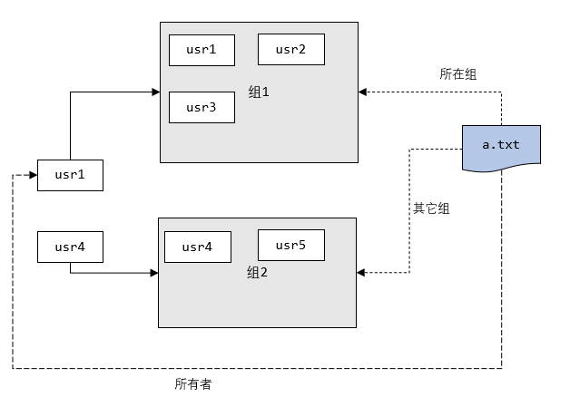

## 组管理

### 一、组的基本介绍

在 linux 中的每个用户必须属于同一个组，不能独立于组外

在 linux 中每个文件有所有者、所在组、其它组的概念




### 二、文件/目录 所有者

一般为文件的创建者,谁创建了该文件，就自然的成为该文件的所有者

#### 1.1 查看文件的所有者

> 指令

```bash
ls -ahl
```


```bash
#		       文件的所有者
drwxr-xr-x.  9 root 		root   4.0K 4月  25 21:37 .
dr-xr-xr-x. 18 root 		root   4.0K 4月  24 18:20 ..
-rw-r--r--.  1 root 		root    152 4月  25 21:32 aa.tar.gz
-rw-r--r--.  1 root 		root      0 4月  25 13:00 a.txt
drwxr-xr-x.  2 root 		root   4.0K 4月  25 13:11 bbb
-rw-r--r--.  1 root 		root     38 4月  25 20:18 hello.txt
-rw-r--r--.  1 root 		root    211 4月  25 21:37 hello.zip
-rw-r--r--.  1 root 		root      3 4月  25 15:51 info.txt
drwx------.  5 jack 		jack   4.0K 4月  24 15:57 jack
drwx------.  5 1001 		  1001 4.0K 4月  24 15:40 milan
-rw-r--r--.  1 root 		root    314 4月  25 15:54 mycal
-rw-r--r--.  1 root 		root      6 4月  25 15:21 mydate.txt
-rw-r--r--.  1 root 		root    76M 4月  25 21:02 myhome.zip
-rw-r--r--.  1 root 		root   1.8K 4月  25 15:56 myprofile
lrwxrwxrwx.  1 root 		root      5 4月  25 16:14 myroot -> /root
drwx------.  3 king 		king   4.0K 4月  24 15:30 test
drwxr-xr-x.  2 root 		root   4.0K 4月  25 21:31 test1
drwx------.  5 tom  		tom    4.0K 4月  25 16:11 tom
drwx------.  3 zwj  		mojiao 4.0K 4月  24 16:25 zwj
```


#### 1.2 修改文件的所有者-chown

> 指令

```bash
# 当只修改文件的所有者时，文件的所在组不发生改变

# 改变所有者 change owner
chown newowner 文件/目录

# 改变所有者和所在组
chown newowner:newgroup 文件/目录

# -R 如果是目录，则使其下所有子文件或目录递归生效
```


> 应用案例

```bash
# 使用 root 创建一个文件 apple.txt，然后将其所有者修改成 tom
touch apple.txt
chown tom apple.txt

 # 将 /home/abc.txt 文件的所有者改成 tom
 chown tom /home/abc.txt
 
 # 将 /home/kkk 目录下的所有的文件和目录的所有者都改成 tom
 chown -R tom /home/kkk
```


### 三、组的创建

#### 3.1 基本指令

```bash
groupadd 组名
```


#### 3.2 应用实例

```bash
# 创建一个组，monster
groupadd monster

# 创建一个用户 fox，并放入到 monster 组中
useradd -g monster fox
```


### 四、文件/目录 所在组

当某个用户创建一个文件后，这个文件的所在组就是该用户所在的组

#### 4.1 查看文件/目录所在组

> 指令

```bash
ls -ahl
```


> 应用实例

```bash
# 使用 fox 创建一个文件 ok.txt，看看该文件属于哪个组
touch ok.txt
ls -ahl

#					所在组
-rw-r--r--. 1 fox 	monster 0 4月  26 14:08 ok.txt
```


#### 4.2 修改文件所在的组-chgrp

> 指令

```bash
# 修改文件或目录所在组
# 当只修改文件的所在组时，文件的所有者不发生改变
chgrp newgroup 文件/目录

# -R 如果是目录，则使其下所有子文件或目录递归生效
```


> 应用实例

```bash
# 使用 root 用户创建文件 orange.txt，看看当前这个文件属于哪个组，然后将这个文件所在组修改到 fruit 组
groupadd fruit
touch orange.txt
ls -ahl
chgrp fruit orange.txt

# 将 /home/abc.txt 文件所在组修改成 shaolin
groupadd shaolin
chgrp shaolin /home/abc.txt

# 将 /home/kkk 目录下的所有文件和目录的所在组都修改成 shaolin
chgrp -R shaolin /home/kkk
```


### 五、文件/目录 其它组

除去文件的所在组外，系统的其它组都是文件的其它组


### 六、改变用户所在组

在添加用户时，可以指定将该用户添加到哪个组中，同样的用 root 的管理权限可以改变某个用户所在的组

#### 6.1 改变用户所在组

```bash
# 改变用户所在组（新组需要存在）
usermod -g 新组名 用户名
```


#### 6.2 改变该用户登录的初始目录

```bash
# 改变该用户登录的初始目录
# 该用户需要有进入到新目录的权限
usermod -d 新目录名 用户名
```


#### 6.3 应用实例

```bash
# 将 zwj 这个用户，从原来所在组，修改到 wudang 组中
cat /etc/group | grep wudang # 判断 wudang 组是否存在
usermod -g wudang zwj
```


