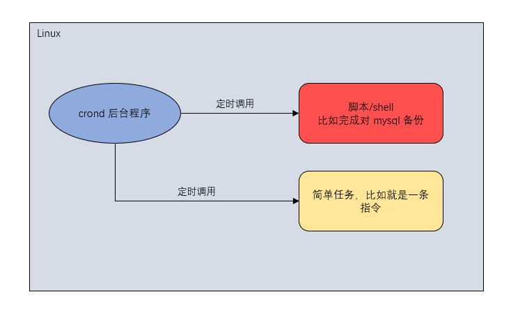
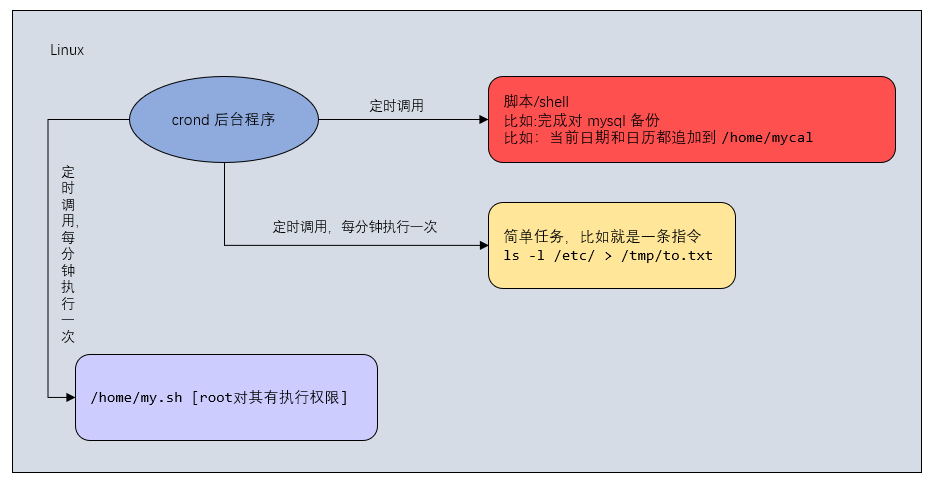

## crond 任务调度

### 一、概述

#### 1.1 任务调度

系统在某个时间执行的特定的命令或程序



#### 1.2 任务调度分类

> 系统工作：有些重要的工作必须周而复始的执行，比如病毒扫描等

> 个别用户工作：个别用户可能希望执行某些程序，比如对 mysql 数据库的备份


### 二、crontab 进行定时任务的设置

> crontab 命令是周期性任定时计划任务，crond 是 crontab 的守护进程

#### 2.1 基本语法

```bash
crontab [选型]
```


#### 2.2 常用选项

| 选项 | 说明                                                  |
| ---- | ----------------------------------------------------- |
| -e   | edit，编辑 crontab 定时任务                           |
| -l   | list，查询 crontab 任务                               |
| -r   | remove，删除当前用户所有的 crontab 任务，终止任务调度 |


#### 2.3 重启任务调度

```bash
# 重启任务调度
service crond restart
```


### 三、快速入门

```bash
# 任务调度文件：/etc/crontab
# 设置个人任务调度，执行 crontab -e 命令
crontad -e
# 输入任务到调度文件，如：*/1 * * * * ls -l /etc/ > /tmp/to.txt
# 意思是每小时的每分钟执行 ls -l /etc/ > /tmp/to.txt 命令
*/1 * * * * ls -l /etc/ > /tmp/to.txt
```


#### 参数细节说明

> 5 个占位符的说明

| 项目       | 含义                 | 范围                         |
| ---------- | -------------------- | ---------------------------- |
| 第一个 "*" | 一小时当中的第几分钟 | 0 - 59                       |
| 第二个 "*" | 一天当中的第几小时   | 0 - 23                       |
| 第三个 "*" | 一个月当中的第几天   | 1 - 31                       |
| 第四个 "*" | 一年当中的第几月     | 1 - 12                       |
| 第五个 "*" | 一周当中的星期几     | 0 - 7（0 和 7 都代表星期日） |


> 特殊符号的说明

| 特殊符号 | 含义                                                         |
| -------- | ------------------------------------------------------------ |
| *        | 代表任何时间。比如第一个 "*" 就代表一小时中每分钟都执行一次，==不等于 " */1 "== |
| ,        | 代表不连续的时间。比如 "0 8,12,16 * * *" 就代表在每天的 8 点 0 分，12 点 0 分，16 点 0 分执行一次 |
| -        | 代表连续的时间范围。比如 "0 5 * * 1-6" 就代表周一到周六的凌晨 5 点 0 分执行一次 |
| */n      | 代表每隔多久执行一次。比如 "*/10 * * * *" 就代表每隔 10 分钟执行一次 |


> 特定时间执行任务案例

| 时间              | 含义                                                         |
| ----------------- | ------------------------------------------------------------ |
| 45 22 * * * 命令  | 在 22 点 45 分执行命令                                       |
| 0 17 * * 1 命令   | 每周一的 17 点 0 分执行命令                                  |
| 0 5 1,15 * * 命令 | 每月 1 号和 15 号的凌晨5 点 0 分执行命令                     |
| 40 4 * * 1-5 命令 | 每周一到周五的凌晨 4 点 40 分执行命令                        |
| */10 4 * * * 命令 | 每天的凌晨 4 点，每隔 10 分钟执行一次命令                    |
| 0 0 1,15 * 1 命令 | 每月 1 号和 15 号，每周一的 0 点 0 分都会执行命令。注意：星期几和几号最好不要同时出现，因为它们定义的都是天，非常容易让管理员混乱。<并集> |


### 四、应用实例

```bash
# 每隔 1 分钟，就将当前的日期信息，追加到 /tmp/mydate 文件中
*/1 * * * * date >> /tmp/mydate

# 每隔 1 分钟，将当前的日期和日历都追加到 /home/mycal 文件中
# (1)
vim /home/my.sh
# 如果 sh 文件里面的路径是相对路径，则是相对于当前用户的家目录
date >> /home/mycal
cal >> /home/mycal
# (2)
# 这里如果写成相对路径，会找不到指令，需要写成绝对路径
chmod u+x /home/my.sh
# (3)
crontab -e
*/1 * * * * /home/my.sh # 注意不要写成 ./home/my.sh

# 每天凌晨 2：00 将 mysql 数据库 testdb ，备份到文件中
# 提示：指令为 mysqldump -uroot -p密码 数据库 > /home/db.bak
0 2 * * * mysqldump -uroot -proot testdb > /home/db.bak
```





