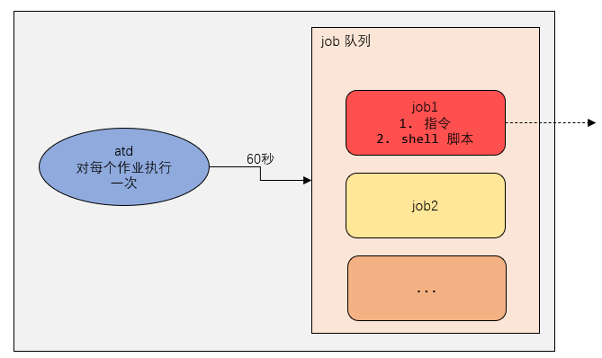

## at 定时任务

### 一、基本介绍

- `at` 命令是一次性定时计划任务，`at` 的守护进程 atd 会以后台模式运行，检查作业队列来运行

- 默认情况下，atd 守护进程每 60 秒（每分钟开始时）检查作业队列，有作业时，会检查作业运行时间，如果时间与当前时间匹配，则运行此作业

- `at` 命令是一次性定时计划任务，执行完一个任务后不再执行此任务了

- 在使用 `at` 命令的时候，一定要保证 atd 进程的启动，可以使用相关指令来查看

  ```bash
  # 查看 atd 进程是否启动，如果存在，表示已经启动
  ps -ef | grep atd
  ```

  




### 二、at 命令格式

```bash
at [选项] [时间]
ctrl  + D 结束 at 命令的输入，需要输入两次
```


> at 命令选项

| 选项           | 含义                                                     |
| -------------- | -------------------------------------------------------- |
| -m             | 当指定的任务被完成后，将给用户发送邮件，即使没有标准输出 |
| -I             | atq 的别名，查询                                         |
| -d             | atrm 的别名，删除                                        |
| -v             | 显示任务将被执行的时间                                   |
| -c             | 打印任务的内容到标准输出                                 |
| -V             | 显示版本信息                                             |
| -q <队列>      | 使用指定的队列                                           |
| -f  <文件>     | 从指定文件读入任务而不是从标准输入读入                   |
| -t  <时间参数> | 以时间参数的形式提交要运行的任务                         |


> at 时间定义

1. 接收在当天的 `hh:mm` （小时：分钟）式的时间指定。假如该时间已经过去，就放在第二天执行

   ```bash
   # hh:mm
   # 例如：04：00
   ```

   

2. 使用 `midnight`（深夜）、`noon`（中午）、`teatime`（饮茶时间，一般是下午 4 点）等比较模糊的词语来指定时间

   ```bash
   # 模糊的词语，midnight、noon、teatime 等
   ```

   

3. 采用 12 小时计时制，即在时间后面加上 `am`（上午）或 `pm`（下午）来说明是上午还是下午

   ```bash
   # 在时间后面加上 am（上午）或 pm（下午）
   # 例如：12pm
   ```

   

4. 指定命令执行的具体日期，指定格式为 `month day`（月 日）或 `mm/dd/yy`（月/日/年）或 `dd.mm.yy`（日.月.年）或 `yy-mm-dd`（年-月-日）。指定的日期必须跟在指定时间的后面

   ```bash
   # month day（月 日）、 mm/dd/yy（月/日/年）、dd.mm.yy （日.月.年）、yy-mm-dd（年-月-日）
   
   # 指定的日期必须跟在指定时间的后面
   # 04:00 2021-04-09
   ```

   

5. 使用相对计时法。指定格式为 `now + count time-units`，`now` 就是当前时间，`time-units` 是时间单位，包括 `miniutes`（分钟）、`hours`（小时）、`days`（天）、`weeks` （日期），`count` 是时间的数量，几天、几小时

   ```bash
   # now + count time-units
   # now 就是当前时间，count 是时间的数量，time-units 是时间单位
   # 例如：now + 5 minutes，表示 5 分钟后
   # 5pm + 2 days，表示 2 天后的下午 5 点
   ```

   

6. 直接使用 `today`（今天）、`tomorrow`（明天）来指定完成命令的时间


### 三、应用实例

```bash
# 2 天后的下午 5 点执行 /bin/ls /home
at 5pm + 2 days
at> /bin/ls /home

# atq 命令来查看系统中没有执行的工作任务
atq

# 明天 17 点钟，输出时间到指定文件内，比如 /root/date100.log
at 5pm tomorrow
at> date > /root/date100.log

# 2 分钟后，输出时间到指定文件内，比如 /root/date200.log
at now + 2 minutes
at> date > /root/date200.log

# 删除已经设置的任务，atrm 编号
atrm 2
```


