## Linux 磁盘分区、挂载

### 一、原理介绍

- Linux 无论有几个分区，分给哪一个目录使用，归根结底只有一个根目录，一个独立且唯一的文件结构，==Linux 中每个分区都是用来组成整个文件系统的一部分==

- Linux 采用了一种 "载入" 的处理方法，它的整个文件系统中包含了一整套的文件和目录，且将一个分区和一个目录联系起来，这是要载入的一个分区将使它的存储空间在一个目录下获得

  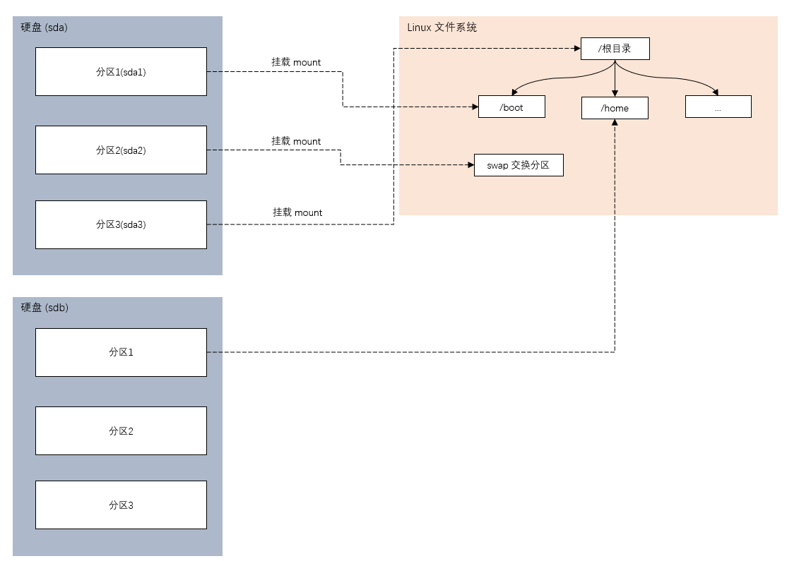


### 二、硬盘说明

- Linux 硬盘分为 IDE 硬盘和 SCSI 硬盘，目前基本上是 SCSI 硬盘

- IDE 硬盘，驱动器标识符为 "hdx~"

  - hd，表明分区所在设备的类型，这里指 IDE 硬盘
  - x 为盘号（a 为基本盘，b 为基本从属盘，c 为辅助主盘，d 为辅助从属盘）
  - ~ 代表分区，前四个分区用数字 1 到 4 表示，它们是主分区或扩展分区，从 5 开始就是逻辑分区

  ```bash
  # hda3 表示 第一个 IDE 硬盘上的第三个主分区或扩展分区
  # hdb2 表示 第二个 IDE 硬盘上的第二个主分区或扩展分区
  ```

  

- SCSI 硬盘，驱动标识符为 "sdx~"
  - sd，表明分区所在设备的类型，这里指 SCSI 硬盘
  - x 为盘号（a 为基本盘，b 为基本从属盘，c 为辅助主盘，d 为辅助从属盘）
  - ~ 代表分区，前四个分区用数字 1 到 4 表示，它们是主分区或扩展分区，从 5 开始就是逻辑分区


### 三、查看所有设备挂载情况

#### 3.1 命令

```bash
# 查看所有设备挂载情况
lsblk
lsblk -f
```

```bash
[root@wn home]# lsblk
NAME   MAJ:MIN RM  SIZE RO TYPE MOUNTPOINT
sda      8:0    0   20G  0 disk 
├─sda1   8:1    0    1G  0 part /boot
├─sda2   8:2    0    2G  0 part [SWAP]
└─sda3   8:3    0   17G  0 part /
sr0     11:0    1  4.3G  0 rom  
[root@wn home]# 
[root@wn home]# 
[root@wn home]# 
[root@wn home]# lsblk -f
分区情况 文件系统类型				 每个分区的唯一的不重复的 40 位的字符串(标识符) 挂载点
NAME   	FSTYPE  LABEL           UUID                                 	MOUNTPOINT
sda                                                                 
├─sda1 	ext4                    b2ea9672-9ffc-4cd2-a231-8b17f822bfa5 	/boot
├─sda2 	swap                    938b067f-b4df-44f8-b814-f37850ae4c27 	[SWAP]
└─sda3 	ext4                    4ae6086f-5da8-4f2f-83af-54769e2d59f3 	/
sr0    	iso9660 CentOS 7 x86_64 2018-11-25-23-54-16-00    
```


### 四、挂载的经典案例

#### 4.1 说明

通过增加一块硬盘来熟悉磁盘的相关指令和深入理解磁盘分区、挂载、卸载的改变


#### 4.2 步骤

##### 4.2.1 虚拟机添加硬盘

在【虚拟机】菜单中，选择【设置】，然后设备列表里添加硬盘，然后一路【下一步】，中间只有选择磁盘大小的地方需要修改，直到完成

注意：==需要重启系统才能识别==

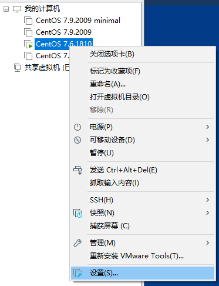


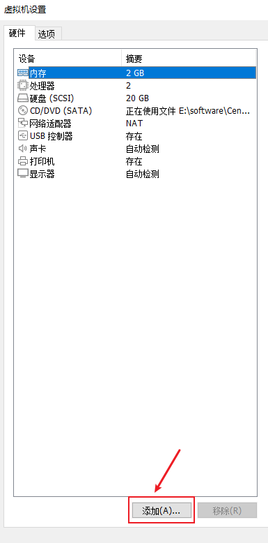


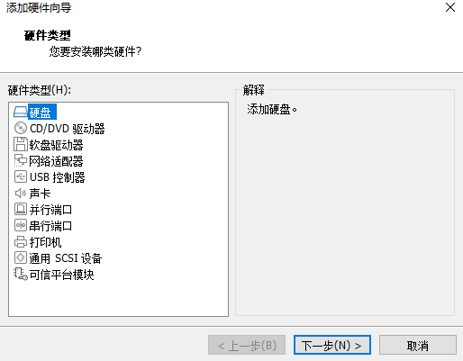


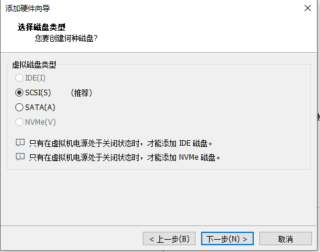


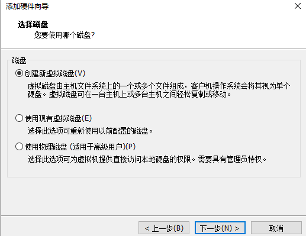


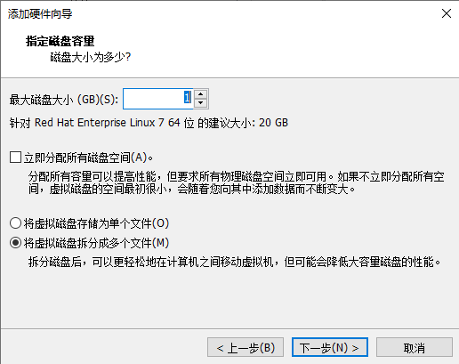


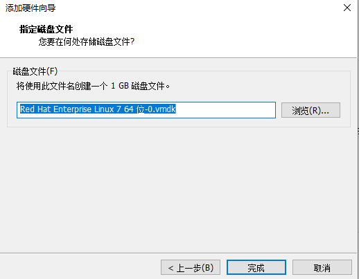


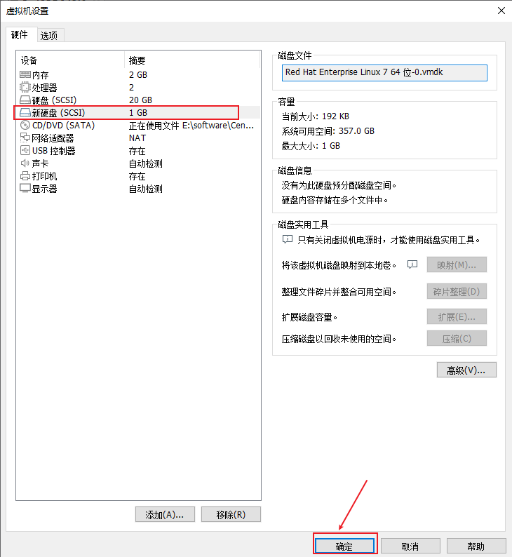


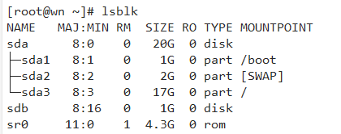


##### 4.2.2  硬盘分区

> 分区命令

```bash
fdisk /dev/sdb
```


> 对 /sdb 分区

|      |                           |
| ---- | ------------------------- |
| m    | 显示命令列表              |
| p    | 显示磁盘分区，同 fdisk -l |
| n    | 新增分区                  |
| d    | 删除分区                  |
| w    | 写入并退出                |

说明：

- 开始分区后输入 `n`，新增分区
- 然后选择 `p`，分区类型为主分区
- 两次回车默认剩余全部空间
- 最后输入 `w` 写入分区并退出，若不保存退出输入 `q`

```bash
[root@wn ~]# lsblk 
NAME   MAJ:MIN RM  SIZE RO TYPE MOUNTPOINT
sda      8:0    0   20G  0 disk 
├─sda1   8:1    0    1G  0 part /boot
├─sda2   8:2    0    2G  0 part [SWAP]
└─sda3   8:3    0   17G  0 part /
sdb      8:16   0    1G  0 disk 
sr0     11:0    1  4.3G  0 rom  
[root@wn ~]# 
[root@wn ~]# fdisk /dev/sdb
欢迎使用 fdisk (util-linux 2.23.2)。

更改将停留在内存中，直到您决定将更改写入磁盘。
使用写入命令前请三思。

Device does not contain a recognized partition table
使用磁盘标识符 0xca2bea9d 创建新的 DOS 磁盘标签。

命令(输入 m 获取帮助)：m
命令操作
   a   toggle a bootable flag
   b   edit bsd disklabel
   c   toggle the dos compatibility flag
   d   delete a partition
   g   create a new empty GPT partition table
   G   create an IRIX (SGI) partition table
   l   list known partition types
   m   print this menu
   n   add a new partition
   o   create a new empty DOS partition table
   p   print the partition table
   q   quit without saving changes
   s   create a new empty Sun disklabel
   t   change a partition's system id
   u   change display/entry units
   v   verify the partition table
   w   write table to disk and exit
   x   extra functionality (experts only)

命令(输入 m 获取帮助)：n
Partition type:
   p   primary (0 primary, 0 extended, 4 free)
   e   extended
Select (default p): p
分区号 (1-4，默认 1)：1
起始 扇区 (2048-2097151，默认为 2048)：
将使用默认值 2048
Last 扇区, +扇区 or +size{K,M,G} (2048-2097151，默认为 2097151)：
将使用默认值 2097151
分区 1 已设置为 Linux 类型，大小设为 1023 MiB

命令(输入 m 获取帮助)：w
The partition table has been altered!

Calling ioctl() to re-read partition table.
正在同步磁盘。
[root@wn ~]
[root@wn ~]# lsblk
NAME   MAJ:MIN RM  SIZE RO TYPE MOUNTPOINT
sda      8:0    0   20G  0 disk 
├─sda1   8:1    0    1G  0 part /boot
├─sda2   8:2    0    2G  0 part [SWAP]
└─sda3   8:3    0   17G  0 part /
sdb      8:16   0    1G  0 disk 
└─sdb1   8:17   0 1023M  0 part 
sr0     11:0    1  4.3G  0 rom  
[root@wn ~]# 

```


```bash
[root@wndexx ~]# fdisk -l # 查看各个磁盘的信息

磁盘 /dev/sda：21.5 GB, 21474836480 字节，41943040 个扇区
Units = 扇区 of 1 * 512 = 512 bytes
扇区大小(逻辑/物理)：512 字节 / 512 字节
I/O 大小(最小/最佳)：512 字节 / 512 字节
磁盘标签类型：dos
磁盘标识符：0x000b5859

   设备 Boot      Start         End      Blocks   Id  System
/dev/sda1   *        2048     2099199     1048576   83  Linux
/dev/sda2         2099200     6293503     2097152   82  Linux swap / Solaris
/dev/sda3         6293504    41936895    17821696   83  Linux

磁盘 /dev/sdb：1073 MB, 1073741824 字节，2097152 个扇区
Units = 扇区 of 1 * 512 = 512 bytes
扇区大小(逻辑/物理)：512 字节 / 512 字节
I/O 大小(最小/最佳)：512 字节 / 512 字节
磁盘标签类型：dos
磁盘标识符：0xca2bea9d

   设备 Boot      Start         End      Blocks   Id  System
/dev/sdb1            2048     2097151     1047552   83  Linux

```


##### 4.2.3 分区格式化

通过对分区格式化指定分区的文件类型

> 命令

```bash
# ext4 是分区类型
mkfs -t ext4 /dev/sdb1
```

```bash
[root@wn ~]# lsblk -f
NAME   FSTYPE  LABEL           UUID                                 MOUNTPOINT
sda                                                                 
├─sda1 ext4                    b2ea9672-9ffc-4cd2-a231-8b17f822bfa5 /boot
├─sda2 swap                    938b067f-b4df-44f8-b814-f37850ae4c27 [SWAP]
└─sda3 ext4                    4ae6086f-5da8-4f2f-83af-54769e2d59f3 /
sdb                                                                 
└─sdb1                                                              
sr0    iso9660 CentOS 7 x86_64 2018-11-25-23-54-16-00               
[root@wn ~]# mkfs -t ext4 /dev/sdb1
mke2fs 1.42.9 (28-Dec-2013)
文件系统标签=
OS type: Linux
块大小=4096 (log=2)
分块大小=4096 (log=2)
Stride=0 blocks, Stripe width=0 blocks
65536 inodes, 261888 blocks
13094 blocks (5.00%) reserved for the super user
第一个数据块=0
Maximum filesystem blocks=268435456
8 block groups
32768 blocks per group, 32768 fragments per group
8192 inodes per group
Superblock backups stored on blocks: 
	32768, 98304, 163840, 229376

Allocating group tables: 完成                            
正在写入inode表: 完成                            
Creating journal (4096 blocks): 完成
Writing superblocks and filesystem accounting information: 完成

[root@wn ~]# lsblk -f
NAME   FSTYPE  LABEL           UUID                                 MOUNTPOINT
sda                                                                 
├─sda1 ext4                    b2ea9672-9ffc-4cd2-a231-8b17f822bfa5 /boot
├─sda2 swap                    938b067f-b4df-44f8-b814-f37850ae4c27 [SWAP]
└─sda3 ext4                    4ae6086f-5da8-4f2f-83af-54769e2d59f3 /
sdb                                                                 
└─sdb1 ext4                    ae89e86f-f122-4e21-9b89-06ad9cf65c13 
sr0    iso9660 CentOS 7 x86_64 2018-11-25-23-54-16-00               
[root@wn ~]# 

```


##### 4.2.4 挂载分区

> 挂载：将一个分区与一个目录联系起来

```bash
mkdir /newdisk

# 如果一个目录本身有文件，挂载了另一个分区后，原先文件不会消失，会被隐藏
mount 设备名称 挂载目录
mount /dev/sdb1 /newdisk
```

```bash
[root@wn /]# mkdir newdisk
[root@wn /]# mount /dev/sdb1 /newdisk/
[root@wn /]# lsblk -f
NAME   FSTYPE  LABEL           UUID                                 MOUNTPOINT
sda                                                                 
├─sda1 ext4                    b2ea9672-9ffc-4cd2-a231-8b17f822bfa5 /boot
├─sda2 swap                    938b067f-b4df-44f8-b814-f37850ae4c27 [SWAP]
└─sda3 ext4                    4ae6086f-5da8-4f2f-83af-54769e2d59f3 /
sdb                                                                 
└─sdb1 ext4                    ae89e86f-f122-4e21-9b89-06ad9cf65c13 /newdisk
sr0    iso9660 CentOS 7 x86_64 2018-11-25-23-54-16-00               
[root@wn /]# 

```


> 卸载

```bash
umount 设备名称或挂载目录
umount /dev/sdb1
# 或
umount /newdisk
```


==注意：用命令行挂载重启后会失效==

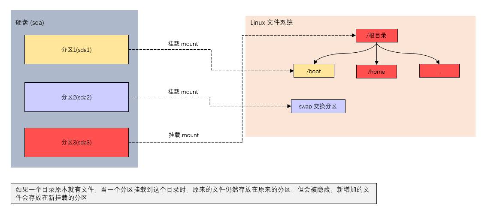


##### 4.2.5 永久挂载

永久挂载：通过修改 /etc/fstab 实现挂载

添加完成后，执行 `mount -a` 或 `reboot` 即可生效

```bash
/dev/sdb1                                 /newdisk       ext4    defaults        0 0
UUID=4ae6086f-5da8-4f2f-83af-54769e2d59f3 /              ext4    defaults        1 1
UUID=b2ea9672-9ffc-4cd2-a231-8b17f822bfa5 /boot          ext4    defaults        1 2
UUID=938b067f-b4df-44f8-b814-f37850ae4c27 swap           swap    defaults        0 0
```


==注意：一个目录可挂载多个分区，后面挂载的分区会覆盖前面挂载的分区。可以在该目录下创建多个目录，分别挂载到分区中，因为挂载点不相同，所以不会造成冲突==


### 五、磁盘情况查询

#### 5.1 查询系统整体磁盘使用情况

> 基本语法

```bash
df -h
```


> 应用实例

```bash
# 查询系统整体磁盘使用情况
[root@wn newdisk]# df -h
文件系统        容量  已用  可用 已用% 挂载点
/dev/sda3        17G  6.0G  9.9G   38% /
devtmpfs        975M     0  975M    0% /dev
tmpfs           991M     0  991M    0% /dev/shm
tmpfs           991M   11M  981M    2% /run
tmpfs           991M     0  991M    0% /sys/fs/cgroup
/dev/sdb1       991M  2.6M  922M    1% /newdisk
/dev/sda1       976M  134M  776M   15% /boot
.host:/         101G   64G   37G   64% /mnt/hgfs
tmpfs           199M   12K  199M    1% /run/user/42
tmpfs           199M     0  199M    0% /run/user/0
[root@wn newdisk]# 
```


#### 5.2 查询指定目录的磁盘占用情况

> 基本语法

```bash
# 查询指定目录的磁盘占用情况，默认为当前目录
du [选项] 目录
```


> 选项

| 选项          | 说明                       |
| ------------- | -------------------------- |
| -s            | 指定目录占用大小汇总       |
| -h            | 带计量单位                 |
| -a            | 含文件                     |
| --max-depth=1 | 子目录深度                 |
| -c            | 列出明细的同时，增加汇总值 |

如果只需要查询某个目录的占用情况，直接使用 -s ，否则会根据设定的子目录的深度查看该目录以及该目录的各个子目录的使用情况，此时如果不设置子目录的深度，会把该目录里面的所有目录的使用情况列举出来


> 应用实例

```bash
# 查询 /opt 目录的磁盘占用情况，深度为 1
[root@wn newdisk]# cd /opt
[root@wn opt]# ls
rh  tmp  tmp2  tmp3  tmp4  VMwareTools-10.3.23-17030940.tar.gz  vmware-tools-distrib  杂文.txt
[root@wn opt]# du -h --max-depth=1 /opt
20K	/opt/tmp3
188M	/opt/tmp
77M	/opt/tmp2
4.0K	/opt/rh
154M	/opt/vmware-tools-distrib
12K	/opt/tmp4
473M	/opt
[root@wn opt]# du -ha --max-depth=1 /opt
52M	/opt/VMwareTools-10.3.23-17030940.tar.gz
3.5M	/opt/杂文.txt
20K	/opt/tmp3
188M	/opt/tmp
77M	/opt/tmp2
4.0K	/opt/rh
154M	/opt/vmware-tools-distrib
12K	/opt/tmp4
473M	/opt
[root@wn opt]# du -hac --max-depth=1 /opt
52M	/opt/VMwareTools-10.3.23-17030940.tar.gz
3.5M	/opt/杂文.txt
20K	/opt/tmp3
188M	/opt/tmp
77M	/opt/tmp2
4.0K	/opt/rh
154M	/opt/vmware-tools-distrib
12K	/opt/tmp4
473M	/opt
473M	总用量
```


### 六、磁盘实用指令

```bash
# 1. 统计 /opt 文件夹下文件的个数
ls -l /opt | grep "^-"
ls -l /opt | grep "^-" | wc -l # 统计文件夹的个数

# 2. 统计 /opt 文件夹下目录的个数
ls -l /opt | grep "^d" | wc -l

# 3. 统计 /opt 文件夹下文件的个数，包括子文件夹里的
ls -lR /opt | grep "^-" | wc -l

# 4. 统计 /opt 文件夹下目录的个数，包括子文件夹里的
ls -lR /opt | grep "^d" | wc -l

# 5. 以树状结构显示目录结构
# 如果没有 tree，则使用 yum install tree 安装 
tree 目录

```


