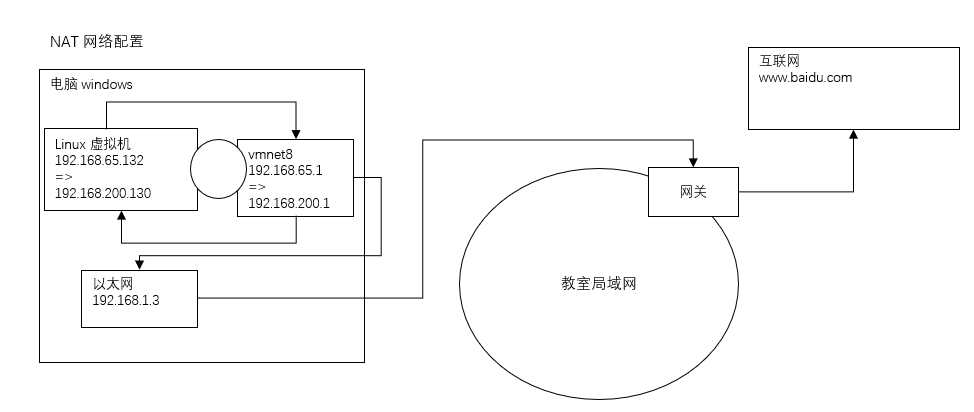
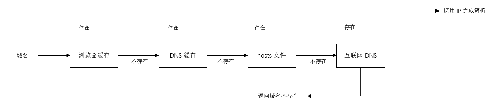

## 网络配置

### 一、NAT 网络配置原理


### 二、查看网络 IP 和网关

#### 2.1 查看虚拟网络编辑器和修改 IP 地址


#### 2.2 查看网关


#### 2.3 查看 windows 环境中 VMnet 8 网络配置

指令：`ipconfig`


#### 2.4 查看 linux 的网络配置

指令：`ifconfig`


### 三、ping 测试主机之间网络连通性

#### 3.1 基本语法

```bash
# 测试当前服务器是否可以连接目的主机
ping 目的主机
```


#### 3.2 应用实例

```bash
# 测试当前服务器是否可以连接百度
ping www.baidu.com
```


### 四、linux 网络环境配置

#### 4.1 第一种方法：自动获取

> 说明：登录后，通过界面来设置自动获取 ip，linux 启动后会自动获取 ip，但是每次自动获取的 ip 地址可能不一样


#### 4.2 第二种方法：指定 ip

> 说明

```bash
# 直接修改配置文件来指定 ip，并可以连接到外网（程序员推荐）

# 编辑 vi /etc/sysconfig/network-scripts/ifcfg-ens3

# 要求：将 ip 地址配置成静态的，比如：ip 地址为 192.168.200.130
```

```bash
# 修改前
TYPE=Ethernet
PROXY_METHOD=none
BROWSER_ONLY=no
BOOTPROTO=dhcp
DEFROUTE=yes
IPV4_FAILURE_FATAL=no
IPV6INIT=yes
IPV6_AUTOCONF=yes
IPV6_DEFROUTE=yes
IPV6_FAILURE_FATAL=no
IPV6_ADDR_GEN_MODE=stable-privacy
NAME=ens33
UUID=a9643b6e-4006-4fe5-a042-5602ad1b207b
DEVICE=ens33
ONBOOT=yes
```


```bash
# 修改后
TYPE=Ethernet
PROXY_METHOD=none
BROWSER_ONLY=no
# 如果是自动分配，为 dhcp
BOOTPROTO=static
DEFROUTE=yes
IPV4_FAILURE_FATAL=no
IPV6INIT=yes
IPV6_AUTOCONF=yes
IPV6_DEFROUTE=yes
IPV6_FAILURE_FATAL=no
IPV6_ADDR_GEN_MODE=stable-privacy
NAME=ens33
UUID=a9643b6e-4006-4fe5-a042-5602ad1b207b
DEVICE=ens33
ONBOOT=yes
# IP 地址
IPADDR=192.168.200.130
# 网关
GATEWAY=192.168.200.2
# 域名解析器
DNS1=192.168.200.2              
```


> ifcfg-ens33 文件说明

|                                           |                                                              |
| ----------------------------------------- | ------------------------------------------------------------ |
| DEVICE=eth0                               | 接口名（设备，网卡）                                         |
| HWADDR=00:0c:2x:6x:0x:xx                  | MAC 地址                                                     |
| TYPE=Ethernet                             | 网络类型（通常是 Ethernet）                                  |
| UUID=a9643b6e-4006-4fe5-a042-5602ad1b207b | 随机 id                                                      |
| ONBOOT=yes                                | 系统启动的时候网络接口是否有效（yes/no）                     |
| BOOTPROTO=static                          | IP 的配置方法<br />==[none\|static\|bootp\|dhcp]==<br />[引导时不使用协议\|静态分配 IP\|BOOTP协议\|DHCP协议（自动分配）] |
| IPADDR=192.168.200.130                    | IP 地址                                                      |
| GATEWAY=192.168.200.2                     | 网关                                                         |
| DNS1=192.168.200.2                        | 域名解析器                                                   |


> 重启网络服务或者重启系统生效

```bash
service network restart
# 或
reboot
```





### 五、设置主机名和 hosts 映射

#### 5.1 设置主机名

```bash
# 1. 为了方便记忆，可以给 linux 系统设置主机名，也可以根据需要修改主机名
# 2. 指令 hostname：查看主机名
# 3. 修改 /etc/hostname 文件
# 4. 修改后，重启生效
```


#### 5.2 设置 hosts 映射

> windows

在 ==C:\Windows\System32\drivers\etc\hosts== 文件指定

```bash
192.168.200.130 wndexx
```


> linux

在 ==/etc/hosts== 文件指定

```bash
192.168.200.1 ThinkPad-PC
```


注意：上述的主机名可以随意指定，只要 ip 正确就行，但是在调用的时候需要输入自己指定的域名


#### 5.3 主机名解析过程分析

> Hosts

hosts 是一个文本文件，用来记录 ip 和 hostname（主机名）的映射关系


> DNS

- DNS，就是 Domain Name System 的缩写，即域名系统

- DNS 是互联网上作为域名和 IP 地址相互映射的一个==分布式==数据库

  

> 应用实例：用户在浏览器输入了 www.baidu.com

- 浏览器先检查浏览器缓存中有没有该域名解析 IP 地址

  - 如果有就调用这个 IP 完成解析
  - 如果没有，就检查 DNS 解析器缓存，如果有，直接返回 IP 完成解析

  这两个缓存，可以理解为 ==本地解析器缓存==

  - 一般来说，当电脑第一次成功访问某一网站后，在一定时间内，浏览器或操作系统会缓存它的 IP 地址（DNS 解析记录）。在 cmd 窗口输入：
    - `ipconfig /displaydns`  DNS 域名解析缓存
    - `ipconfig / flushdns`     手动清理 dns 缓存

- 如果本地解析器缓存没有找到对应映射，会检查系统中 ==hosts 文件==中有没有配置对应的域名 IP 映射，如果有，则完成解析并返回

- 如果 本地 DNS 解析器缓存和 hosts 文件中均没有找到对应的 IP ，则到==域名服务 DNS== 进行解析域名





