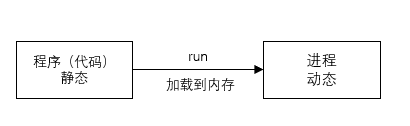
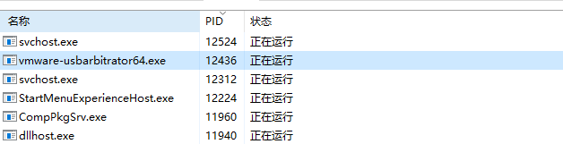
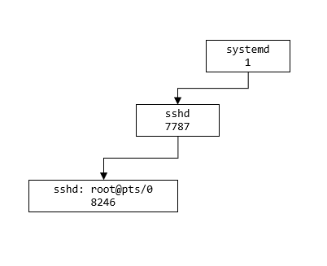

## 查看进程和终止进程

### 一、基本介绍

- 在 Linux 中，每个执行的程序都成为一个进程。每个进程都分配一个 ID 号（pid，进程号）

  

  

  

- 每个进程都可能以两种方式存在的：前台与后台

  - 前台，所谓==前台进程==就是用户目前的屏幕上可以进行操作的，占有控制终端的进程
  - 后台，所谓==后台进程==则是实际在操作，但屏幕上无法看到进程，通常使用后台方式执行。例如 mysql、tomcat 服务
  - ==在 windows 系统中，只有一个任务在前台运行，选择了哪一个窗口在操作哪一个就是在前台运行，其他任务都在后台运行==

- 一般系统的服务都是以后台进程的方式存在，而且都会常驻在系统中，直到关机才结束


### 二、显示系统执行的进程

#### 2.1 基本介绍

`ps` 命令是用来查看目前系统中，有哪些进程正在执行，以及它们执行的状况，可以不加任何参数

```bash
ps [选项]
```


> 选项

| 选项 | 说明                       |
| ---- | -------------------------- |
| -a   | 显示当前终端的所有进程信息 |
| -u   | 以用户的格式显示进程信息   |
| -x   | 显示后台进程运行的参数     |


> ps 显示的信息说明

| 字段 | 说明                    |
| ---- | ----------------------- |
| PID  | 进程识别号              |
| TTY  | 终端机号                |
| TIME | 此进程所消耗的 CPU 时间 |
| CMD  | 正在执行的命令或进程名  |


#### 2.2 ps 详解

> 指令

```bash
ps -aux | grep xxx

# 查看有没有 sshd 服务
ps -aux | grep sshd
```


> 信息说明

```bash
# System V 展示风格
USER        PID %CPU %MEM    VSZ   RSS TTY      STAT START   TIME COMMAND
root          2  0.0  0.0      0     0 ?        S    09:09   0:00 [kthreadd]
root          3  0.0  0.0      0     0 ?        S    09:09   0:00 [ksoftirqd/0]
root          5  0.0  0.0      0     0 ?        S<   09:09   0:00 [kworker/0:0H]
root          7  0.0  0.0      0     0 ?        S    09:09   0:00 [migration/0]
root          8  0.0  0.0      0     0 ?        S    09:09   0:00 [rcu_bh]
root          9  0.0  0.0      0     0 ?        S    09:09   0:03 [rcu_sched]
root         10  0.0  0.0      0     0 ?        S<   09:09   0:00 [lru-add-drain]
root         11  0.0  0.0      0     0 ?        S    09:09   0:00 [watchdog/0]

# USER		进程执行用户
# PID		进程号
# %CPU		进程占用 cpu 的百分比
# %MEM		进程占用物理内存的百分比
# VSZ		进程占用虚拟内存的大小（KB）
# RSS		进程占用的物理内存大小（KB）
# TTY		终端名称，缩写的终端名称
# STAT		当前运行状态
#				S 表示睡眠
#				s 表示该进程是会话的先导进程
#				N 表示进程拥有比普通优先级更低的优先级
#				R 表示正在运行
#				D 表示短期等待
#				Z 表示僵死进程，
#				T 表示被跟踪或者被停止
# START		进程执行的开始时间
# TIME 		进程占用的 cpu 时间
# COMMAND	进程名，执行该进程的指令和参数，如果过长会被截断显示
```


#### 2.3 应用实例

> 要求：以全格式显示当前所有的进程，查看进程的父进程。查看 sshd 的父进程信息
>
> 父进程：如果一个进程创建了多个进程，被创建的进程为该进程的子进程，该进程为被创建进程的父进程

```bash
# 以全格式显示当前所有的进程
ps -ef

# 选项说明
-e	显示所有进程
-f	全格式

ps -ef | grep xxx

# BSD 风格
# UID		用户 ID
# PID		进程 ID
# PPID		父进程 ID
# C			CPU 用于计算执行优先级的因子。
# 				- 数值越大，表明进程是 CPU 密集型运算，执行优先级会降低
#				- 数值越小，表明进程是 I/O 密集型晕眩，执行优先级会提高
# STIME		进程启动的时间
# TTY		完整的终端名称
# TIME		进程占用 CPU 的时间
# CMD		启动进程所用的命令和参数
```


```bash
[root@wndexx ~]# ps -ef | grep sshd
root       7787      1  0 09:09 ?        00:00:00 /usr/sbin/sshd -D
# sshd: root@pts/0  	shell 用 root 登录的进程
root       8246   7787  0 09:09 ?        00:00:00 sshd: root@pts/0
root      10271   8493  0 11:30 pts/0    00:00:00 grep --color=auto sshd
[root@wndexx ~]# ps -ef
UID         PID   PPID  C STIME TTY          TIME CMD
root          1      0  0 09:09 ?        00:00:02 /usr/lib/systemd/systemd --switched-root --system --deserialize 22
```





### 三、终止进程 kill 和 killall

#### 3.1 介绍

若是某个进程执行一般需要停止时，或是已经消耗了很大的系统资源时，此时可以考虑停止该进程，使用 `kill` 命令来完成此项任务


#### 3.2 基本语法

```bash
# 通过进程号杀死/终止进程，子进程不一定被杀死
kill [选项] 进程号

# 通过进程名称杀死/终止进程，也支持通配符，这在系统因负载过大而变得很慢时很有用，满足进程名的所有进程及其所有子进程会被杀死
killall 进程名称
```


#### 3.3 常用选项

| 选项 | 说明             |
| ---- | ---------------- |
| -9   | 强迫进程立刻停止 |


#### 3.4 最佳实践

```bash
# 1. 踢掉某个非法登录用户
[root@wndexx ~]# ps aux | grep sshd
root       7787  0.0  0.2 112756  4316 ?        Ss   09:09   0:00 /usr/sbin/sshd -D
root       8246  0.0  0.2 160848  5612 ?        Ss   09:09   0:01 sshd: root@pts/0
root      11473  0.3  0.2 156636  5428 ?        Ss   13:24   0:00 sshd: tom [priv]
tom       11486  0.0  0.1 156636  2420 ?        S    13:24   0:00 sshd: tom@pts/1
root      11547  0.0  0.0 112728   988 pts/0    S+   13:25   0:00 grep --color=auto ssh
[root@wndexx ~]# kill 11473

# 2. 终止远程服务 sshd，在适当时候再次重启 sshd 服务
# 启动了 sshd 后，用户才能远程登录 linux 服务器，如果杀死 sshd 进程，则不能再远程登录，但是原先登录的用户不受影响，即 sshd 的子进程并没有被杀死
[root@wndexx ~]# ps -aux | grep sshd
root       7787  0.0  0.2 112756  4316 ?        Ss   09:09   0:00 /usr/sbin/sshd -D
root       8246  0.0  0.2 160848  5612 ?        Ss   09:09   0:01 sshd: root@pts/0
root      11582  0.0  0.0 112728   988 pts/0    S+   13:28   0:00 grep --color=auto ssh
[root@wndexx ~]# kill 7787
[root@wndexx ~]# ps -aux | grep sshd
root       8246  0.0  0.2 160848  5612 ?        Ss   09:09   0:01 sshd: root@pts/0
root      11586  0.0  0.0 112728   984 pts/0    S+   13:29   0:00 grep --color=auto ssh
# 重启 sshd 服务
[root@wndexx ~]# /bin/systemctl start sshd.service
[root@wndexx ~]# ps -aux | grep sshd
root       8246  0.0  0.2 160848  5612 ?        Ss   09:09   0:01 sshd: root@pts/0
root      11625  0.2  0.2 112756  4320 ?        Ss   13:31   0:00 /usr/sbin/sshd -D
root      11630  0.0  0.0 112728   988 pts/0    S+   13:31   0:00 grep --color=auto sshd
[root@wndexx ~]# 

# 3. 终止多个 gedit
[root@wndexx ~]# killall gedit
[root@wndexx ~]# 

# 4. 强制杀掉一个终端
[root@wndexx ~]# ps -aux | grep bash  # 查看本机终端进程
root       7096  0.0  0.0 115304   960 ?        S    09:09   0:01 /bin/bash /usr/sbin/ksmtuned
root       8493  0.0  0.1 116784  3544 pts/0    Ss+  09:09   0:00 -bash
tom       11664  0.0  0.1 116776  3304 pts/1    Ss+  13:33   0:00 -bash
root      11933  0.0  0.0  72312   776 ?        Ss   13:34   0:00 /usr/bin/ssh-agent /bin/sh -c exec -l /bin/bash -c "env GNOME_SHELL_SESSION_MODE=classic gnome-session --session gnome-classic"
root      12763  0.0  0.1 116740  3356 pts/2    Ss+  13:35   0:00 bash
root      12826  0.1  0.1 116864  3344 pts/3    Ss   13:38   0:00 bash
root      12876  0.0  0.0 112728   988 pts/3    S+   13:38   0:00 grep --color=auto bash
[root@wndexx ~]# kill 12763   		# 没有杀死
[root@wndexx ~]# kill -9 12763
[root@wndexx ~]# kill -9 12826		# 也可以杀死当前所处的终端
```


### 四、查看进程树 pstree

#### 4.1 基本语法

```bash
# 更加直观的查看进程信息
pstree [选项]
```


#### 4.2 常用选项

| 选项 | 说明               |
| ---- | ------------------ |
| -p   | 显示进程的 PID     |
| -u   | 显示进程的所属用户 |


#### 4.3 应用实例

```bash
# 以树状的形式显示进程的 pid
pstree -p

# 以树状的形式显示进程的用户 id
pstree -u
```


