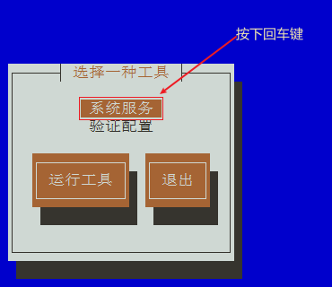

## 服务管理

### 一、介绍

==服务（service）==本质就是进程，但是是运行在后台的，通常都会监听某个端口，等待其它程序的请求。

比如 mysqld、sshd、防火墙等

因此又称为 ==守护进程（daemon）==，这是 Linux 中非常重要的知识点


### 二、service 指令

> 指令

```bash
service 服务名 [ start | stop | restart | reload | status ]
```


> 说明

- 在 CentOS 7.0 后，很多服务不再使用 `service`，而是 `systemctl`

- `service` 指令管理的服务在 ==/etc/init.d== 查看

  ```bash
  [root@wndexx ~]# ls -l /etc/init.d/
  总用量 84
  -rw-r--r--. 1 root root 18281 8月  24 2018 functions
  -rwxr-xr-x. 1 root root  4569 8月  24 2018 netconsole
  -rwxr-xr-x. 1 root root  7923 8月  24 2018 network
  -rw-r--r--. 1 root root  1160 10月 31 2018 README
  -rwxr-xr-x. 1 root root 44969 4月  23 15:25 vmware-tools
  ```

  


> service 管理指令案例

```bash
# 使用 service 指令查看、关闭、启动 network【注意：在虚拟系统演示，因为网络连接会关闭】
[root@wndexx ~]# service network status
已配置设备：
lo ens33
当前活跃设备：
lo ens33 virbr0
[root@wndexx ~]# service network stop
Stopping network (via systemctl):                          [  确定  ]
[root@wndexx ~]# service network start
Starting network (via systemctl):                          [  确定  ]
[root@wndexx ~]# 
```


### 三、查看服务名

> 查看所有的系统服务

```bash
# 查看所有的系统服务
setup
```





> 查看 service 指令管理的服务

```bash
ls -l /etc/init.d/
```


### 四、服务的运行级别（runlevel）

> Linux 系统有 7 种运行级别（runlevel）:常用的是级别 3 和 5

| 运行级别      | 说明                                                         |
| ------------- | ------------------------------------------------------------ |
| 运行级别 0    | 系统停机状态，系统默认运行级别不能设为 0，否则不能正常启动   |
| 运行级别1     | 单用户工作状态，root 权限，用于系统维护，禁止远程登陆        |
| 运行级别2     | 多用户状态（没有 NFS，网络文件系统），不支持网络             |
| ==运行级别3== | 完全的多用户状态（有 NFS），无界面，登录后进入控制台命令行模式 |
| 运行级别4     | 系统未使用，保留                                             |
| ==运行级别5== | X11 控制台，登录后进入图形 GUI 模式                          |
| 运行级别6     | 系统正常关闭并重启，默认运行级别不能设为 6，否则不能正常启动 |


> 开机的流程说明


> CentOS 7 后运行级别说明

在 /etc/initab 进行了简化，如下：

```bash
# multi-user.target:analogous to runlevel 3

# graphical.target:analogous to runlevel 5

# to view current default target,run
systemctl get-default

# to set a default target,run:
systemctl set-default multi-user.target
# or
systemctl set-default raphical.target

# 其它的运行级别依旧存在
```


### 五、chkconfig 指令

> 介绍

- 通过 `chkconfig` 命令可以==设置服务在各个运行级别是否自启动==
- `chkconfig` 指令管理的服务在 /etc/init.d 查看
- 注意：CentOS 7.0 后，很多服务使用 `systemctl` 管理


> chkconfig 基本语法

```bash
# 查看 chkconfig 指令管理的服务
chkconfig --list

# 查看指定的服务
chkconfig --list | grep 服务名
# 或
chkconfig 服务名 --list 

# 设置服务在指定运行级别下是否自启动。n 是数字，代表运行级别，on 表示自启动，off 表示不自启动
chkconfig --level n 服务名 on/off
```


> 案例演示

```bash
# 设置 network 服务在运行级别 3，关闭自启动
chkconfig --level 3 network off
chkconfig --level 3 network on
```


> 使用细节

`chkconfig` 重新设置服务自启动或关闭自启动后，需要重启机器 `reboot` 生效


### 六、systemctl 指令

> `systemctl` 管理指令

- 基本语法

  ```bash
  systemctl [start | stop | restart | status] 服务名
  ```

- `systemctl` 指令管理的服务在 ==/usr/lib/systemd/system== 查看

  ```bash
  ls -l /usr/lib/systemd/system | grep fire 
  ```

  

> systemctl 设置服务的自启动状态

```bash
# 查看服务开机启动状态，grep 可以进行过滤
systemctl list-unit-files [| grep 服务名]

# centos7 以后运行级别简化为了只要为 3 和 5 两个级别，systemctl 设置服务是否开机自启动对级别 3 和 5 都生效

# 设置服务开机启动
systemctl enable 服务名

# 关闭服务开机启动
systemctl disable 服务名

# 查询某个服务是否是自启动的
systemctl is-enabled 服务名
```


> 应用案例

```bash
# 查看当前防火墙的状况，关闭防火墙和重启防火墙  firewalld[.service]
systemctl status firewalld
systemctl stop firewalld
systemctl start firewalld


# systemctl status firewalld 查看防火墙是否正在运行
# systemctl list-unit-files | grep firewalld 查看防火墙是否是开机自启动的

# 服务名可以写成 sshd 或 sshd.service
[root@wndexx ~]# systemctl is-enabled sshd
enabled
[root@wndexx ~]# systemctl is-enabled sshd.service
enabled
```


> 细节讨论

- 防火墙的作用

  

  ```bash
  # 1. 查看端口是否处于监听状态
  netstat -anp | more
  
  ctive Internet connections (servers and established)
  Proto Recv-Q Send-Q Local Address    Foreign Address  State       PID/Program name    
  tcp        0      0 0.0.0.0:111       0.0.0.0:*       LISTEN      1/systemd           
  tcp        0      0 0.0.0.0:6000      0.0.0.0:*       LISTEN      8173/X              
  tcp        0      0 192.168.122.1:53  0.0.0.0:*       LISTEN      8020/dnsmasq        
  tcp        0      0 0.0.0.0:22        0.0.0.0:*       LISTEN      7753/sshd           
  tcp        0      0 127.0.0.1:631     0.0.0.0:*       LISTEN      7756/cupsd          
  tcp        0      0 127.0.0.1:25      0.0.0.0:*       LISTEN      8058/master       
  # 2. 以 111 端口为例，目前 111 端口 state 为 listen，处于监听状态
  # 在监听状态下，防火墙决定对 111 端口的访问是放行还是拦截
  # 通过 windows 的 cmd 检查是否能够访问 linux 系统的 111 端口
  telnet 192.168.200.130 111
  # 无法访问
  正在连接192.168.200.130...无法打开到主机的连接。 在端口 111: 连接失败
  
  # 3. 关闭防火墙
  systemctl stop firewalld
  
  # 4. 再一次检查是否能够访问 111 端口
  telnet 192.168.200.130 111
  # 可以访问
  
  # 防火墙可以防止端口被其它人访问
  ```

  

- 关闭或者启动防火墙后，立即生效

- 这种方式只是==临时生效==，当重启系统后，还是回归以前对服务的设置

- 如果希望对某个服务的设置==永久生效==，就需要对某个服务设置开机自启动或关闭自启动，使用 `systemctl [enable | disable] 服务名`

  

### 六、打开或者关闭指定端口

在真正的生产环境，往往需要将防火墙打开，此时，为了防止外部请求数据不能跟服务器监听端口通讯，需要打开指定的端口，比如80、22、8080

> firewall 指令

```bash
# 打开端口
firewall-cmd --permanent --add-port=端口号/协议

# 关闭端口
firewall-cmd --permanent --remove-port=端口号/协议

# 重新载入，使设置生效
firewall-cmd --reload

# 查询端口是否开放
firewall-cmd --query-port=端口/协议

# 查看已经开放的端口
firewall-cmd --list-ports
```


> 应用实例

```bash
# 启动防火墙，测试 111 端口是否能 telnet
systemctl start firewalld
# cmd 下
telnet 192.168.200.130 111

# 开放 111 端口
firewall-cmd --permanent --add-port=111/tcp
firewall-cmd --reload
firewall-cmd --query-port=111/tcp

# 再次关闭 111 端口
firewall-cmd --permanent --remove-port=111/tcp
firewall-cmd --reload
firewall-cmd --query-port=111/tcp

```


