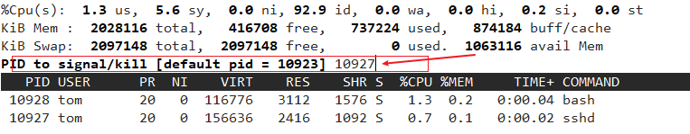
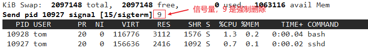
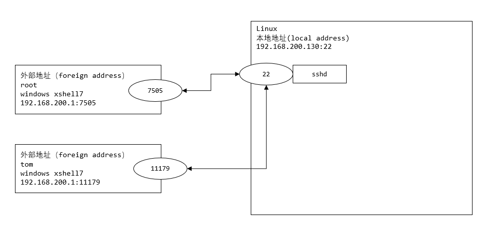

## 动态监控进程和监控网络状态

### 一、动态监控进程

#### 1.1 介绍

`top` 命令与 `ps` 命令很相似，它们都是用来显示正在执行的进程。

`top` 与 `ps` 最大的不同之处，在于 `top` 每隔一段时间可以更新正在运行的进程


#### 1.2 基本语法

```bash
top [选项]
```


#### 1.3 选项说明

| 选项    | 功能                                       |
| ------- | ------------------------------------------ |
| -d 秒数 | 指定 `top` 命令每隔几秒更新，默认是 3 秒   |
| -i      | 使 `top` 不显示任何限制或者僵死进程        |
| -p      | 通过指定监控进程 ID 来监控，某个进程的状态 |


#### 1.4 top 命令显示的信息

```bash
top - 14:57:36 up 41 min,  2 users,  load average: 0.00, 0.01, 0.05
	Tasks: 251 total,   2 running, 249 sleeping,   0 stopped,   0 zombie
	%Cpu(s):  0.0 us,  0.2 sy,  0.0 ni, 99.8 id,  0.0 wa,  0.0 hi,  0.0 si,  0.0 st
	KiB Mem :  2028116 total,   424424 free,   730504 used,   873188 buff/cache
	KiB Swap:  2097148 total,  2097148 free,        0 used.  1069800 avail Mem 

	PID  USER      PR  NI    VIRT    RES    SHR S  %CPU %MEM     TIME+ COMMAND
	6956 root      20   0  246484   6848   5364 S   0.7  0.3   0:12.12 vmtoolsd
	9930 root      20   0  162156   2432   1596 R   0.7  0.1   0:05.03 top 
```


> 系统整体的统计信息

```bash
- 第一行：一些系统信息

  - 14:57:36	当前时间

  - up 41 min	系统运行时间

  - 2 users		当前登录用户数

  - load average: 0.00, 0.01, 0.05		系统负载，系统负载，即任务队列的平均长度。三个数值分别为 1分钟、5分钟、15分钟前到现在的平均值。如果这三个值的平均值在 0.7 以上，说明当前系统负载较大

    

- 第二行：进程统计信息

  - Tasks: 251 total	进程总数

  - 2 running			正在运行的进程数

  - 249 sleeping		睡眠的进程数

  - 0 stopped			停止的进程数

  - 0 zombie			僵尸进程数

    

- 第三行：CPU 的统计信息

  - 0.0 us			用户空间占用 CPU 百分比
  
  - 0.2 sy			系统占用 CPU
  
  - 0.0 ni			用户进程空间内改变过优先级的进程占用 CPU 百分比
  
  - 99.8 id			空闲 CPU 百分比
  
  - 0.0 wa			等待输入输出的 CPU 时间百分比
  
  - 0.1 hi			硬中断占用百分比
  
  - 0.0 si			软中断占用百分比

  

- 第四行和第五行：内存占用信息

  - Mem
  
    - 2028116 total			物理内存总量
    
    - 424424 free			空闲的内存总量
    
    - 730504 used			使用的物理内存总量
    
    - 873188 buff/cache		用作缓冲和缓存的内存量
    
  - Swap
  
    - 2097148 total			交换区内存总量
    
    - 2097148 free			空闲的交换区总量
    
    -  0 used				使用的交换区总量
    
    - 1069800 avail Mem		可用内存空间
```


> 进程的统计信息

```bash
列名    含义
PID     进程 id
PPID    父进程id
RUSER   Real user name
UID     进程所有者的用户 id
USER    进程所有者的用户名
GROUP   进程所有者的组名
TTY     启动进程的终端名。不是从终端启动的进程则显示为 ?
PR      优先级
NI      nice 值。负值表示高优先级，正值表示低优先级
P       最后使用的 CPU，仅在多 CPU 环境下有意义
%CPU    进程使用的 CPU 的百分比
TIME    进程使用的 CPU 时间总计，单位秒
TIME+   进程使用的 CPU 时间总计，单位 1/100秒
%MEM    进程使用的物理内存百分比
VIRT    进程使用的虚拟内存总量，单位 kb。VIRT=SWAP+RES
SWAP    进程使用的虚拟内存中，被换出的大小，单位 kb。
RES     进程使用的、未被换出的物理内存大小，单位 kb。RES=CODE+DATA
CODE    可执行代码占用的物理内存大小，单位 kb
DATA    可执行代码以外的部分(数据段+栈)占用的物理内存大小，单位 kb
SHR     共享内存大小，单位 kb
nFLT    页面错误次数
nDRT    最后一次写入到现在，被修改过的页面数。
S       进程状态(D=不可中断的睡眠状态,R=运行,S=睡眠,T=跟踪/停止,Z=僵尸进程)
COMMAND 执行的命令
WCHAN   若该进程在睡眠，则显示睡眠中的系统函数名
Flags   任务标志，参考 sched.h
```


#### 1.5 交互操作说明

| 操作 | 说明                            |
| ---- | ------------------------------- |
| P    | 以 CPU 使用率排序，默认就是此项 |
| M    | 以内存的使用率排序              |
| N    | 以 PID 排序                     |
| q    | 退出 top                        |


#### 1.6 应用实例

```bash
# 案例1：监视特定用户，比如监控 tom 用户
# top：输入此命令，按下按回车键，查看执行的进程
# u：然后输入 "u"，回车，再输入用户名，即可

# 案例2：终止指定的进程，结束 tom 登录
# top：输入此命令，按回车键，查看执行的进程
# k：然后输入 "k"，回车，再输入要结束的进程 ID 号

# 案例3：指定 top 指令更新系统状态的间隔时间（每隔 10 秒自动更新）
top -d 10
```








### 二、监控网络状态

#### 2.1 查看系统网络情况 netstat

> 基本语法

```bash
netstat [选项]
```


> 选项说明

| 选项 | 说明               |
| ---- | ------------------ |
| -an  | 按一定顺序排列输出 |
| -p   | 显示哪个进程在调用 |


```bash
# netstat -an | more
Proto Recv-Q Send-Q Local Address           Foreign Address         State      
tcp        0      0 0.0.0.0:111             0.0.0.0:*               LISTEN     
tcp        0      0 0.0.0.0:6000            0.0.0.0:*               LISTEN     
tcp        0      0 192.168.122.1:53        0.0.0.0:*               LISTEN     
tcp        0      0 0.0.0.0:22              0.0.0.0:*               LISTEN     
tcp        0      0 127.0.0.1:631           0.0.0.0:*               LISTEN     
tcp        0      0 127.0.0.1:25            0.0.0.0:*               LISTEN     
tcp        0      0 127.0.0.1:6010          0.0.0.0:*               LISTEN     
tcp        0     36 192.168.200.130:22      192.168.200.1:7505      ESTABLISHED
tcp6       0      0 :::111                  :::*                    LISTEN     
tcp6       0      0 :::6000                 :::*                    LISTEN     
tcp6       0      0 :::22                   :::*                    LISTEN  

# Proto ：网络协议

# Local Address：本地地址
    # 0.0.0.0:xx，127.0.0.xx		进程在本地监听 xx 端口，协议是 ipv4
    # ::::xx 					 进程在本地监听 xx 端口，协议是 ipv6

# Foreign Address：外部地址

# State ：状态	 	LISTEN 监听，ESTABLISHED 连接，当本地地址和外部地址断开连接后，会变成 TIME_WAIT（超时） 状态，如果一段时间后仍未重新建立连接，将连接销毁

```





> 应用案例

```bash
# 查看服务名为 sshd 的服务的信息
netstat -anp | grep sshd
```


#### 2.2 检测主机连接命令 ping

`ping` 是一种网络检测工具，主要用于和检测远程主机之间是否网络通畅

```bash
ping 对方ip地址
```


