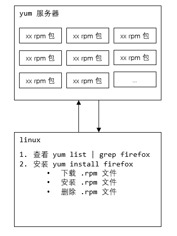

## RPM 与 YUM

### 一、RPM

#### 1.1 介绍

rpm  一种用于互联网下载包的打包及安装工具，它包含在某些 Linux 分发版中，生成具有 ==.RPM== 扩展名的文件

RPM 是 ReadHat Package Manager（Redhat 软件包管理工具）的缩写，类似于 windows 的 setup.exe，这以文件格式名称虽然打上了 RedHat 的标志，但是其原始设计理念是开放式的

Linux 的分发版本都有采用（suse，redhat，centos 等等），可以算是的公认的行业标准了


#### 1.2 rpm 包的简单查询指令

> 查询已安装的 rpm 列表

```bash
# 查询已安装的 rpm 列表
rpm -qa | grep xx
```


> 举例

```bash
# 看看当前系统，是否安装了 firefox
rpm -qa | grep fixfox
```


> rpm 包名基本格式

```bash
# 一个 rpm 包名： firefox-60.2.2-1.el7.centos.x86_64
# 名称：firefox
# 版本号：60.2.2-1
# 使用操作系统：el7.centos.x86_64，表示 centos7.x 的 64 位系统。
# 如果是 i686、i386 表示 32 位系统，noarch 表示通用
```


#### 1.3 rpm 包的其它查询指令

```bash
rpm -qa				查询所安装的所有 rpm 软件包
rpm -qa | more
rpm -qa | grep xx


rpm -q 软件包名		 查询软件包是否安装
# 案例：rpm -q firefox
# firefox-60.2.2-1.el7.centos.x86_64


rpm -qi 软件包名	 查询软件包信息
# 案例：rpm -qi firefox
[root@wndexx ~]# rpm -qi firefox
Name        : firefox
Version     : 60.2.2
Release     : 1.el7.centos
Architecture: x86_64
Install Date: 2022年04月23日 星期六 13时24分25秒
Group       : Unspecified
Size        : 216144933
License     : MPLv1.1 or GPLv2+ or LGPLv2+
Signature   : RSA/SHA256, 2018年10月09日 星期二 20时51分59秒, Key ID 24c6a8a7f4a80eb5
Source RPM  : firefox-60.2.2-1.el7.centos.src.rpm
Build Date  : 2018年10月09日 星期二 08时33分46秒
Build Host  : x86-01.bsys.centos.org
Relocations : (not relocatable)
Packager    : CentOS BuildSystem <http://bugs.centos.org>
Vendor      : CentOS
URL         : https://www.mozilla.org/firefox/
Summary     : Mozilla Firefox Web browser
Description :
Mozilla Firefox is an open-source web browser, designed for standards
compliance, performance and portability.


rpm -ql 软件包名	 查询软件包中的文件
# 案例：rpm -ql firefox


rpm -qf 文件全路径名	查询文件所属的软件包
# rpm -qf /etc/passwd
# setup-2.8.71-10.el7.noarch

# rpm -qf /usr/lib64/firefox/platform.ini
# firefox-60.2.2-1.el7.centos.x86_64

```


#### 1.4  卸载 rpm 包

> 基本语法

```bash
rpm -e RPM包的名称		# erase
```


> 应用案例

```bash
# 删除 firefox 软件包
rpm -e firefox
```


> 细节讨论

- 如果其他软件包依赖于要卸载的软件包，卸载时会产生错误信息

  ```bash
  rpm -e foo
  
  # removing thers packages would break depencies:foo is needed by bar-1.0-1
  ```

  

- 如果需要强制删除软件包，可以增加参数 `--nodeps`，但一般不推荐这样做，因为依赖于该软件包的程序可能无法运行

  ```bash
  rpm -e --nodeps foo
  ```

  

#### 1.5 安装 rpm 包

> 基本语法

```bash
rpm -ivh RPM包全路径名称
```


> 参数说明

```bash
i=install 安装
v=verbose 提示
h=hash    进度条
```


> 应用实例

```bash
# 演示卸载和安装 firefox 浏览器
rpm -e firefox
rpm -ivh /opt/firefox-60.2.2-1.el7.centos.x86_64.rpm 
```


### 二、YUM

#### 2.1 介绍

yum 是一个 shell 前端软件包管理器，基于 rpm 包管理，能够从指定的服务器自动下载 rpm 包并安装，可以自动处理依赖性关系，并且一次安装所有依赖的软件包（==应用商店==）


#### 2.2 yum 的基本指令

```bash
# 查询 yum 服务器是否有需要安装安装的软件
yum list | grep 软件列表

# 安装指定的 yum 包
yum install xxx
```





#### 2.3 yum 应用实例

```bash
# 使用 yum 安装 firefox
rpm -e firefox
yum list | grep firefox
yum install firefox
```


