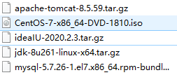
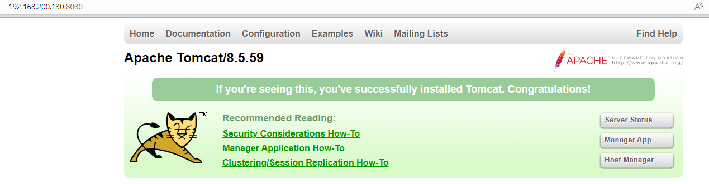
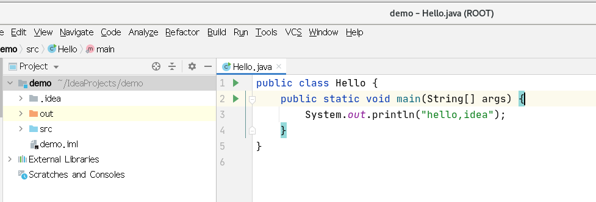

## 搭建 JavaEE 环境

### 一、概述

如果需要在 Linux 下进行 JavaEE 的开发，需要安装如下软件




### 二、安装 JDK8

> 在 opt 目录下创建 jdk 目录，并通过 xftp6 将 jdk-8u261-linux-x64.tar.gz 上传到 /opt/jdk 下

```bash
mkdir /opt/jdk
```


> 解压 jdk-8u261-linux-x64.tar.gz

```bash
cd /opt/jdk/
tar -zxvf jdk-8u261-linux-x64.tar.gz
```


> 在 /usr/local 下创建 java 目录，并将解压后的 jdk 目录移动到 java 目录下

```bash
mkdir /usr/local/java
mv /opt/jdk/jdk1.8.0_261 /usr/local/java
```


> 配置环境变量

```bash
vim /etc/profile
export JAVA_HOME=/usr/local/java/jdk1.8.0_261
# 注意 :$PATH 一定要写，否则会把原来的环境变量覆盖，原先的基本指令无法使用
export PATH=$JAVA_HOME/bin:$PATH

# 让新的环境变量生效
source /etc/profile

# ./ 执行当前目录下的可执行文件！！
```


> 测试

```bash
[root@wndexx bin]# javac -version
javac 1.8.0_261

[root@wndexx bin]# java -version
]java version "1.8.0_261"
Java(TM) SE Runtime Environment (build 1.8.0_261-b12)
Java HotSpot(TM) 64-Bit Server VM (build 25.261-b12, mixed mode)

[root@wndexx bin]# cd /home/
[root@wndexx home]# vim Hello.java
[root@wndexx home]# ls
aa.tar.gz  abc.txt  apple.txt  bbb  dg.txt  Hello.java  hello.zip  jack   milan  mycal       myhome.zip  myroot  ss    test1  tom   ts   wk  xq
abc        ani      a.txt      bj   fox     hello.txt   info.txt   jerry  m.sh   mydate.txt  myprofile   my.sh   test  thh    tom2  ttt  xh  zwj
[root@wndexx home]# javac Hello.java 
[root@wndexx home]# java Hello
hello,java!

```


### 三、安装 tomcat8

> 在 opt 目录下创建 tomcat 目录，并通过 xftp6 将 apache-tomcat-8.5.59.tar.gz 上传到 /opt/tomcat 下

```bash
mkdir /opt/tomcat
```


> 解压 apache-tomcat-8.5.59.tar.gz

```bash
tar -zxvf apache-tomcat-8.5.59.tar.gz
```


> 进入 /opt/apache-tomcat-8.5.59/bin 目录，运行 startup.sh 脚本

```bash
cd /opt/apache-tomcat-8.5.59/bin/
./startup.sh
```


> 开放 8080 端口

```bash
firewall-cmd --permanet --add-port 8080/tcp
firewall-cmd --reload
```


> 测试

```bash
# 在 浏览器中访问 http://linuxIP地址：8080
http://192.168.200.130:8080
```




### 四、安装 IntelliJ IDEA2020

> 下载地址：[Download IntelliJ IDEA: The Capable & Ergonomic Java IDE by JetBrains](https://www.jetbrains.com/idea/download/#section=linux)


> 在 opt 目录下创建 idea 目录，并通过 xftp6 将 ideaIU-2020.2.3.tar.gz 上传到 /opt/idea 下

```bash
mkdir /opt/idea
```


> 解压 ideaIU-2020.2.3.tar.gz

```bash
tar ideaIU-2020.2.3.tar.gz
```


> 进入 /opt/apache-tomcat-8.5.59/bin 目录，运行 idea.sh 脚本

```bash
cd /opt/idea-IU-202.7660.26/bin/
# 注意：在远程工具执行 idea.sh 脚本无法运行，需要在虚拟机上执行该脚本
./idea.sh
```


> 配置 idea，并测试




### 五、安装 mysql5.7

> 在 opt 目录下创建 mysql 目录，并通过 xftp6 将 mysql-5.7.26-1.el7.x86_64.rpm-bundle.tar 上传到 /opt/mysql 下

```bash
# 也可以通过 wget 指令下载 mysql 压缩包
wget http://dev.mysql.com/get/mysql-5.7.26-1.el7.x86_64.rpm-bundle.tar
```


> 解压 mysql-5.7.26-1.el7.x86_64.rpm-bundle.tar 

```bash
cd mysql
tar -xvf mysql-5.7.26-1.el7.x86_64.rpm-bundle.tar 
```


> 删除 mariadb 数据库

```bash
# centos7.6 自带的类 mysql 数据库是 mariadb，会跟 mysql 冲突，要先删除

rpm -qa | grep mariadb
# mariadb-libs-5.5.60-1.el7_5.x86_64

rpm -e --nodeps mariadb-libs
```


> 安装 mysql

```bash
# 顺序安装以下 rpm 包
rpm -ivh mysql-community-common-5.7.26-1.el7.x86_64.rpm
rpm -ivh mysql-community-libs-5.7.26-1.el7.x86_64.rpm
rpm -ivh mysql-community-client-5.7.26-1.el7.x86_64.rpm
rpm -ivh mysql-community-server-5.7.26-1.el7.x86_64.rpm
```


> 启动 mysql

```bash
systemctl start mysqld
```


> 修改 root 密码

```bash
# 安装 mysql 时会自动给 root 用户设置随机密码
# 1. 查看当前密码
grep "password" /var/log/mysqld.log
# 2022-05-01T07:37:09.705332Z 1 [Note] A temporary password is generated for root@localhost: -k%_az2urXs


# 2. 登录 mysql
mysql -uroot -p
# 可以直接在 p 后面加上上面查到的密码，也可以按下回车键，根据提示输入密码


# 3. 设置密码提示策略为 0
set global validate_password_policy=0;

# mysqk 密码复杂度要求分为三种

# 低：0 or LOW | LENGTH	
# 只要求长度，默认 8 位

# 中：1 or MEDIUM	| LENGTH; numeric, lowercase/uppercase, and special characters	
# 要求长度、数字、大小写、特殊字符

# 高：2 or STRONG	| LENGTH; numeric, lowercase/uppercase, and special characters;dictionary file		
# 要求长度、数字、大小写、特殊字符、字典文件

# 4. 设置密码
set password for 'root'@'localhost'=password('12345678');

# 5. 使密码设置生效
flush privileges;
```


