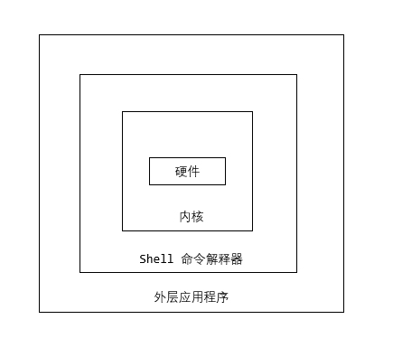
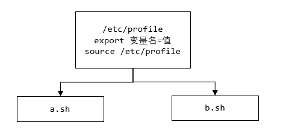

## Shell 编程

### 一、Shell 的用途

- Linux 运维工程师需要编写 shell 程序进行服务器集群管理
- JavaEE 和 Python 程序员需要编写一些服务器维护方面的脚本，例如编写一个定时备份数据库的脚本
- 大数据程序员需要编写 shell 程序管理集群


### 二、Shell 的概念

Shell 是一个命令行解释器，它为用户提供了一个向 Linux 内核发送请求以便运行程序的界面系统级程序

用户可以用 Shell 来启动、挂起、停止甚至编写一些程序




### 三、Shell 脚本的执行方式

#### 3.1 脚本格式要求

- 脚本以 `#!/bin/bash` 开头，表明当前执行脚本的 shell 类型

  ```bash
  #!/bin/bash
  ```

  

- 脚本需要有可执行权限

  ```bash
  chmod u+x xx.sh
  ```

  

#### 3.2 编写第一个 shell 脚本

> 创建一个 shell 脚本，输出 hello,world!

```bash
vim hello.sh

#!/bin/bash
echo "hello,world!"
```


#### 3.3 脚本的常用执行方式

> 输入脚本的相对路径或绝对路径

说明：首先要赋予 hello.sh 脚本执行权限，再执行脚本

```bash
chmod u+x hello.sh

# 相对路径  ./ + 脚本的相对路径地址
./hello.sh

# 绝对路径	脚本的绝对路径地址  
/root/shcode/hello.sh
```


> sh + 脚本

说明：不用赋予脚本可执行权限，直接执行即可

```bash
sh hello.sh
# 或
sh /root/shcode/hello.sh
```


### 四、Shell 变量

#### 4.1 shell 变量介绍

- Linux Shell 中的变量分为，==系统变量==和==用户自定义变量==

- 系统变量：\$HOME、\$PWD、\$SHELL、\$USER 等等，比如 echo $HOME ..

  ```bash
  [root@wndexx shcode]# echo $HOME
  /root
  [root@wndexx shcode]# echo $PATH
  /usr/local/java/jdk1.8.0_261/bin:/usr/local/sbin:/usr/local/bin:/usr/sbin:/usr/bin:/root/bin
  [root@wndexx shcode]# echo $PWD
  /root/shcode
  [root@wndexx shcode]# echo $SHELL
  /bin/bash
  [root@wndexx shcode]# echo $USER
  root
  ```

- 显示当前 shell 中所有变量：set


#### 4.2 shell 变量的定义

> 基本语法

- 定义变量

  ```bash
  变量名=值
  ```


- 撤销变量

  ```bash
  unset 变量
  ```


- 声明静态变量

  ```bash
  # 不能 unset，只读，类似于 java 中的常量
  readonly 变量=值
  ```

  

> 快速入门

```bash
##### var.sh #######
1 #!/bin/bash
2 # 定义变量 A
3 A=100
4 # 输出变量需要加上 $
5 echo A=$A
6 echo "A=$A"

7 # 撤销变量 A
8 unset A
9 echo "A=$A"

10 # 声明静态变量 B=2，不能 unset
11 readonly B=2
12 echo "B=$B"
13 unset B
~             

# 案例4：可把变量提升为全局环境变量，可供其它 shell 程序使用

```


> 定义变量的规则

- 变量名称可以由字母、数字和下划线组成，但不能以数字开头。5A=200(×)
- 等号两侧不能有空格
- 变量名称一般习惯大写


> 将命令的返回值赋给变量

- A=\`date`   反引号，运行里面的命令，并把结果返回给变量 A
  - A=date，是将 "date" 这个单词赋给 A
- A=$(date)   等价于反引号


### 五、设置环境变量

#### 5.1 基本语法

- `export 变量名=变量值`
  - 功能描述：将 shell 变量输出为环境变量/全局变量
- `source 配置文件`
  - 功能描述：让修改后的配置信息立即生效
- `echo $变量名`
  - 功能描述：查询环境变量的值



#### 5.2 快速入门

```bash
# 在 /etc/profile 文件中定义 TOMCAT_HOME 环境变量
export TOMCAT_HOME=/opt/tomcat
source /etc/profile

# 查看环境变量 TOMCAT_HOME 的值
echo $TOMCAT_HOME

# 在另一个 shell 程序中使用 TOMCAT_HOME

```


注意：

- 在输出 TOMCAT_HOME 环境变量前，需要让其生效  `source /etc/profile`

- 任何脚本文件都可以作为配置文件，环境变量可定义在任意配置文件中

- ==系统变量都是环境变量/全局变量==

- shell 脚本的多行注释

  ```bash
  :<<!  # 单独一行
  内容 
  ！	 # 单独一行
  ```

  


### 六、位置参数变量

#### 6.1 介绍

当执行一个 shell 脚本时，如果希望获取到命令行的参数信息，就可以使用到位置参数变量

比如：`./myshell.sh 100 200`，可以在 myshell 脚本中获取到 100 和 200 两个参数


#### 6.2 基本语法

- `$n`
  - n 为数字，$0 表示命令本身，$1 - $9 代表第一到丢个参数，十以上的参数需要用大括号包含，如 ${10}
- `$*`
  - 这个变量代表命令行中所有的参数，$* 把所有的参数看成一个整体
- `$@`
  - 这个变量也代表命令行中所有的参数，不过 $@ 把每个参数区分对待
- `$#`
  - 这个变量代表命令行中所有参数的个数。比如 `./myshell.sh 100 200`  命令 ，$#=2


#### 6.3 案例

```bash
# 编写一个 shell 脚本 myshell.sh，在脚本中获取到命令行的各个参数信息

###### myshell.sh #######
#!/bin/bash
echo "0=$0 1=$1 2=$2"
echo "所有的参数=$*"
echo "$@"
echo "参数的个数=$#"

[root@wndexx shcode]# sh myshell.sh 100 200
0=myshell.sh 1=100 2=200
所有的参数=100 200
100 200
参数的个数=2
```


### 七、预定义变量

#### 7.1 基本介绍

预定义变量就是 shell 设计者实现已经定义好的变量，可以直接在 shell 脚本中使用


#### 7.2 基本语法

- `$$`
  - 功能描述：当前进程的进程号（PID）
- `$!`
  - 功能描述：后台运行的最后一个进程的进程号（PID）
- `$?`
  - 功能描述：最后一次指定的命令的返回状态。
    - 如果这个变量的值为 0，证明上一个命令正确执行
    - 如果这个变量的值非 0（具体是哪个数，由命令自己来决定），则证明上一个命令没有正确执行


#### 7.3 应用实例

```bash
# 在一个 shell 脚本中简单实用一下预定义变量

    #### preShell.sh #########
    #!/bin/bash
    echo "当前执行的进程id=$$"
    # 以后台的方式运行一个脚本，并获取其进程号
    /root/shcode/myshell.sh &
    echo "最后一个后台方式运行的进程id=$!"
    echo "执行的结果是=$?"  # 上一个命令是 `echo "最后一个后台方式运行的进程id=$!"`

    [root@wndexx shcode]# sh preShell.sh 
    当前执行的进程id=15364
    最后一个后台方式运行的进程id=15365
    执行的结果是=0


# 如果 $? 的上一个命令是指令另外一个脚本，即使脚本里面的最后一条命令没有正确执行，只要执行该脚本的这个命令正确执行，返回的也是 0

    # preShell.sh
    #!/bin/bash
    echo "当前执行的进程id=$$"
    # 以后台的方式运行一个脚本，并获取其进程号
    /root/shcode/myshell.sh 100 200 &
    echo "执行的结果是=$?"


    # myshell.sh
    #!/bin/bash
    echo "0=$0 1=$1 2=$2"
    echo "所有的参数=$*"
    echo "$@"
    echo "参数的个数=$#"
    readonly B=2
    unset B

    [root@wndexx shcode]# sh preShell.sh 
    当前执行的进程id=15478
    执行的结果是=0         ！！！！！！！！！！！！！！
    [root@wndexx shcode]# 0=/root/shcode/myshell.sh 1=100 2=200
    所有的参数=100 200
    100 200
    参数的个数=2
    /root/shcode/myshell.sh: 第 8 行:unset: B: 无法反设定: 只读 variable
    [root@wndexx shcode]# 

```


### 八、运算符

#### 8.1 基本语法

```bash
# 写法1
$((运算式))

# 写法2
$[运算式]

# 写法3 expression
expr 运算式
```


#### 8.2 说明

- expr 运算符间要有空格
- 将 expr 的结果赋给某个变量，使用 ``
- expr + 、-、\\*、/、%  ，加、减、乘、除、取余


#### 8.3 应用实例

```bash
########## oper.sh #############
#!/bin/bash
# 案例一：计算 (2+3)*4 的值
# 方式1
RES=$(((2+3)*4))
echo "res1=$RES"
# 方式2，推荐使用
RES=$[(2+3)*5]
echo "res2=$RES"
# 方式3
TEMP=`expr 2 + 3`
RES=`expr $TEMP \* 6`
echo "res3=$RES"

# 案例二：计算命令行输入的两个参数(整数)的和
SUM=$[$1+$2]
echo "sum=$SUM"
~                  

[root@wndexx shcode]# sh oper.sh 20 50
res1=20
res2=25
res3=30
sum=70

```


### 九、条件判断

#### 9.1 基本语法

```bash
# condition 前后要有空格
[ condition ]
# 返回结果可用 $? 验证：0 为 true；1 为 false

# [ 字符串 ] 		返回 true
[root@wndexx shcode]# [ aa ]
[root@wndexx shcode]# echo $?
0 # true

# [  ] 			  返回 false。注意即使中括号内为空，也要加上两个空格
[root@wndexx shcode]# [  ]
[root@wndexx shcode]# echo $?
1  # false

# [ condition ] && echo ok || echo notok	条件满足，执行后面的语句
[root@wndexx shcode]# [ ok = ok ] && echo ok || echo no
ok
[root@wndexx shcode]# [ ok = ok1 ] && echo ok || echo no
no
```


#### 9.2 常用判断条件

> 字符串比较

|         |      |
| ------- | ---- |
| = 或 == | 等于 |


> 两个==整数==的比较

|      |          |
| ---- | -------- |
| -lt  | 小于     |
| -le  | 小于等于 |
| -eq  | 等于     |
| -gt  | 大于     |
| -ge  | 大于等于 |
| -ne  | 不等于   |


> 按照文件权限进行判断

|      |              |
| ---- | ------------ |
| -r   | 有读的权限   |
| -w   | 有写的权限   |
| -x   | 有执行的权限 |


> 按照文件类型进行判断

|      |                              |
| ---- | ---------------------------- |
| -f   | 文件存在并且是一个常规的文件 |
| -e   | 文件存在                     |
| -d   | 文件存在并且是一个目录       |

说明：

- 如果判断的文件写了后缀名，明确指定要查找的是一个常规文件，则直接使用 `-e` 就可以判断该文件是否存在
- 如果判断的文件没有写后缀名，如果使用 `-e` ，不论文件是一个常规文件或者目录都返回 true
- 如果判断的文件没有写后缀名，要判断该文件存在且是一个常规文件，使用 `-f`
- 如果判断的文件没有写后缀名，要判断该文件存在且是一个目录，使用 `-d`


#### 9.3 应用实例

```bash
#### ifdemo.sh ########
#!/bin/bash

# 案例一："ok" 是否等于 "ok"
if [ "ok" = "ok" ]
then
        echo "equal"
fi

# 案例二：23 是否大于等于 22
if [ 23 -ge 22 ]
then
        echo "大于"
fi

# 案例三： /root/shcode/aaa.txt 目录中的文件是否存在
if [ -f /root/shcode/aaa.txt ]
then
        echo "存在"
fi

# 其它
if [ hello ]
then
        echo "ok"
fi

if [  ]
then
        echo "假"
fi


[root@wndexx shcode]# vim ifdemo.sh 
[root@wndexx shcode]# sh ifdemo.sh 
equal
大于
存在
ok
[root@wndexx shcode]# 
```


### 十、流程控制

#### 10.1 if 判断

> 基本语法

```bash
# 单分支
if [ 条件判断式 ]  # if 和 [ 中间有空格
then
	代码1
else
	代码2
fi

# 多分支
if [ 条件判断式 ]  # if 和 [ 中间有空格
then
	代码1
elif [ 条件判断式 ]
then
	代码2
...
else
	代码n
fi
```


> 注意

- [ 条件判断式 ]，中括号和条件判断式之间必须有空格
- else 语句可以省略


> 应用实例

```bash
########## ifcase.sh ###########
#!/bin/bash
# 案例：如果输入的参数大于等于 60，输出 "及格"；如果小于 60，输出 "不及格"
if [ $1 -ge 60 ]
then
        echo "及格"
else
        echo "不及格"
fi
              
[root@wndexx shcode]# vim ifcase.sh
[root@wndexx shcode]# sh ifcase.sh 60
及格
```


#### 10.2 case 语句

> 基本语法

```bash
case $变量名 in
"值1")
	如果变量的值等于值1，则执行程序1
;;
"值2")
	如果变量的值等于值2，则执行程序2
;;
...
*)
	如果变量的值都不是以上的值，则执行此程序
;;
esac
```


> 应用实例

```bash
########### testcase.sh ###########
#!/bin/bash
# 案例：当命令行参数是 1 时，输出 "周一"; 是 2 时，输出 "周二"; 其它情况，输出 "其它"
case $1 in
"1")
        echo "周一"
;;
"2")
        echo "周二"
;;
*)
        echo "其它"
;;
esac


[root@wndexx ~]# vim testcase.sh
[root@wndexx ~]# sh testcase.sh 
其它
[root@wndexx ~]# sh testcase.sh 1
周一
[root@wndexx ~]# sh testcase.sh 2
周二
```


#### 10.3 for 循环

> 基本语法1

```bash
for 变量 in 值1 值2 值3 ...
do
	程序
done
```


> 案例

```bash
################# testfor.sh ###################
#!/bin/bash
# 打印命令行输入的参数【这里可以看出 $* 和 $@ 的区别】
# 注意：$* 是把输入的参数，当作一个整体，所以只会输出一句话
for i in "$*"
do
        echo "num is $i"
done

# 使用 $@ 来获取输入的参数，注意，这时是分别对待，所以有几个参数，就输出几句
echo "=========="
for j in "$@"
do
        echo "num is $j"
done


[root@wndexx ~]# vim testfor.sh
[root@wndexx ~]# sh testfor.sh 1 2 3 4 5
num is 1 2 3 4 5
==========
num is 1
num is 2
num is 3
num is 4
num is 5
```


> 基本语法2

```bash
for((初始值;循环控制条件;变量变化)) # 可以不加空格
do
	程序
done
```


> 案例

```bash
################# testfor2.sh ###################
#!/bin/bash
# 案例1：从 1 加到 100，输出结果
# 定义一个变量 SUM
SUM=0
for((i=1;i<=100;i++))
do
        SUM=$[$SUM+$i]
done
echo "sum=$SUM"

# 案例2：从 1 加到命令行输入的参数，输出结果
SUM=0
for((i=1;i<=$1;i++))
do
        SUM=$[$SUM+$i]
done
echo "sum=$SUM"


[root@wndexx ~]# vim testfor2.sh
[root@wndexx ~]# sh testfor2.sh  10
sum=5050
sum=55
```


#### 10.4 while 循环

> 基本语法1

```bash
while [ 条件判断式 ] # while 和 [ 之间有空格
do
	程序
done
```


> 案例

```bash
####### testwhile.sh ##########
#!/bin/bash
# 从命令行输入一个数 n，统计 1+2+...+n 的值
SUM=0
i=1
while [ $i -le $1 ]
do
        SUM=$[$SUM+$i]
        i=$[$i+1]
done
echo "sum=$SUM"


[root@wndexx ~]# vim testwhile.sh
[root@wndexx ~]# sh testwhile.sh 100
sum=5050
```


