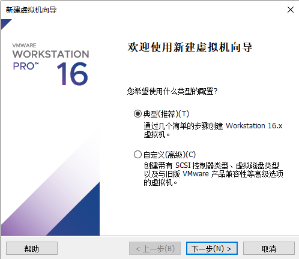

## Ubuntu 的安装

### 一、Ubuntu 介绍

Ubuntu（友帮拓、优般图、乌班图）是一个以桌面应用为主的开源 GNU/Linux 操作系统，Ubuntu 是基于 GNU/Linux，支持 x86、amd64（即 x64）和 ppc 架构，由全球化的专业开发团队（Canonical Ltd）打造的。
专业的 Python 开发者一般会选择 Ubuntu 这款 Linux 系统作为生产平台
温馨提示：
Ubuntu 和 Centos 都是基于 GNU/Linux 内核的，因此基本使用和 Centos 是几乎一样的，它们的各种指令可以通
用，在学习和使用 Ubuntu 的过程中，会发现各种操作指令在前面学习 CentOS 都使用过。只是界面和预安装的软件有所差别
Ubuntu 下载地址：http://cn.ubuntu.com/download/


### 二、安装步骤





等待安装，直到出现如下画面


### 三、配置

> 设置中文


### 四、获取 root 权限

> 方法1：sudo 命令

安装 ubuntu 成功后，都是普通用户权限，并没有最高 root 权限，如果需要使用 root 权限的时候，通常都会在命令前面加上 `sudo` 

```bash
wndexx@ubuntu:/$ fdisk -l
fdisk: 打不开 /dev/loop0: 权限不够
fdisk: 打不开 /dev/loop1: 权限不够
fdisk: 打不开 /dev/loop2: 权限不够
fdisk: 打不开 /dev/loop3: 权限不够
fdisk: 打不开 /dev/loop4: 权限不够
fdisk: 打不开 /dev/fd0: 权限不够
fdisk: 打不开 /dev/sda: 权限不够

wndexx@ubuntu:/$ sudo fdisk -l
[sudo] wndexx 的密码： 
Disk /dev/loop0：54.98 MiB，57626624 字节，112552 个扇区
单元：扇区 / 1 * 512 = 512 字节
扇区大小(逻辑/物理)：512 字节 / 512 字节
...

```


> 方法2：使用 su 命令切换到 root 用户

- 设置 root 密码

  如果没有给 root 设置初始密码，就会抛出 su : Authentication failure

  ```bash
  wndexx@ubuntu:~$ su - root
  Password: 
  su: Authentication failure
  ```

  ```bash
  # 给 root 设置密码
  wndexx@ubuntu:~$ sudo passwd
  [sudo] password for wndexx: 
  New password: 
  Retype new password: 
  passwd: password updated successfully
  ```

  

- 使用 su 命令切换到 root 用户

  ```bash
  su - root # - 可以省略
  
  
  wndexx@ubuntu:~$ su - root
  Password: 
  root@ubuntu:~# 
  
  
  # 提示符 $ 代表一般用户，# 代表 root 用户 
  ```

  

- 退出 root 用户

  ```bash
  # logout 或 exit
  
  wndexx@ubuntu:~$ su - root
  Password: 
  root@ubuntu:~# logout
  wndexx@ubuntu:~$ su - root
  Password: 
  root@ubuntu:~# exit
  logout
  wndexx@ubuntu:~$ 
  ```

  

### 五、Ubuntu 下开发 Python

#### 5.1 说明

 Ubuntu 默认已经安装好 Python 的开发环境

```bash
wndexx@ubuntu:~$ python3
Python 3.8.2 (default, Jul 16 2020, 14:00:26) 
[GCC 9.3.0] on linux
Type "help", "copyright", "credits" or "license" for more information.
>>> quit()
wndexx@ubuntu:~$ 
```


#### 5.2 测试

```bash
# 编写 hello.py 
vi hellp.py
#### hellp.py ####
print("hello,python")

# 运行 hello.py 
wndexx@ubuntu:~$ python3 hellp.py 
hello,python
```


