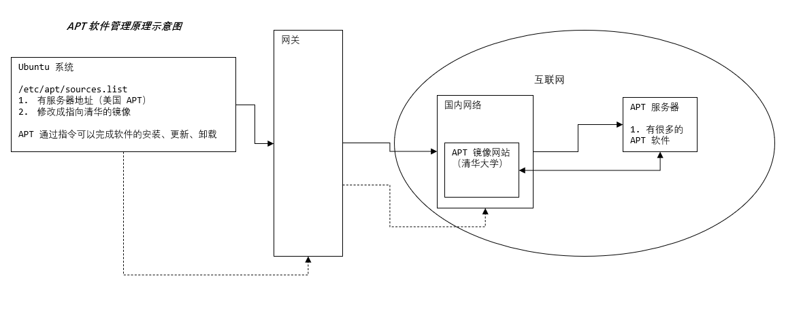
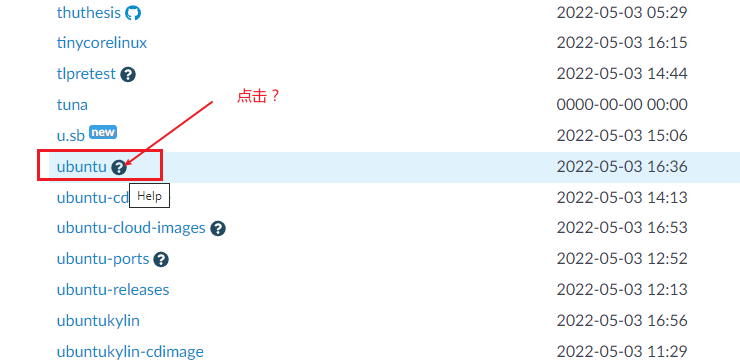
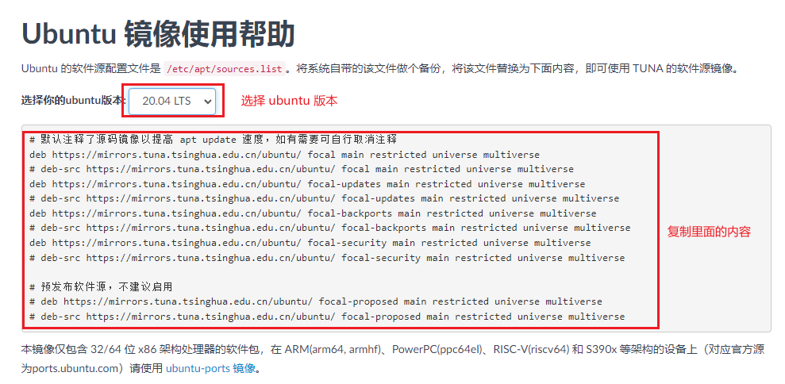
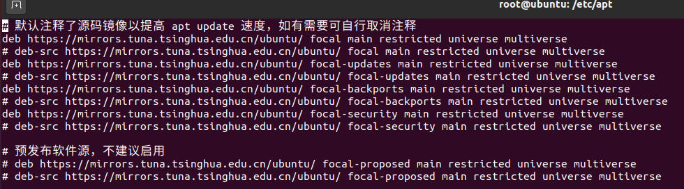
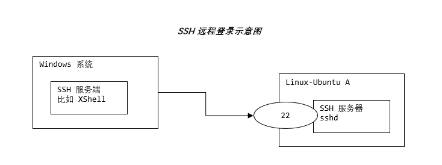
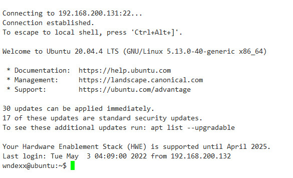
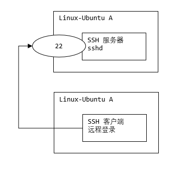
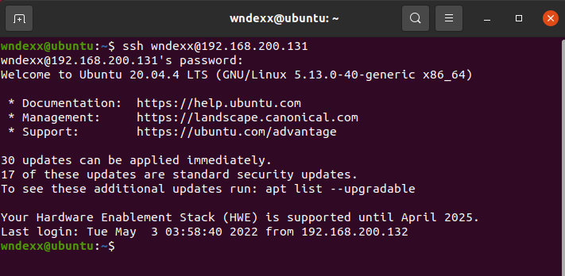

## APT 软件管理和远程登录

### 一、APT

#### 1.1 说明

apt 是 Advanced Packaging Tool 的简称，是一款安装包管理工具

在 Ubuntu 下，使用 apt 命令进行软件包的安装、删除、清理等，类似于 Windows 中的软件管理工具



#### 1.2 更新 ubuntu 软件下载地址

国内镜像源：https://mirrors.tuna.tsinghua.edu.cn/

所谓的镜像源：可以理解为提供下载软件的地方，比如 Android 手机上可以下载软件的安卓市场；iOS 手机上可
以下载软件的 AppStore

> 备份 /etc/apt/sources.list

```bash
sudo cp /etc/apt/sources.list /etc/apt/sources.list.backup
```


> 清空 /etc/apt/sources.list

```bash
su root
echo '' > /etc/apt/sources.list
```


> 复制镜像地址








注意：这里需要将 ==https== 改成 ==http== ，否则会下一步更新会失败


> 更新源地址

```bash
sudo apt-get update
```


> 测试安装、卸载 vim

```bash
# 安装 vim
sudo apt-get install vim

# 获取 vim 信息
sudo apt-cache show vim

# 卸载 vim
sudo apt-get remove vim
```


#### 1.3 apt 命令

| 命令                                      | 说明                                       |
| ----------------------------------------- | ------------------------------------------ |
| `sudo apt-get update`                     | 更新源                                     |
| `sudo apt-get install 软件包`             | 安装软件包                                 |
| `sudo apt-get remove 软件包`              | 卸载软件包                                 |
| `sudo apt-cache search 软件包`            | 搜索软件包                                 |
|                                           |                                            |
| `sudo apt-cache show 软件包`              | 获取软件包的相关信息，如说明、大小、版本等 |
| `sudo apt-get install 软件包 --reinstall` | 重新安装软件包                             |
| `sudo apt-get -f install`                 | 修复安装                                   |
| `sudo apt-get remove package --purge`     | 删除包，包括配置文件等                     |
| `sudo apt-get build-dep 软件包`           | 安装软件相关的编译环境                     |
|                                           |                                            |
| `sudo apt-get upgrade`                    | 更新已安装的所有软件包                     |
| `sudo apt-get dist-upgrade`               | 升级系统                                   |
| `sudo apt-cache depends 软件包`           | 了解该软件包依赖哪些包                     |
| `sudo apt-cache rdepends 软件包`          | 查看该软件包被那些包依赖                   |
| `sudo apt-get source 软件包`              | 下载该软件包的源代码                       |


### 二、远程登录

#### 2.1 SSH 介绍

SSH 为 Secure Shell 的缩写，由 IETF 的网络工作小组（Network Working Group）所制定

SSH 为建立在应用层和传输层基础上的安全协议。

SSH 是目前较可靠，专为远程登录会话和其他网络服务提供安全性的协议。常用于远程登录。几乎所有 UNIX/Linux 平台都可运行 SSH。

使用 SSH 服务，需要安装相应的服务器和客户端。客户端和服务器的关系：如果，A 机器想被 B 机器远程控制，那么，A 机器需要安装 SSH 服务器，B 机器需要安装 SSH 客户端



#### 2.2 安装 SSH 

centos 默认安装了 ssh ，系统启动时 sshd 服务就开启了，所以可以直接进行远程登录

ubuntu  默认没有安装 ssh，没有 sshd 服务

```bash
# 22 号端口没有启动
# 如果 netstat 命令无法使用，需要先安装 net-tools
# sudo apt-get install net-tools
wndexx@ubuntu:~$ netstat -anp | more
(Not all processes could be identified, non-owned process info
 will not be shown, you would have to be root to see it all.)
Active Internet connections (servers and established)
Proto Recv-Q Send-Q Local Address           Foreign Address         State       PID/Program name    
tcp        0      0 127.0.0.53:53           0.0.0.0:*               LISTEN      -      tcp        0      0 127.0.0.1:631           0.0.0.0:*               LISTEN      -     tcp6       0      0 ::1:631                 :::*                    LISTEN      -     
raw6       0      0 :::58                   :::*                    7           -      ...
```


> 安装 ssh

```bash
# 执行该指令后，在当前这台 Linux 上就安装了 SSH 服务端和客户端
sudo apt-get install openssh-server

# 启动 sshd 服务，开始监听 22 号端口
systemctl start sshd
# 或
service sshd start
```


启动 sshd 服务后，就可以通过 xshell 远程登录了




#### 2.3 从一台 linux 系统远程登录到另外一台 linux 系统



假设要从 ubuntuA 连接到 ubuntuB

- ubuntuB 需要安装 ssh 服务端，ubuntuA 需要安装 ssh 客户端

  ```bash
  # 执行该指令后，在当前 Linux 上就安装了 SSH 服务端和客户端
  sudo apt-get install openssh-server
  ```

  

- ubuntuB 需要启动 sshd 服务

  ```bash
  systemctl start sshd
  ```

  

- ubuntuA 连接到 ubuntuB

  ```bash
  # 这里 IP 是 ubuntuB 的 IP，用户名是 ubuntuB 的用户名
  ssh 用户名@IP
  
  # 使用 ssh 访问，如果访问出现错误，可查看是否有该文件 /.ssh/known_ssh，如果存在，删除即可
  ```

  

- 登出

  ```bash
  exit 或 logout
  ```

  




