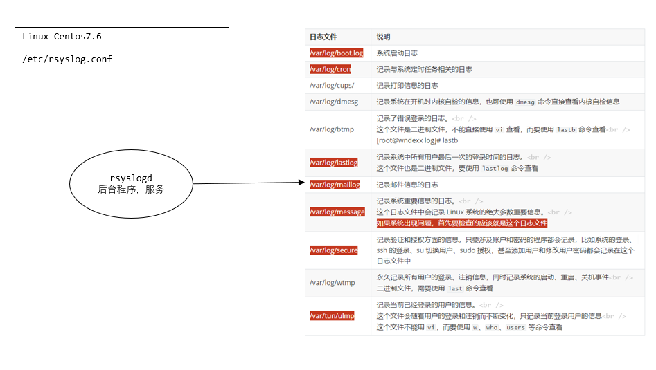
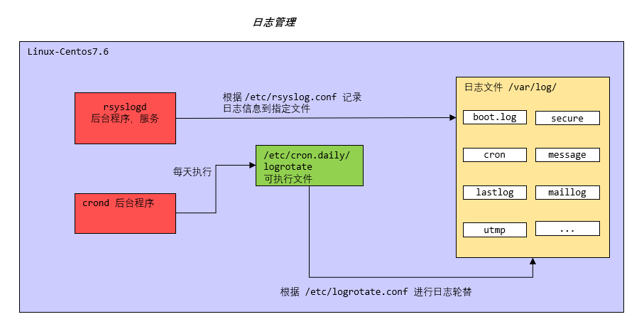

## 日志管理

### 一、基本介绍

- 日志文件是重要的系统信息文件，其中记录了许多重要的系统事件，包括用户的登录信息、系统的启动信息、系统的安全信息、邮件相关信息、各种服务相关信息等
- 日志对于安全来说也很重要，它记录了系统每天发生的各种事情，可以通过日志来检查错误发生的原因。或者受到攻击时攻击者留下的痕迹
- 可以这样理解，日志是用来记录重大事件的工具


### 二、系统常用的日志

#### 2.1 系统日志文件的保存位置

```bash
/var/log/
```


```bash
[root@wndexx ~]# cd /var/log/
[root@wndexx log]# ls
anaconda            libvirt            tallylog
audit               maillog            tuned
boot.log            maillog-20220424   vmware-install.log
boot.log-20220427   maillog-20220501   vmware-network.1.log
boot.log-20220428   messages           vmware-network.2.log
boot.log-20220429   messages-20220424  vmware-network.3.log
boot.log-20220430   messages-20220501  vmware-network.4.log
boot.log-20220501   mysqld.log         vmware-network.5.log
boot.log-20220502   ntpstats           vmware-network.6.log
boot.log-20220503   pluto              vmware-network.7.log
btmp                ppp                vmware-network.8.log
btmp-20220501       qemu-ga            vmware-network.9.log
chrony              rhsm               vmware-network.log
cron                sa                 vmware-vgauthsvc.log.0
cron-20220424       samba              vmware-vmsvc.log
cron-20220501       secure             vmware-vmusr.log
cups                secure-20220424    wpa_supplicant.log
dmesg               secure-20220501    wtmp
dmesg.old           speech-dispatcher  Xorg.0.log
firewalld           spooler            Xorg.0.log.old
gdm                 spooler-20220424   Xorg.9.log
glusterfs           spooler-20220501   yum.log
grubby_prune_debug  sssd
lastlog             swtpm

```


#### 2.2 系统常用的日志

| 日志文件              | 说明                                                         |
| --------------------- | ------------------------------------------------------------ |
| ==/var/log/boot.log== | 系统启动日志                                                 |
| ==/var/log/cron==     | 记录与系统定时任务相关的日志                                 |
| /var/log/cups/        | 记录打印信息的日志                                           |
| /var/log/dmesg        | 记录系统在开机时内核自检的信息，也可使用 `dmesg` 命令直接查看内核自检信息 |
| /var/log/btmp         | 记录了错误登录的日志。<br />这个文件是二进制文件，不能直接使用 `vi` 查看，而要使用 `lastb` 命令查看<br />[root@wndexx log]# lastb |
| ==/var/log/lastlog==  | 记录系统中所有用户最后一次的登录时间的日志。<br />这个文件也是二进制文件，要使用 `lastlog` 命令查看 |
| ==/var/log/maillog==  | 记录邮件信息的日志                                           |
| ==/var/log/message==  | 记录系统重要信息的日志。<br />这个日志文件中会记录 Linux 系统的绝大多数重要信息。<br />==如果系统出现问题，首先要检查的应该就是这个日志文件== |
| ==/var/log/secure==   | 记录验证和授权方面的信息，只要涉及账户和密码的程序都会记录，比如系统的登录、ssh 的登录、su 切换用户、sudo 授权，甚至添加用户和修改用户密码都会记录在这个日志文件中 |
| /var/log/wtmp         | 永久记录所有用户的登录、注销信息，同时记录系统的启动、重启、关机事件<br />二进制文件，需要使用 `last` 命令查看 |
| ==/var/tun/utmp==     | 记录当前已经登录的用户的信息。<br />这个文件会随着用户的登录和注销而不断变化，只记录当前登录用户的信息<br />这个文件不能用 `vi`，而要使用 `w`、`who`、`users` 等命令查看 |


#### 2.3 应用案例

```bash
# 使用 root 用户通过 xshell7 登录，第一次使用错误的密码，第二次使用正确的密码
# 观察日志文件 /vat/log/secure 是否记录相关信息

[root@wndexx log]# cat secure
...
May  4 11:30:35 wndexx sshd[5831]: Failed password for root from 192.168.200.1 port 9952 ssh2
May  4 11:30:41 wndexx sshd[5831]: Failed password for root from 192.168.200.1 port 9952 ssh2
May  4 11:30:43 wndexx sshd[5831]: Accepted password for root from 192.168.200.1 port 9952 ssh2
...
```


### 三、日志管理服务 rsyslogd

CentOS7.6 日志服务是 rsyslogd，CentOS6.x 日志服务是 syslogd

rsyslogd 功能更强大，rsyslogd 的使用、日志文件的格式，和 syslogd 服务是兼容的

==rsyslogd 服务根据 /etc/rsyslog.conf 配置文件的相关配置，将对应的日志信息记录到对应的日志文件==




#### 3.1 查询 Linux 中的 rsyslogd 服务是否启动

```bash
# grep -v 关键字 		挑选出不含有关键字的记录
ps aux | grep rsyslogd | grep -v grep
```


#### 3.2 查询 rsyslogd 服务的自启动状态

```bash
systemctl list-unit-files | grep rsyslog

# 或

systemctl is-enabled rsyslog
```


#### 3.3 配置文件 /etc/rsyslog.conf

> 编辑文件时的格式

```bash
*.*		存放日志的文件
# 其中第一个 * 代表日志类型，第二个 * 代表日志级别
```


> 日志类型

| 日志类型             | 说明                                 |
| -------------------- | ------------------------------------ |
| auth                 | pam 产生的日志                       |
| authpriv             | ssh、ftp 等登录信息的验证信息        |
| cron                 | 时间任务相关                         |
| kern                 | 内核                                 |
| lpr                  | 打印                                 |
| mail                 | 邮件                                 |
| mark(syslog)-rsyslog | 服务内部的信息，时间标识             |
| news                 | 新闻组                               |
| user                 | 用户程序产生的相关信息               |
| uucp                 | unix to unix copy 主机之间相关的通信 |
| local 1-7            | 自定义的日志设备                     |


> 日志级别

| 日志级别 | 说明                                               |
| -------- | -------------------------------------------------- |
| debug    | 有调试信息的，日志通信最多                         |
| info     | 一般信息日志，最常用                               |
| notice   | 最具有重要性的普通条件的信息                       |
| warning  | 警告级别                                           |
| err      | 错误级别，阻止某个功能或者模块不能正常工作的信息   |
| crit     | 严重级别，阻止整个系统或整个软件不能正常工作的信息 |
| alert    | 需要立即修改的信息                                 |
| emerg    | 内核崩溃等重要信息                                 |
| none     | 什么都不记录                                       |

==注意：从上倒下，级别从低到高，记录的信息越来越少==


#### 3.4 日志服务 rsyslogd 记录的日志文件

>  日志文件的格式包含以下 4 项

- 事件产生的时间

- 产生事件的服务器的主机名

- 产生事件的服务名或程序名

- 时间的具体信息

  

> 查看日志实例

```bash
# 查看一下 /var/log/secure 日志，这个日志中记录的时用户验证和授权方面的信息

时间			  主机名   服务                描述
May  4 11:30:33 wndexx unix_chkpwd[5833]: password check failed for user (root)
May  4 11:30:33 wndexx sshd[5831]: pam_unix(sshd:auth): authentication failure; logname= uid=0 euid=0 tty=ssh ruser= rhost=pc  user=root
May  4 11:30:33 wndexx sshd[5831]: pam_succeed_if(sshd:auth): requirement "uid >= 1000" not met by user "root"
May  4 11:30:35 wndexx sshd[5831]: Failed password for root from 192.168.200.1 port 9952 ssh2
May  4 11:30:39 wndexx unix_chkpwd[5834]: password check failed for user (root)
May  4 11:30:39 wndexx sshd[5831]: pam_succeed_if(sshd:auth): requirement "uid >= 1000" not met by user "root"
May  4 11:30:41 wndexx sshd[5831]: Failed password for root from 192.168.200.1 port 9952 ssh2
May  4 11:30:43 wndexx sshd[5831]: Accepted password for root from 192.168.200.1 port 9952 ssh2
May  4 11:30:43 wndexx sshd[5831]: pam_unix(sshd:session): session opened for user root by (uid=0)
May  4 12:37:31 wndexx sshd[5831]: pam_unix(sshd:session): session closed for user root

```


#### 3.5 自定义日志服务

```bash
# 在 /etc/rsyslog.conf 中添加一个日志文件 /var/log/my.log ，当有事件发送时（比如 sshd 服务相关事件），该文件会接收到信息并保存
vim /etc/rsyslog.conf 

### /etc/rsyslog.conf ###
# 增加自定义的日志
*.*                                                     /var/log/my.log

reboot
cat /etc/rsyslog.conf | grep sshd
May  4 13:53:35 wndexx sshd[4349]: Server listening on 0.0.0.0 port 22.
May  4 13:53:35 wndexx sshd[4349]: Server listening on :: port 22.
May  4 13:53:43 wndexx sshd[4637]: Accepted password for root from 192.168.200.1 port 1182 ssh2
May  4 13:53:43 wndexx sshd[4637]: pam_unix(sshd:session): session opened for user root by (uid=0)
```


### 四、日志轮替

#### 4.1 基本介绍

日志轮替就是把旧的日志文件移动并改名，同时建立新的空日志文件，当旧日志文件超出保存的范围之后，就会进行删除


#### 4.2 日志轮替文件命名

centos7 使用 logrotate 进行日志轮替管理，要想改变日志轮替文件名字，通过 /etc/logrotate/conf 配置文件中的 dateext 参数

- 如果配置文件中有 "dateext" 参数，那么日志会用==日期==来作为日志文件的后缀，例如 "secure-20010101"。
  - 这样日志文件名不会重叠，也就不需要日志文件的改名，只需要指定保存日志个数，删除多余的日志文件即可
- 如果配置文件中没有 "dateext" 参数，日志文件就需要进行改名了。
  - 第一次进行日志轮替时，当前的 "secure" 日志会自动改名为 "secure.1"，然后新建 "secure" 日志，用来保存新的日志
  - 当第二次进行日志轮替时，"secure.1" 会自动改名为 "secure.2"，当前的 "secure" 日志会自动改名为 "secure.1"，然后再次新建 "secure" 日志，用来保存新的日志，依此类推


#### 4.3 logrotate 配置文件

> /etc/logrotate.conf 为 logrotate 的全局配置文件

```properties
# rotate log files weekly. 每周对日志文件进行一次轮替
weekly
# keep 4 weeks worth of. 共保存 4 份日志文件，当建立新的日志文件时，旧的将会被删除
rotate 4
# create new (empty) log files after rotating old ones. 创建新的日志文件，在日志轮替后
create
# use date as a suffix of the rotated file. 使用日期作为日志轮替文件的后缀
dateext
# uncomment this if you want your log files compressed. 日志文件是否压缩，如果取消注释，则日志会在转储的同时进行压缩
# compress
# RPM packages drop log  ratation information into this directory
include /etc/logrotate.d
# 包含 /etc/logrotate.d/ 目录中所有的子配置文件。也就是说会把这个目录中所有子配置文件读取进来

# 下面是单独设置，优先级更高

# no packages own wtmp and btmp -- we'll rotate them here
/var/log/wtmp{
	# 每月对日志文件进行一次轮替
    monthly
    # 建立新的日志文件，权限是 0664，所有者是 root，所属组是 utmp 组
    create 0664 root utmp
    # 日志文件最小轮替大小是 1MB，也就是日志一定要超过 1MB 才会进行轮替，否则就算时间达到一个月，也不进行日志轮替
    minsize 1M 
    # 仅保留一个日志备份。也就是只有 wtmp 和 wtmp.1 日志保留而已
    rotate 1 
}
/var/log/btmp{
	# 如果日志不存在，则忽略该日志的警告信息
    missingok
    monthly
    create 0600 root utmp
    rotate 1
}
```


对 "include /etc/logrotate.d" 的解释：把某个日志文件的轮替规则写到 /etc/logrotate.d 目录下会被加入到主配置文件中，达到和在主配置文件中进行配置一样的效果

```bash
[root@wndexx log]# cd /etc/logrotate.d/
[root@wndexx logrotate.d]# ls
bootlog  chrony  cups  glusterfs  iscsiuiolog  libvirtd  libvirtd.qemu  mysql  numad  ppp  psacct  samba  sssd  syslog  wpa_supplicant  yum
[root@wndexx logrotate.d]# cat bootlog
/var/log/boot.log
{
    missingok
    daily
    copytruncate
    rotate 7
    notifempty
}
```


> 参数说明

| 参数                                       | 说明                                                         |
| ------------------------------------------ | ------------------------------------------------------------ |
| daily                                      | 日志的轮替周期是每天                                         |
| weekly                                     | 日志的轮替周期是每周                                         |
| monthly                                    | 日志的轮替周期是每月                                         |
|                                            |                                                              |
| rotate 数字                                | 保留的日志文件的个数，0 指没有备份                           |
| compress                                   | 日志轮替时，旧的日志进行压缩                                 |
| create 权限 所有者 所属组                  | 建立新日志，同时指定新日志的权限、所有者、所属组             |
| mail 邮件地址                              | 当日志轮替时，输出内容通过邮件发送到指定的邮件地址           |
| missingok                                  | 在日志轮替期间，任何错误将被忽略，例如“文件无法找到”之类的错误<br />防止因为旧的备份文件不存在导致无法进行日志轮替的发生 |
| notifempty                                 | 如果日志为空文件，则不进行日志轮替                           |
| minsize 大小                               | 日志轮替的最小值。<br />也就是日志一定要达到这个最小值才会轮替，否则就算时间达到也不轮替 |
| copytruncate                               | 用于还在打开中的日志文件，把当前日志备份并截断。<br /> 把正在输出的日志拷 (copy) 一份出来，再清空 (trucate) 原来的日志。 |
|                                            |                                                              |
| size 大小                                  | 日志只有大于指定大小才进行日志轮替，而不是按照事件轮替       |
| dateext                                    | 使用日期作为日志轮替文件的后缀                               |
| sharedscripts<br />      脚本              | 在此关键字之后的脚本只执行一次                               |
| prerotate<br />      脚本<br />endscripts  | 在日志轮替之前执行脚本命令                                   |
| postrotate<br />      脚本<br />endscripts | 在日志轮替之后执行脚本命令                                   |


#### 4.4 自定义日志轮替

把自己的日志加入日志轮替

> 方法一

直接在 /etc/logrotate.conf 配置文件中写入该日志的轮替策略


> 方法二

在 /etc/logrotate.d/ 目录中新建立该日志的轮替文件，在该轮替文件中写入正确的轮替策略，因为该目录中的文件都会被 "include " 到主配置文件中，所以效果等同于方法一


推荐使用第二种方法，因为系统中需要轮替的日志非常多，如果全都直接写入 /etc/logrotate.conf 配置文件，那么这个文件的可管理性就会非常差，不利于此文件的维护


> 案例

在 /etc/logrotate.conf 进行配置，或者直接在 /etx/logrotate.d/ 下创建文件 mylog，仿照 /etc/logrotate.d/bootlog 编写自定义的日志文件的轮替策略

```bash
vim /etc/logrotate.d/mylog
/etc/log/my.log{
	missingok
	daily
	copytruncate
	rotate 7
	notifyempty
}
```


```bash
boot.log            maillog-20220424   vmware-install.log
boot.log-20220427   maillog-20220501   vmware-network.1.log
boot.log-20220428   messages           vmware-network.2.log
boot.log-20220429   messages-20220424  vmware-network.3.log
boot.log-20220430   messages-20220501  vmware-network.4.log
boot.log-20220501   mysqld.log         vmware-network.5.log
boot.log-20220502   ntpstats           vmware-network.6.log
boot.log-20220503
```


说明：

- boot.log-20220503 备份的是 2022-05-02 到 2022-05-03 之间的 boot.log 文件
- 对于 notifyempty，如果轮替的时候当前的日志文件为空，则不会进行日志轮替，等到下一次轮替
  - 这样不会导致空的日志文件顶替掉旧的日志文件


#### 4.5 日志轮替机制原理

之所以可以通过日志轮替在指定的时间备份日志，是依赖==系统定时任务==

在 /etc/cron.daily/ 目录，会发现有一个可执行的 logrotate 文件，logrotate 通过这个文件依赖定时任务执行的

```bash
[root@wndexx ~]# ls -l /etc/cron.daily/
总用量 12
-rwx------. 1 root root 219 10月 31 2018 logrotate
-rwxr-xr-x. 1 root root 618 10月 30 2018 man-db.cron
-rwx------. 1 root root 208 4月  11 2018 mlocate
```





#### 4.6 内存日志

在 linux 系统中，有些日志是时刻变化的，跟当前系统的运行情况相关，比如内核相关的日志，此时可以先将日志写到内存中


> journalctl 指令

`journalctl` 可以查看内存日志

| 指令                                                         | 说明                                       |
| ------------------------------------------------------------ | ------------------------------------------ |
| journalctl                                                   | 查看全部                                   |
| journalctl -n 3                                              | 查看最新 3 条                              |
| journalctl --since 19:00 --until 19:10:10                    | 查看起始时间到结束时间的内存日志。可加日期 |
| journalctl -p err                                            | 报错日志                                   |
| journalctl -o verbose                                        | 日志详细信息                               |
| journalctl _PID=1245 _COMM=sshd<br />或<br />journalctl \| grep sshd | 查看包含这些参数的日志（在详细日志查看）   |

注意：==journalctl 查看的是内存日志，重启清空==


> 案例

```bash
# 使用 journalctl | grep sshd 查看当前用户登录情况
journalctl | grep sshd
```


