## 定制自己的 Linux 系统

通过裁剪现有 Linux 系统（CentOS7.6），创建属于自己的 min Linux 小系统 

### 一、Linux 启动流程

1. 首先 Linux 通过自检，检查硬件设备有没有故障
2. 如果有多块启动盘，需要在 BIOS 中选择启动磁盘
3. 启动 MBR（主引导记录（MBR），也被称为主引导扇区，是计算机开机以后访问硬盘时所必须要读取的第一个扇区） 中的 bootloader 引导程序
4. 加载内核文件
5. 执行所有进程的父进程 systemd
6. 欢迎界面

在 Linux 的启动流程中，加载内核文件时，涉及到的关键文件：

- kernel 文件：vmlinuz-3.10.0-957.el7.x86_64
- initrd 文件：initramfs-3.10.0-957.el7.x86_64.img


### 二、制作 min linux 思路分析

1. 在现有的 Linux 系统（centos7.6）上加一块硬盘 /dev/sdb。
   - 在硬盘上分两个分区，一个是 /boot，一个是 /，并将其格式化。
   - 需要明确的是，现在加的这个硬盘在现有的 Linux 系统中是 /dev/sdb，当把所有东西设置好，要把这个硬盘拔除，放在新系统上，此时，就是 /dev/sda
2. 在 /dev/sdb 硬盘上，将其打造成独立的 Linux 系统，里面的所有文件是需要拷贝进去的
3. 作为能独立运行的 Linux 系统，内核一定不能少，要把内核文件和 initramfs 文件也一起拷贝到 /dev/sdb 上
4. 以上步骤完成，自制 Linux 就完成，创建一个新的 linux 虚拟机，将其硬盘指向常见的硬盘，启动即可

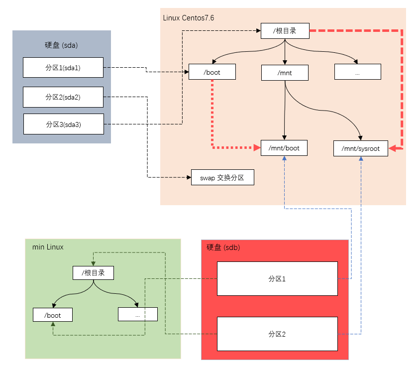


### 三、具体步骤

#### 3.1 在现有的 linux 添加一块大小为 20G 的硬盘

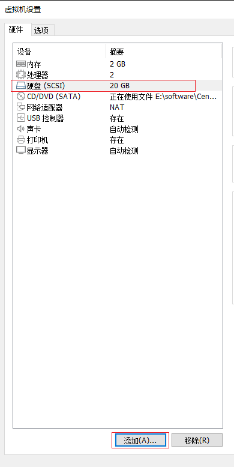


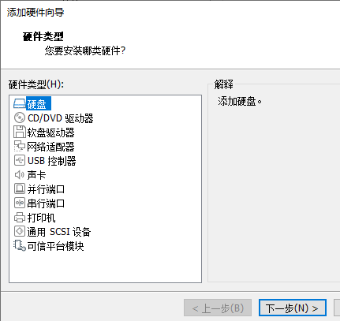

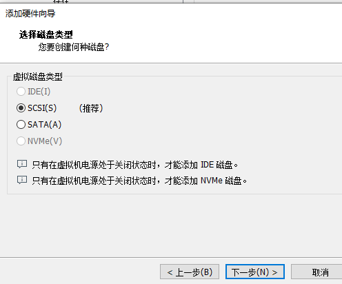

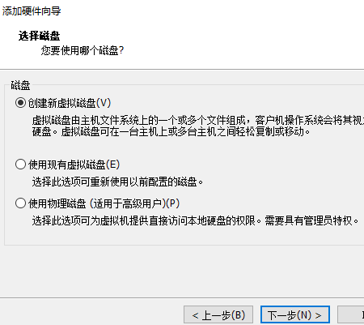


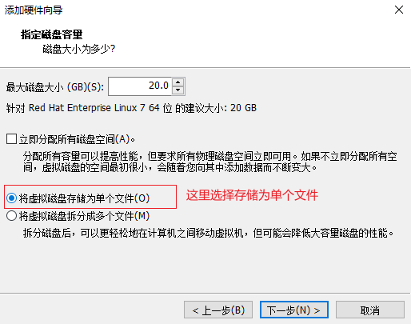


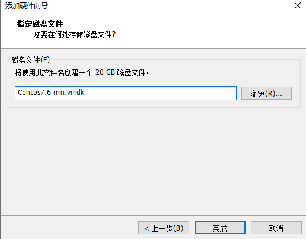


查看硬盘分区和挂载情况

```bash
[root@wndexx ~]# lsblk
NAME   MAJ:MIN RM  SIZE RO TYPE MOUNTPOINT
sda      8:0    0   20G  0 disk 
├─sda1   8:1    0    1G  0 part /boot
├─sda2   8:2    0    2G  0 part [SWAP]
└─sda3   8:3    0   17G  0 part /
sdb      8:16   0   20G  0 disk 
sr0     11:0    1  4.3G  0 rom  /run/media/root/CentOS 7 x86_64
```


#### 3.2 硬盘分区

```bash
[root@wndexx ~]# fdisk /dev/sdb
欢迎使用 fdisk (util-linux 2.23.2)。

更改将停留在内存中，直到您决定将更改写入磁盘。
使用写入命令前请三思。

Device does not contain a recognized partition table
使用磁盘标识符 0x321fd798 创建新的 DOS 磁盘标签。

命令(输入 m 获取帮助)：m
命令操作
   a   toggle a bootable flag
   b   edit bsd disklabel
   c   toggle the dos compatibility flag
   d   delete a partition
   g   create a new empty GPT partition table
   G   create an IRIX (SGI) partition table
   l   list known partition types
   m   print this menu
   n   add a new partition
   o   create a new empty DOS partition table
   p   print the partition table
   q   quit without saving changes
   s   create a new empty Sun disklabel
   t   change a partition's system id
   u   change display/entry units
   v   verify the partition table
   w   write table to disk and exit
   x   extra functionality (experts only)

命令(输入 m 获取帮助)：n
Partition type:
   p   primary (0 primary, 0 extended, 4 free)
   e   extended
Select (default p): p
分区号 (1-4，默认 1)：
起始 扇区 (2048-41943039，默认为 2048)：
将使用默认值 2048
# Last 扇区, +扇区 or +size{K,M,G} (2048-41943039，默认为 41943039)：+500M
分区 1 已设置为 Linux 类型，大小设为 500 MiB

命令(输入 m 获取帮助)：n
Partition type:
   p   primary (1 primary, 0 extended, 3 free)
   e   extended
Select (default p): 
Using default response p
分区号 (2-4，默认 2)：
起始 扇区 (1026048-41943039，默认为 1026048)：
将使用默认值 1026048
# Last 扇区, +扇区 or +size{K,M,G} (1026048-41943039，默认为 41943039)：
将使用默认值 41943039
分区 2 已设置为 Linux 类型，大小设为 19.5 GiB

# 命令(输入 m 获取帮助)：w
The partition table has been altered!

Calling ioctl() to re-read partition table.
正在同步磁盘。

```


```bash
[root@wndexx ~]# lsblk
NAME   MAJ:MIN RM  SIZE RO TYPE MOUNTPOINT
sda      8:0    0   20G  0 disk 
├─sda1   8:1    0    1G  0 part /boot
├─sda2   8:2    0    2G  0 part [SWAP]
└─sda3   8:3    0   17G  0 part /
sdb      8:16   0   20G  0 disk 
├─sdb1   8:17   0  500M  0 part 
└─sdb2   8:18   0 19.5G  0 part 
sr0     11:0    1  4.3G  0 rom  /run/media/root/CentOS 7 x86_64
```


#### 3.3 分区格式化

```bash
mkfs.ext4 /dev/sdb1
mkfs.ext4 /dev/sdb2
```


```bash
[root@wndexx ~]# mkfs.ext4 /dev/sdb1   # 相当于 mkfs -t ext4 /dev/sdb1 
mke2fs 1.42.9 (28-Dec-2013)
文件系统标签=
OS type: Linux
块大小=1024 (log=0)
分块大小=1024 (log=0)
Stride=0 blocks, Stripe width=0 blocks
128016 inodes, 512000 blocks
25600 blocks (5.00%) reserved for the super user
第一个数据块=1
Maximum filesystem blocks=34078720
63 block groups
8192 blocks per group, 8192 fragments per group
2032 inodes per group
Superblock backups stored on blocks: 
	8193, 24577, 40961, 57345, 73729, 204801, 221185, 401409

Allocating group tables: 完成                            
正在写入inode表: 完成                            
Creating journal (8192 blocks): 完成
Writing superblocks and filesystem accounting information: 完成 

[root@wndexx ~]# mkfs.ext4 /dev/sdb2
mke2fs 1.42.9 (28-Dec-2013)
文件系统标签=
OS type: Linux
块大小=4096 (log=2)
分块大小=4096 (log=2)
Stride=0 blocks, Stripe width=0 blocks
1281120 inodes, 5114624 blocks
255731 blocks (5.00%) reserved for the super user
第一个数据块=0
Maximum filesystem blocks=2153775104
157 block groups
32768 blocks per group, 32768 fragments per group
8160 inodes per group
Superblock backups stored on blocks: 
	32768, 98304, 163840, 229376, 294912, 819200, 884736, 1605632, 2654208, 
	4096000

Allocating group tables: 完成                            
正在写入inode表: 完成                            
Creating journal (32768 blocks): 完成
Writing superblocks and filesystem accounting information: 完成  
```


#### 3.4 挂载分区

```bash
# mkdir 可以同时创建两个或多个目录，用空格隔开
mkdir -p /mnt/boot /mnt/sysroot
mount /dev/sdb1 /mnt/boot
mount /dev/sdb2 /mnt/sysroot
```


```bash
[root@wndexx ~]# mkdir -p /mnt/boot /mnt/sysroot
[root@wndexx ~]# mount /dev/sdb1 /mnt/boot
[root@wndexx ~]# mount /dev/sdb2 /mnt/sysroot
[root@wndexx ~]# lsblk
NAME   MAJ:MIN RM  SIZE RO TYPE MOUNTPOINT
sda      8:0    0   20G  0 disk 
├─sda1   8:1    0    1G  0 part /boot
├─sda2   8:2    0    2G  0 part [SWAP]
└─sda3   8:3    0   17G  0 part /
sdb      8:16   0   20G  0 disk 
├─sdb1   8:17   0  500M  0 part /mnt/boot
└─sdb2   8:18   0 19.5G  0 part /mnt/sysroot
sr0     11:0    1  4.3G  0 rom  /run/media/root/CentOS 7 x86_64
```


#### 3.5 安装 grub

> **GNU GRUB**（简称“GRUB”）是一个来自GNU项目的启动引导程序。GRUB是多启动规范的实现，它允许用户可以在计算机内同时拥有多个操作系统，并在计算机启动时选择希望运行的操作系统。GRUB可用于选择操作系统分区上的不同内核，也可用于向这些内核传递启动参数。
>
> GNU GRUB的前身为**Grand Unified Bootloader**。它主要用于类Unix系统；同大多Linux发行版一样，GNU系统也采用GNU GRUB作为它的==启动器==。Solaris从10 1/06版开始在x86系统上也采用GNU GRUB作为启动器。

```bash
grub2-install --root-directory=/mnt /dev/sdb
# 确认是否安装成功
hexdump -C -n 512 /dev/sdb
```


```bash
[root@wndexx ~]# grub2-install --root-directory=/mnt /dev/sdb
Installing for i386-pc platform.
Installation finished. No error reported.
[root@wndexx ~]# hexdump -C -n 512 /dev/sdb
00000000  eb 63 90 00 00 00 00 00  00 00 00 00 00 00 00 00  |.c..............|
00000010  00 00 00 00 00 00 00 00  00 00 00 00 00 00 00 00  |................|
*
00000050  00 00 00 00 00 00 00 00  00 00 00 80 01 00 00 00  |................|
00000060  00 00 00 00 ff fa 90 90  f6 c2 80 74 05 f6 c2 70  |...........t...p|
00000070  74 02 b2 80 ea 79 7c 00  00 31 c0 8e d8 8e d0 bc  |t....y|..1......|
00000080  00 20 fb a0 64 7c 3c ff  74 02 88 c2 52 be 05 7c  |. ..d|<.t...R..||
00000090  b4 41 bb aa 55 cd 13 5a  52 72 3d 81 fb 55 aa 75  |.A..U..ZRr=..U.u|
000000a0  37 83 e1 01 74 32 31 c0  89 44 04 40 88 44 ff 89  |7...t21..D.@.D..|
000000b0  44 02 c7 04 10 00 66 8b  1e 5c 7c 66 89 5c 08 66  |D.....f..\|f.\.f|
000000c0  8b 1e 60 7c 66 89 5c 0c  c7 44 06 00 70 b4 42 cd  |..`|f.\..D..p.B.|
000000d0  13 72 05 bb 00 70 eb 76  b4 08 cd 13 73 0d 5a 84  |.r...p.v....s.Z.|
000000e0  d2 0f 83 de 00 be 85 7d  e9 82 00 66 0f b6 c6 88  |.......}...f....|
000000f0  64 ff 40 66 89 44 04 0f  b6 d1 c1 e2 02 88 e8 88  |d.@f.D..........|
00000100  f4 40 89 44 08 0f b6 c2  c0 e8 02 66 89 04 66 a1  |.@.D.......f..f.|
00000110  60 7c 66 09 c0 75 4e 66  a1 5c 7c 66 31 d2 66 f7  |`|f..uNf.\|f1.f.|
00000120  34 88 d1 31 d2 66 f7 74  04 3b 44 08 7d 37 fe c1  |4..1.f.t.;D.}7..|
00000130  88 c5 30 c0 c1 e8 02 08  c1 88 d0 5a 88 c6 bb 00  |..0........Z....|
00000140  70 8e c3 31 db b8 01 02  cd 13 72 1e 8c c3 60 1e  |p..1......r...`.|
00000150  b9 00 01 8e db 31 f6 bf  00 80 8e c6 fc f3 a5 1f  |.....1..........|
00000160  61 ff 26 5a 7c be 80 7d  eb 03 be 8f 7d e8 34 00  |a.&Z|..}....}.4.|
00000170  be 94 7d e8 2e 00 cd 18  eb fe 47 52 55 42 20 00  |..}.......GRUB .|
00000180  47 65 6f 6d 00 48 61 72  64 20 44 69 73 6b 00 52  |Geom.Hard Disk.R|
00000190  65 61 64 00 20 45 72 72  6f 72 0d 0a 00 bb 01 00  |ead. Error......|
000001a0  b4 0e cd 10 ac 3c 00 75  f4 c3 00 00 00 00 00 00  |.....<.u........|
000001b0  00 00 00 00 00 00 00 00  98 d7 1f 32 00 00 00 20  |...........2... |
000001c0  21 00 83 dd 1e 3f 00 08  00 00 00 a0 0f 00 00 dd  |!....?..........|
000001d0  1f 3f 83 d4 a2 32 00 a8  0f 00 00 58 70 02 00 00  |.?...2.....Xp...|
000001e0  00 00 00 00 00 00 00 00  00 00 00 00 00 00 00 00  |................|
000001f0  00 00 00 00 00 00 00 00  00 00 00 00 00 00 55 aa  |..............U.|
00000200
```


#### 3.6 拷贝内核文件指目标磁盘

```bash
\cp -r /boot/* /mnt/boot
```


#### 3.7 修改 grub2/grub.cfg 文件

```bash
vim /mnt/root/grub2/grub.cfg
```


```bash
### BEGIN /etc/grub.d/10_linux ###
menuentry 'CentOS Linux (3.10.0-957.el7.x86_64) 7 (Core)' --class centos --class gnu-linux --class gnu --class os --unrestricted $menuentry_id_option 'gnulinux-3.10.0-957.el7.x86_64-advanced-4ae6086f-5da8-4f2f-83af-54769e2d59f3' {
        load_video
        set gfxpayload=keep
        insmod gzio
        insmod part_msdos
        insmod ext2
        set root='hd0,msdos1'
        if [ x$feature_platform_search_hint = xy ]; then
          search --no-floppy --fs-uuid --set=root --hint-bios=hd0,msdos1 --hint-efi=hd0,msdos1 --hint-baremetal=ahci0,msdos1 --hint='hd0,msdos1'  b2ea9672-9ffc-4cd2-a231-8b17f822bfa5
        else
          search --no-floppy --fs-uuid --set=root b2ea9672-9ffc-4cd2-a231-8b17f822bfa5
        fi
        linux16 /vmlinuz-3.10.0-957.el7.x86_64 root=UUID=4ae6086f-5da8-4f2f-83af-54769e2d59f3 ro rhgb quiet LANG=zh_CN.UTF-8
        initrd16 /initramfs-3.10.0-957.el7.x86_64.img
}
menuentry 'CentOS Linux (0-rescue-532787cee8ce4249a6c7c4c5ac01d6dd) 7 (Core)' --class centos --class gnu-linux --class gnu --class os --unrestricted $menuentry_id_option 'gnulinux-0-rescue-532787cee8ce4249a6c7c4c5ac01d6dd-advanced-4ae6086f-5da8-4f2f-83af-54769e2d59f3' {
        load_video
        insmod gzio
        insmod part_msdos
        insmod ext2
        set root='hd0,msdos1'
        if [ x$feature_platform_search_hint = xy ]; then
          search --no-floppy --fs-uuid --set=root --hint-bios=hd0,msdos1 --hint-efi=hd0,msdos1 --hint-baremetal=ahci0,msdos1 --hint='hd0,msdos1'  b2ea9672-9ffc-4cd2-a231-8b17f822bfa5
        else
          search --no-floppy --fs-uuid --set=root b2ea9672-9ffc-4cd2-a231-8b17f822bfa5
        fi
        linux16 /vmlinuz-0-rescue-532787cee8ce4249a6c7c4c5ac01d6dd root=UUID=4ae6086f-5da8-4f2f-83af-54769e2d59f3 ro rhgb quiet
        initrd16 /initramfs-0-rescue-532787cee8ce4249a6c7c4c5ac01d6dd.img
}

### END /etc/grub.d/10_linux ###

```


```bash
### BEGIN /etc/grub.d/10_linux ###
menuentry 'CentOS Linux (3.10.0-957.el7.x86_64) 7 (Core)' --class centos --class gnu-linux --class gnu --class os --unrestricted $menuentry_id_option 'gnulinux-3.10.0-957.el7.x86_64-advanced-4ae6086f-5da8-4f2f-83af-54769e2d59f3' {
        load_video
        set gfxpayload=keep
        insmod gzio
        insmod part_msdos
        insmod ext2
        set root='hd0,msdos1'
        if [ x$feature_platform_search_hint = xy ]; then
          search --no-floppy --fs-uuid --set=root --hint-bios=hd0,msdos1 --hint-efi=hd0,msdos1 --hint-baremetal=ahci0,msdos1 --hint='hd0,msdos1'  0e560337-5e99-48af-9e3b-111ce748d3fc
        else
          search --no-floppy --fs-uuid --set=root 0e560337-5e99-48af-9e3b-111ce748d3fc
        fi
        linux16 /vmlinuz-3.10.0-957.el7.x86_64 root=UUID=74d2a31a-f672-46ed-b60d-4a4bfbf2a036 ro rhgb quiet LANG=zh_CN.UTF-8 selinux=0 init=/bin/bash
        initrd16 /initramfs-3.10.0-957.el7.x86_64.img
}
menuentry 'CentOS Linux (0-rescue-532787cee8ce4249a6c7c4c5ac01d6dd) 7 (Core)' --class centos --class gnu-linux --class gnu --class os --unrestricted $menuentry_id_option 'gnulinux-0-rescue-532787cee8ce4249a6c7c4c5ac01d6dd-advanced-4ae6086f-5da8-4f2f-83af-54769e2d59f3' {
        load_video
        insmod gzio
        insmod part_msdos
        insmod ext2
        set root='hd0,msdos1'
        if [ x$feature_platform_search_hint = xy ]; then
          search --no-floppy --fs-uuid --set=root --hint-bios=hd0,msdos1 --hint-efi=hd0,msdos1 --hint-baremetal=ahci0,msdos1 --hint='hd0,msdos1'  0e560337-5e99-48af-9e3b-111ce748d3fc
        else
          search --no-floppy --fs-uuid --set=root 0e560337-5e99-48af-9e3b-111ce748d3fc
        fi
        linux16 /vmlinuz-0-rescue-532787cee8ce4249a6c7c4c5ac01d6dd root=UUID=74d2a31a-f672-46ed-b60d-4a4bfbf2a036 ro rhgb quiet selinux=0 init=/bin/bash
        initrd16 /initramfs-0-rescue-532787cee8ce4249a6c7c4c5ac01d6dd.img
}

### END /etc/grub.d/10_linux ###

```


```bash
root@wndexx ~]# lsblk -f
NAME   FSTYPE  LABEL           UUID                                 MOUNTPOINT
sda                                                                 
├─sda1 ext4                    b2ea9672-9ffc-4cd2-a231-8b17f822bfa5 /boot
├─sda2 swap                    938b067f-b4df-44f8-b814-f37850ae4c27 [SWAP]
└─sda3 ext4                    4ae6086f-5da8-4f2f-83af-54769e2d59f3 /
sdb                                                                 
├─sdb1 ext4                    0e560337-5e99-48af-9e3b-111ce748d3fc /mnt/boot
└─sdb2 ext4                    74d2a31a-f672-46ed-b60d-4a4bfbf2a036 /mnt/sysroot
sr0    iso9660 CentOS 7 x86_64 2018-11-25-23-54-16-00               /run/media/r
[root@wndexx ~]# 
```


#### 3.8 创建目标文件根文件系统

```bash
mkdir -pv /mnt/sysroot/{etc/rc.d,usr,var,proc,sys,dev,lib,lib64,bin,sbin,boot,srv,mnt,media,home,root} 
```


```bash
[root@wndexx grub2]# mkdir -pv /mnt/sysroot/{etc/rc.d,usr,var,proc,sys,dev,lib,lib64,bin,sbin,boot,srv,mnt,media,home,root}
mkdir: 已创建目录 "/mnt/sysroot/etc"
mkdir: 已创建目录 "/mnt/sysroot/etc/rc.d"
mkdir: 已创建目录 "/mnt/sysroot/usr"
mkdir: 已创建目录 "/mnt/sysroot/var"
mkdir: 已创建目录 "/mnt/sysroot/proc"
mkdir: 已创建目录 "/mnt/sysroot/sys"
mkdir: 已创建目录 "/mnt/sysroot/dev"
mkdir: 已创建目录 "/mnt/sysroot/lib"
mkdir: 已创建目录 "/mnt/sysroot/lib64"
mkdir: 已创建目录 "/mnt/sysroot/bin"
mkdir: 已创建目录 "/mnt/sysroot/sbin"
mkdir: 已创建目录 "/mnt/sysroot/boot"
mkdir: 已创建目录 "/mnt/sysroot/srv"
mkdir: 已创建目录 "/mnt/sysroot/mnt"
mkdir: 已创建目录 "/mnt/sysroot/media"
mkdir: 已创建目录 "/mnt/sysroot/home"
mkdir: 已创建目录 "/mnt/sysroot/root"
```


#### 3.9 拷贝需要的 bash(也可拷贝需要的指令) 和库文件给新的系统使用

```bash
cp /lib64/*.* /mnt/sysroot/lib64/
cp /bin/bash /mnt/sysroot/bin/
```


```bash
[root@wndexx grub2]# cp /lib64/*.* /mnt/sysroot/lib64/
cp: 略过目录"/lib64/db4.7.25"
cp: 略过目录"/lib64/dleyna-1.0"
cp: 略过目录"/lib64/farstream-0.1"
cp: 略过目录"/lib64/farstream-0.2"
cp: 略过目录"/lib64/gdk-pixbuf-2.0"
cp: 略过目录"/lib64/girepository-1.0"
cp: 略过目录"/lib64/gnome-settings-daemon-3.0"
cp: 略过目录"/lib64/goa-1.0"
cp: 略过目录"/lib64/grilo-0.3"
cp: 略过目录"/lib64/gstreamer-0.10"
cp: 略过目录"/lib64/gstreamer-1.0"
cp: 略过目录"/lib64/gtk-2.0"
cp: 略过目录"/lib64/gtk-3.0"
cp: 略过目录"/lib64/libcanberra-0.30"
cp: 略过目录"/lib64/libpeas-1.0"
cp: 略过目录"/lib64/mission-control-plugins.0"
cp: 略过目录"/lib64/pulse-10.0"
cp: 略过目录"/lib64/python2.7"
cp: 略过目录"/lib64/tracker-1.0"
cp: 略过目录"/lib64/vte-2.91"
cp: 略过目录"/lib64/webkit2gtk-4.0"
[root@wndexx grub2]# cp /bin/bash /mnt/sysroot/bin/
```


#### 3.10 创建一个新的虚拟机，将默认分配的硬盘移除掉，指向刚刚创建的磁盘

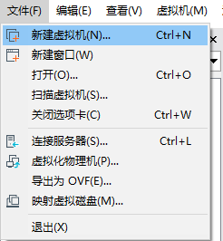


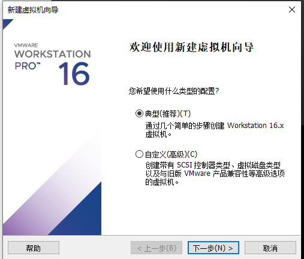

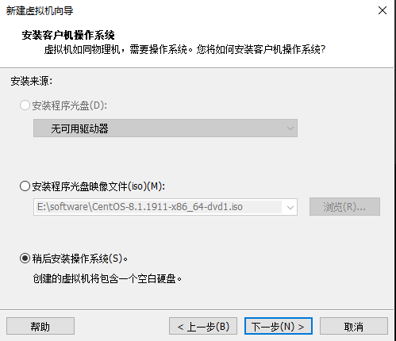


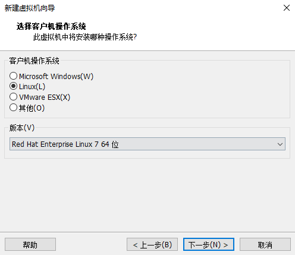

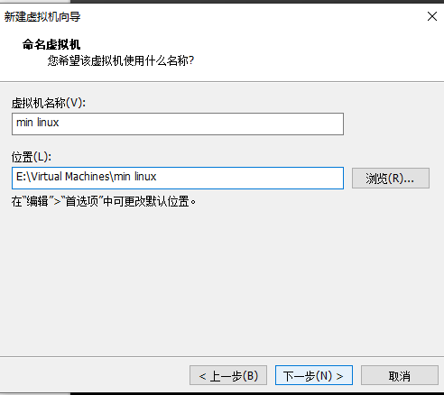


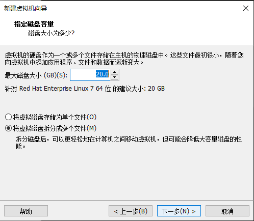


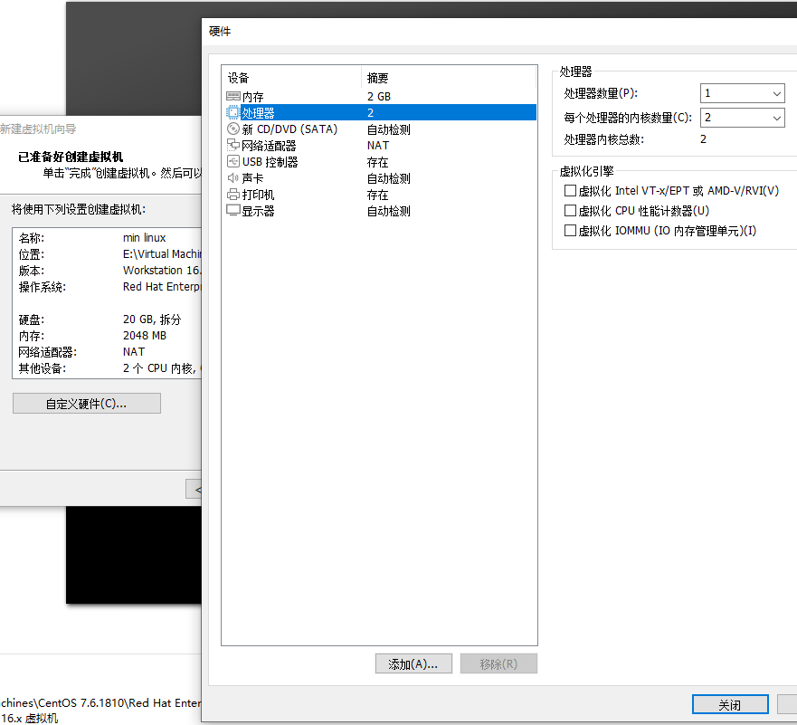


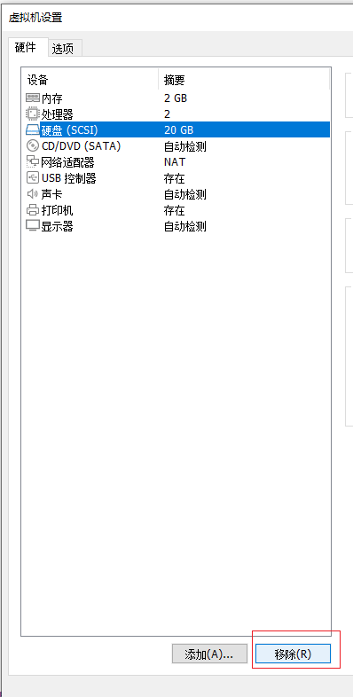


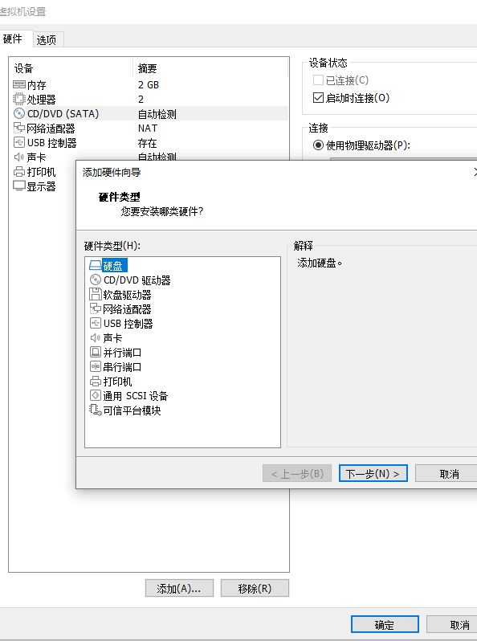


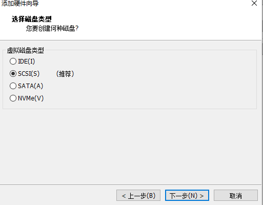


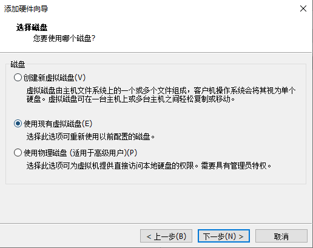


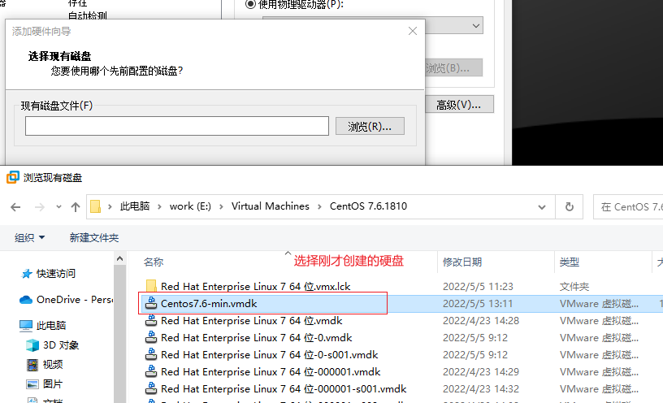

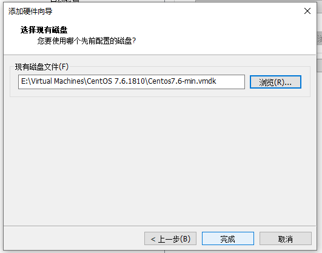


启动系统，出现如下界面，表示成功！

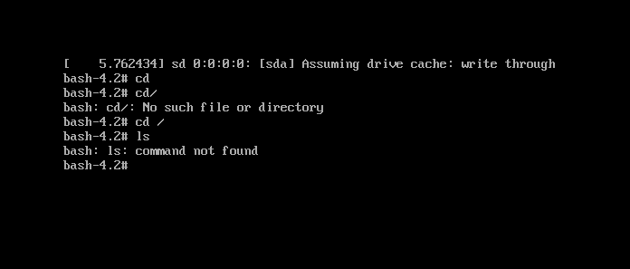


#### 3.11 拷贝需要的指令到对应的目录

这时，很多指令都不能使用，比如 ls，reboot 等，可以将需要拷贝的指令拷贝到对应的目录即可

重新进入原来的 linux 系统拷贝相应的指令即可，比如将 /bin/ls 拷贝到 /mnt/sysroot/bin/，将 sbin/reboot 拷贝到 /mnt/sysroot/bin/

```bash
mount /dev/sdb2 /mnt/sysroot
cp /bin/ls /mnt/sysroot/bin/
cp /bin/systemctl /mnt/sysroot/bin/
cp /sbin/reboot /mnt/sysroot/sbin/
```


再重新启动新的 linux 系统，就可以使用 ls，reboot 等命令了

因为没有配置环境变量，所以这里要写全路径名

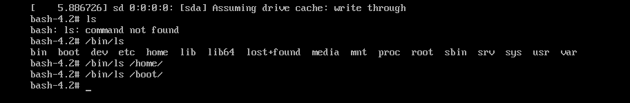


