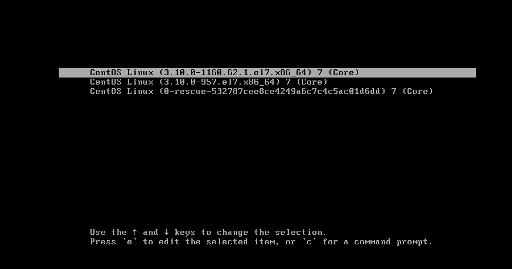

## Linux 内核源码介绍&内核升级

### 一、Linux 内核源码

#### 1.1 介绍

下载地址：[The Linux Kernel Archives](https://www.kernel.org/)

内核源代码有很多版本，可以从 linux0.01 内核入手，总共的代码 1w 行左右， 最新版本代码过于庞大，不易于阅读


#### 1.2 阅读前置要求

- 熟悉 c 语言

- 了解内核源码的整体分布情况

  - 现代的操作系统一般有进程管理、内存管理、文件系统、驱动程序和网络组成。Linux 内核源码的哥哥目录大致与此相对应

- 阅读顺序上，有纵向和横向之分。

  - 纵向，就是顺着程序的执行顺序逐步进行。对于代码启动的代码可以按照启动顺序一步步阅读

  - 横向，就是按模块进行。对于像内存管理部分，可以单独拿出来进行阅读分析

    

#### 1.3 linux0.01 内核源码目录介绍

```bash
[root@wndexx linuxsrc]# tree -d linux-0.01
linux-0.01
├── boot
├── fs
├── include
│   ├── asm
│   ├── linux
│   └── sys
├── init
├── kernel
├── lib
├── mm
└── tools

```


| 目录    | 说明                                              |
| ------- | ------------------------------------------------- |
| boot    | 和系统引导相关的代码                              |
| fs      | 存放 linux 支持的文件系统代码                     |
| include | 存放 linux 核心需要的头文件，比如 asm，linux，sys |
| kernel  | 和系统内核相关的源码                              |
| lib     | 存放库代码                                        |
| mm      | 和内存管理相关的代码                              |
| tools   | 一些工具代码                                      |


#### 1.4 main.c 

```c
void main(void)		/* This really IS void, no error here. */
{			/* The startup routine assumes (well, ...) this */
/*
 * Interrupts are still disabled. Do necessary setups, then
 * enable them
 */
    // 初始化运行时间
	time_init();
    // tty 初始化
	tty_init();
    // 陷阱门（硬件中断向量）初始化
	trap_init();
    // 调度程序初始化
	sched_init();
    // 缓冲管理初始化
	buffer_init();
    // 硬盘初始化
	hd_init();
    // 所有初始化工作完成后，开启中断
	sti();
    // 进入到用户模式
	move_to_user_mode();
	if (!fork()) {		/* we count on this going ok */
		init();
	}
/*
 *   NOTE!!   For any other task 'pause()' would mean we have to get a
 * signal to awaken, but task0 is the sole exception (see 'schedule()')
 * as task 0 gets activated at every idle moment (when no other tasks
 * can run). For task0 'pause()' just means we go check if some other
 * task can run, and if not we return here.
 */
	for(;;) pause();
}
```


### 二、内核升级

```bash
# 查看当前的内核版本
uname -a

# 检测内核版本，查看可以升级的内核
yum info kernel -q

# 升级内核
yum update kernel

# 查看已经安装的内核
yum list kernel -q
```


注意：

- 安装完内核后，需要重启系统，在内核选择界面选择对应的内核版本，才能以该版本启动

  

- 多个内核版本可以共存

- 需要依据系统的兼容性选择可以升级的内核版本，不能随便升级到任意版本


```bash
[root@wndexx linux-5.8.16]# yum info kernel -q
已安装的软件包
名称    ：kernel
架构    ：x86_64
版本    ：3.10.0
发布    ：957.el7
大小    ：63 M
源    ：installed
来自源：anaconda
简介    ： The Linux kernel
网址    ：http://www.kernel.org/
协议    ： GPLv2
描述    ： The kernel package contains the Linux kernel (vmlinuz), the core of any
         : Linux operating system.  The kernel handles the basic functions
         : of the operating system: memory allocation, process allocation, device
         : input and output, etc.

可安装的软件包
名称    ：kernel
架构    ：x86_64
版本    ：3.10.0
发布    ：1160.62.1.el7
大小    ：50 M
源    ：updates/7/x86_64
简介    ： The Linux kernel
网址    ：http://www.kernel.org/
协议    ： GPLv2
描述    ： The kernel package contains the Linux kernel (vmlinuz), the core of any
         : Linux operating system.  The kernel handles the basic functions
         : of the operating system: memory allocation, process allocation, device
         : input and output, etc.

[root@wndexx linux-5.8.16]# uname -a
Linux wndexx 3.10.0-957.el7.x86_64 #1 SMP Thu Nov 8 23:39:32 UTC 2018 x86_64 x86_64 x86_64 GNU/Linux

[root@wndexx linux-5.8.16]# yum update kernel
已加载插件：fastestmirror, langpacks
Loading mirror speeds from cached hostfile
 * base: mirror.worria.com
 * extras: repo.virtualhosting.hk
 * updates: repo.virtualhosting.hk
正在解决依赖关系
--> 正在检查事务
---> 软件包 kernel.x86_64.0.3.10.0-1160.62.1.el7 将被 安装
--> 正在处理依赖关系 linux-firmware >= 20190429-72，它被软件包 kernel-3.10.0-1160.62.1.el7.x86_64 需要
--> 正在检查事务
---> 软件包 linux-firmware.noarch.0.20180911-69.git85c5d90.el7 将被 升级
---> 软件包 linux-firmware.noarch.0.20200421-80.git78c0348.el7_9 将被 更新
--> 解决依赖关系完成

依赖关系解决

====================================================================================================================================================================================
 Package                                    架构                               版本                                                       源                                   大小
====================================================================================================================================================================================
正在安装:
 kernel                                     x86_64                             3.10.0-1160.62.1.el7                                       updates                              50 M
为依赖而更新:
 linux-firmware                             noarch                             20200421-80.git78c0348.el7_9                               updates                              80 M

事务概要
====================================================================================================================================================================================
安装  1 软件包
升级           ( 1 依赖软件包)

总计：131 M
Is this ok [y/d/N]: y
Downloading packages:
Running transaction check
Running transaction test
Transaction test succeeded
Running transaction
警告：RPM 数据库已被非 yum 程序修改。
** 发现 2 个已存在的 RPM 数据库问题， 'yum check' 输出如下：
2:postfix-2.10.1-7.el7.x86_64 有缺少的需求 libmysqlclient.so.18()(64bit)
2:postfix-2.10.1-7.el7.x86_64 有缺少的需求 libmysqlclient.so.18(libmysqlclient_18)(64bit)
  正在更新    : linux-firmware-20200421-80.git78c0348.el7_9.noarch                                                                                                              1/3 
  正在安装    : kernel-3.10.0-1160.62.1.el7.x86_64                                                                                                                              2/3 
  清理        : linux-firmware-20180911-69.git85c5d90.el7.noarch                                                                                                                3/3 
  验证中      : kernel-3.10.0-1160.62.1.el7.x86_64                                                                                                                              1/3 
  验证中      : linux-firmware-20200421-80.git78c0348.el7_9.noarch                                                                                                              2/3 
  验证中      : linux-firmware-20180911-69.git85c5d90.el7.noarch                                                                                                                3/3 

已安装:
  kernel.x86_64 0:3.10.0-1160.62.1.el7                                                                                                                                              

作为依赖被升级:
  linux-firmware.noarch 0:20200421-80.git78c0348.el7_9                                                                                                                              

完毕！
[root@wndexx linux-5.8.16]# yum list kernel -q
已安装的软件包
kernel.x86_64       3.10.0-957.el7                             @anaconda
kernel.x86_64       3.10.0-1160.62.1.el7                       @updates 

[root@wndexx linux-5.8.16]# uname -a
Linux wndexx 3.10.0-957.el7.x86_64 #1 SMP Thu Nov 8 23:39:32 UTC 2018 x86_64 x86_64 x86_64 GNU/Linux

```


