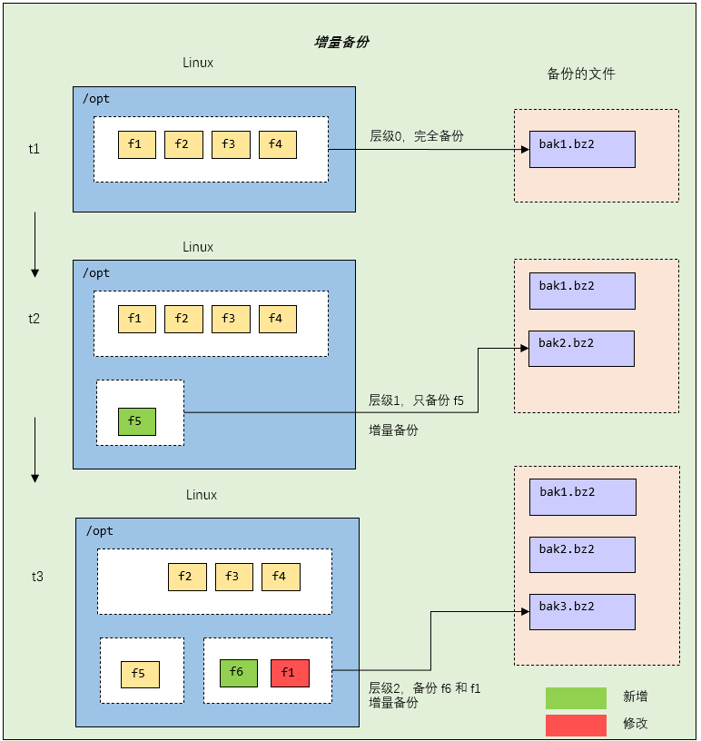

## 系统备份与恢复

实体机无法做快照，如果系统出现异常或者数据损坏，后果严重，要重做系统，还会造成数据丢失，可以使用备份和恢复技术

linux 的备份和恢复有两种方式：

- 把需要的文件（或者分区）用 `tar` 打包就行，下次需要恢复的时候，再解压覆盖即可
- 使用 `dump` 和 `restore` 命令


### 一、安装 dump 和 restore

如果 linux 上没有 `dump` 和 `restore` 指令，需要安装

```bash
yum -y install dump
yum -y install restore
```


### 二、使用 dump 完成备份

#### 2.1 基本介绍

dump 支持分卷和增量备份（所谓==增量备份==是指备份上次备份后，修改/增加过的文件，也称==差异备份==）


#### 2.2 语法说明

```bash
dump [-cu] [-0123456789] [-f <备份后文件名>] [-T <日期>] [目录或文件系统]
dump [-w/-W]
```


#### 2.3 选项说明

```bash
# 修改备份磁带预设的密度与容量
-c	

# 备份的层级。0 为最完整备份，会备份所有文件；若指定 0 以上的层级，则备份上一次备份以来修改或新增的文件，到 9 后，可以再次轮替
-0123456789	

# 指定备份后文件名
-f <备份后文件名>

# 调用 bzlib 库压缩备份文件，也就是将备份后的文件压缩成 bz2 格式，让文件更小
-j

# 指定开始备份的时间与日期
-T <日期>

# 备份完成后，在 /etc/dumpdates 中记录备份的文件系统，层级，日期与时间等。如果需要进行增量备份，这个选项不能省略 
-u 

# 指定文件名，若该文件已存在备份文件中，则列出备份文件的名称
-t 

# 显示需要备份的文件及其最后一次备份的层级，时间，日期
-W

# 与 -W 类似，但仅显示需要备份的文件
-w
```





说明：==增量备份只会备份到层级 9，继续往下备份时，又会从层级 0 开始，先进行完整备份，再从层级 1 开始进行增量备份==


#### 2.4 案例

> dump 应用案例 1

```bash
# 将 /boot 分区所有内容备份到 /opt/boot.bak0.bz2 文件中，备份级别为 "0"
dump -0uj -f /opt/boot.bak0.bz2 /boot
```


```bash
[root@wndexx etc]# dump -0uj -f /opt/boot.bak0.bz2 /boot/
  DUMP: Date of this level 0 dump: Thu May  5 22:10:18 2022
  DUMP: Dumping /dev/sda1 (/boot) to /opt/boot.bak0.bz2
  DUMP: Label: none
  DUMP: Writing 10 Kilobyte records
  DUMP: Compressing output at compression level 2 (bzlib)
  DUMP: mapping (Pass I) [regular files]
  DUMP: mapping (Pass II) [directories]
  DUMP: estimated 173541 blocks.
  DUMP: Volume 1 started with block 1 at: Thu May  5 22:10:18 2022
  DUMP: dumping (Pass III) [directories]
  DUMP: dumping (Pass IV) [regular files]
  DUMP: Closing /opt/boot.bak0.bz2
  DUMP: Volume 1 completed at: Thu May  5 22:10:45 2022
  DUMP: Volume 1 took 0:00:27
  DUMP: Volume 1 transfer rate: 5782 kB/s
  DUMP: Volume 1 174160kB uncompressed, 156136kB compressed, 1.116:1
  DUMP: 174160 blocks (170.08MB) on 1 volume(s)
  DUMP: finished in 27 seconds, throughput 6450 kBytes/sec
  DUMP: Date of this level 0 dump: Thu May  5 22:10:18 2022
  DUMP: Date this dump completed:  Thu May  5 22:10:45 2022
  DUMP: Average transfer rate: 5782 kB/s
  DUMP: Wrote 174160kB uncompressed, 156136kB compressed, 1.116:1
  DUMP: DUMP IS DONE

```


> dump 应用案例 2

```bash
# 在 /boot 目录下增加一个文件，备份层级为 "1"（只备份上次使用层级 "0" 备份后发生改变的数据）
vim hello.java

=== hello.java ===
hello,world
==================

dump -1uj -f /opt/boot.bak1.bz2 /boot
```


```bash
[root@wndexx boot]# vim hello.java
[root@wndexx boot]# dump -1uj -f /opt/boot.bak1.bz2 /boot/
  DUMP: Date of this level 1 dump: Fri May  6 08:17:56 2022
  DUMP: Date of last level 0 dump: Fri May  6 08:16:51 2022
  DUMP: Dumping /dev/sda1 (/boot) to /opt/boot.bak1.bz2
  DUMP: Label: none
  DUMP: Writing 10 Kilobyte records
  DUMP: Compressing output at compression level 2 (bzlib)
  DUMP: mapping (Pass I) [regular files]
  DUMP: mapping (Pass II) [directories]
  DUMP: estimated 39 blocks.
  DUMP: Volume 1 started with block 1 at: Fri May  6 08:17:56 2022
  DUMP: dumping (Pass III) [directories]
  DUMP: dumping (Pass IV) [regular files]
  DUMP: Closing /opt/boot.bak1.bz2
  DUMP: Volume 1 completed at: Fri May  6 08:17:56 2022
  DUMP: 40 blocks (0.04MB) on 1 volume(s)
  DUMP: finished in less than a second
  DUMP: Date of this level 1 dump: Fri May  6 08:17:56 2022
  DUMP: Date this dump completed:  Fri May  6 08:17:56 2022
  DUMP: Average transfer rate: 0 kB/s
  DUMP: Wrote 40kB uncompressed, 11kB compressed, 3.637:1
  DUMP: DUMP IS DONE
[root@wndexx boot]# cd /opt/
[root@wndexx opt]# ll
总用量 305204
-rw-r--r--. 1 root root 159883161 5月   6 08:17 boot.bak0.bz2
-rw-r--r--. 1 root root     11934 5月   6 08:17 boot.bak1.bz2
-rw-r--r--. 1 root root  95103108 10月  9 2018 firefox-60.2.2-1.el7.centos.x86_64.rpm
drwxr-xr-x. 3 root root      4096 5月   1 14:11 idea
drwxr-xr-x. 2 root root      4096 5月   1 12:49 jdk
drwxr-xr-x. 3 root root      4096 5月   5 15:32 linuxsrc
drwxr-xr-x. 2 root root      4096 5月   1 14:54 mysql
drwxr-xr-x. 2 root root      4096 10月 31 2018 rh
drwxr-xr-x. 3 root root      4096 4月  25 21:04 tmp
drwxr-xr-x. 3 root root      4096 4月  25 21:29 tmp2
drwxr-xr-x. 3 root root      4096 4月  25 21:39 tmp3
drwxr-xr-x. 3 root root      4096 4月  25 21:40 tmp4
drwxr-xr-x. 3 root root      4096 5月   1 13:28 tomcat
-rw-r--r--. 1 root root  53834249 10月 14 2020 VMwareTools-10.3.23-17030940.tar.gz
drwxr-xr-x. 8 root root      4096 10月 14 2020 vmware-tools-distrib
-rw-r--r--. 1 root root   3642757 4月  25 14:43 杂文.txt
```


注意：通过 `dump` 命令再配合 `crontab` 可以实现无人值守备份


#### 2.5 dump -W

显示需要备份的文件及其最后一次备份的层级、日期、时间

```bash
[root@wndexx opt]# dump -W
Last dump(s) done (Dump '>' file systems):
> /dev/sda3	(     /) Last dump: never
  /dev/sda1	( /boot) Last dump: Level 1, Date Fri May  6 08:17:56 2022
```


#### 2.6 查看备份时间文件

```bash
cat /etc/dumpdates

[root@wndexx opt]# cat /etc/dumpdates 
/dev/sda1 0 Fri May  6 08:16:51 2022 +0800
/dev/sda1 1 Fri May  6 08:17:56 2022 +0800
```


#### 2.7 dump 备份文件或目录

dump 备份分区时，支持增量备份

如果备份文件或目录，==不再支持增量备份==，只能使用 0 层级备份

> 案例

```bash
# 使用 dump 备份 /etc 整个目录
dump -0j -f /opt/etc.bak0.bz2
```


```bash
[root@wndexx ~]# dump -0j -f /opt/etc.bak0.bz2 /etc/
  DUMP: Date of this level 0 dump: Fri May  6 08:54:59 2022
  DUMP: Dumping /dev/sda3 (/ (dir etc)) to /opt/etc.bak0.bz2
  DUMP: Label: none
  DUMP: Writing 10 Kilobyte records
  DUMP: Compressing output at compression level 2 (bzlib)
  DUMP: mapping (Pass I) [regular files]
  DUMP: mapping (Pass II) [directories]
  DUMP: estimated 67741 blocks.
  DUMP: Volume 1 started with block 1 at: Fri May  6 08:54:59 2022
  DUMP: dumping (Pass III) [directories]
  DUMP: dumping (Pass IV) [regular files]
  DUMP: Closing /opt/etc.bak0.bz2
  DUMP: Volume 1 completed at: Fri May  6 08:55:06 2022
  DUMP: Volume 1 took 0:00:07
  DUMP: Volume 1 transfer rate: 3456 kB/s
  DUMP: Volume 1 77360kB uncompressed, 24194kB compressed, 3.198:1
  DUMP: 77360 blocks (75.55MB) on 1 volume(s)
  DUMP: finished in 7 seconds, throughput 11051 kBytes/sec
  DUMP: Date of this level 0 dump: Fri May  6 08:54:59 2022
  DUMP: Date this dump completed:  Fri May  6 08:55:06 2022
  DUMP: Average transfer rate: 3456 kB/s
  DUMP: Wrote 77360kB uncompressed, 24194kB compressed, 3.198:1
  DUMP: DUMP IS DONE
[root@wndexx ~]# cd /opt/
[root@wndexx opt]# ls
boot.bak0.bz2  etc.bak0.bz2                            idea  linuxsrc  rh   tmp2  tmp4    VMwareTools-10.3.23-17030940.tar.gz  杂文.txt
boot.bak1.bz2  firefox-60.2.2-1.el7.centos.x86_64.rpm  jdk   mysql     tmp  tmp3  tomcat  vmware-tools-distrib

# 使用层级 1 备份文件或目录会出错 ！！！
[root@wndexx opt]# dump -1j -f /opt/etc.bak1.bz2 /etc/
  DUMP: Only level 0 dumps are allowed on a subdirectory
  DUMP: The ENTIRE dump is aborted.
  
# 备份文件或目录时，不能使用参数 u，会出错 ！！
[root@wndexx opt]# dump -0uj -f /opt/etc.bak1.bz2 /etc/
  DUMP: You can't update the dumpdates file when dumping a subdirectory
  DUMP: The ENTIRE dump is aborted.

```


注意：如果是重要的备份文件，比如数据区，建议将文件上传到其它服务器保存


### 三、使用 restore 完成恢复

#### 3.1 介绍

`restore` 命令用来恢复已备份的文件，可以从 `dump` 生成的备份文件中恢复原文件


#### 3.2 基本语法

```bash
restore [模式选项] [选项]
```


#### 3.3 模式

以下四个模式，==不能混用==，在一次命令中，只能指定一种

| 模式 | 说明                                                   |
| ---- | ------------------------------------------------------ |
| -C   | 对比模式。将备份的文件与已存在的文件相互对比           |
| -i   | 交互模式。在进行还原操作时，restore 指令将依序询问用户 |
| -r   | 还原模式                                               |
| -t   | 查看模式。看备份文件中有哪些文件                       |


#### 3.4 选项

| 选项          | 说明                                     |
| ------------- | ---------------------------------------- |
| -f <备份设备> | 从指定的文件中读取备份数据，进行还原操作 |


#### 3.5 案例

> 案例1 	比较模式

```bash
cd /boot/
mv hello.java hello100.java
cd /opt/
restore -C -f boot.bak1.bz2 
    Dump tape is compressed.
    Dump   date: Fri May  6 08:17:56 2022
    Dumped from: Fri May  6 08:16:51 2022
    Level 1 dump of /boot on wndexx:/dev/sda1
    Label: none
    filesys = /boot
    restore: unable to stat ./hello.java: No such file or directory
	Some files were modified!  1 compare errors
	
mv /boot/hello100.java /boot/hello.java 
restore -C -f boot.bak1.bz2 
    Dump tape is compressed.
    Dump   date: Fri May  6 08:17:56 2022
    Dumped from: Fri May  6 08:16:51 2022
    Level 1 dump of /boot on wndexx:/dev/sda1
    Label: none
    filesys = /boot
```


> 案例2	查看模式

```bash
restore -t -f boot.bak0.bz2
```

```bash
[root@wndexx opt]# restore -t -f boot.bak1.bz2 
Dump tape is compressed.
Dump   date: Fri May  6 08:17:56 2022
Dumped from: Fri May  6 08:16:51 2022
Level 1 dump of /boot on wndexx:/dev/sda1
Label: none
         2	.
       354	./hello.java
```


> 案例3	还原模式

`restore` 命令还原模式。注意细节：如果你有增量备份，需要把增量备份文件也进行恢复，有几个增量备份文件，就要恢复几个，按==顺序==来恢复即可  `bak0 --> bak1 --> bak2 -> ...`

注意：恢复 boot 分区时，不包含 boot 目录本身

```bash
mkdir boottemp
cd boottemp/
restore -r -f /opt/boot.bak0.bz2 
	Dump tape is compressed.
ls
    config-3.10.0-1160.62.1.el7.x86_64  
    initramfs-0-rescue-532787cee8ce4249a6c7c4c5ac01d6dd.img  
    symvers-3.10.0-1160.62.1.el7.x86_64.gz             
    vmlinuz-3.10.0-1160.62.1.el7.x86_64
    config-3.10.0-957.el7.x86_64        
    initramfs-3.10.0-1160.62.1.el7.x86_64.img                
    symvers-3.10.0-957.el7.x86_64.gz                   
    vmlinuz-3.10.0-957.el7.x86_64
    efi                                 
    initramfs-3.10.0-957.el7.x86_64.img                      
    System.map-3.10.0-1160.62.1.el7.x86_64
    grub                                
    lost+found                                               
    System.map-3.10.0-957.el7.x86_64
    grub2                               
    restoresymtable                                          
    vmlinuz-0-rescue-532787cee8ce4249a6c7c4c5ac01d6dd
    
restore -r -f /opt/boot.bak1.bz2 
	Dump tape is compressed.
ls
    config-3.10.0-1160.62.1.el7.x86_64  
    initramfs-0-rescue-532787cee8ce4249a6c7c4c5ac01d6dd.img  
    symvers-3.10.0-957.el7.x86_64.gz
    config-3.10.0-957.el7.x86_64        
    initramfs-3.10.0-1160.62.1.el7.x86_64.img                
    System.map-3.10.0-1160.62.1.el7.x86_64
    efi                                 
    initramfs-3.10.0-957.el7.x86_64.img                      
    System.map-3.10.0-957.el7.x86_64
    grub                                
    lost+found                                               
    vmlinuz-0-rescue-532787cee8ce4249a6c7c4c5ac01d6dd
    grub2                               
    restoresymtable                                          
    vmlinuz-3.10.0-1160.62.1.el7.x86_64
    hello.java        # !!!!!!!!!!!!!!!!!                  
    symvers-3.10.0-1160.62.1.el7.x86_64.gz                   
    vmlinuz-3.10.0-957.el7.x86_64

```


> 案例4	restore 命令恢复备份的文件，或整个目录的文件

注意：在恢复目录时，会恢复包含目录本身以及绝对路径上的所有目录

```bash
[root@wndexx ~]# restore -t -f /opt/tt1.bak.bz2 
Dump tape is compressed.
Dump   date: Fri May  6 10:28:15 2022
Dumped from: the epoch
Level 0 dump of / (dir opt/tt1) on wndexx:/dev/sda3
Label: none
         2	.
        16	./opt
     32769	./opt/tt1
      7775	./opt/tt1/s.txt
```


```bash
# 基本语法
restore -r -f 备份好的文件

restore -r -f /opt/etc.bak0.bz2
[root@wndexx etctmp]# ls
etc  restoresymtable
[root@wndexx etctmp]# cd etc
[root@wndexx etc]# ls
abrt                      cron.daily                  firefox             inittab   magic                     pbm2ppa.conf      			rpc                ...  
```


