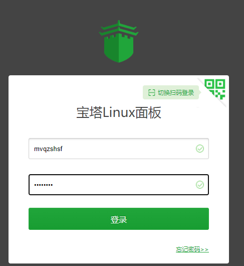

## Linux 可视化管理

### 一、Webmin

#### 1.1 介绍

Webmin 是功能强大的基于 Web 的 Unix/linux 系统管理工具。管理员通过浏览器访问 Webmin 的各种管理功能并完成相应的管理操作。除了各版本的 linux 以外还可用于：AIX、HPUX、Solaris、Unixware、Irix 和 FreeBSD 等 Unix 系统


#### 1.2 下载地址

 http://download.webmin.com/download/yum/ 

也可使用 

```bash
wget http://download.webmin.com/download/yum/webmin-1.700-1.noarch.rpm
```


#### 1.3 安装

```bash
rpm -ivh /opt/webmin/webmin-1.700-1.noarch.rpm
```


#### 1.4 重置密码

webmin 的用户名和 OS 一样也是 root，这里更改的是 webmin  的 root 用户的密码，改为 root

```bash
/usr/libexec/webmin/changepass.pl /etc/webmin root root
```


#### 1.5 修改端口

处于安全目的，需要修改 webmin 服务的端口号（默认 10000）

```bash
# 修改端口。将 port=10000 修改为其它端口号，如 port=3214
vim /etc/webmin/miniserv.conf 

==== miniserv.conf ====
...
port=3214
...
listen=3214
...
=======================
```


#### 1.6 重启 webmin

```bash
# 重启
/etc/webmin/restart 

# 启动
/etc/webmin/start

# 停止
/etc/webmin/stop
```


#### 1.7 防火墙开放 6666 端口

```bash
# --zone=public 端口开放的区域

# 防火墙开放 3214 端口
firewall-cmd --zone=public --permanent --add-port=3214/tcp

# 更新防火墙配置
firewall-cmd --reload

# 查看已经开放的端口
firewall-cmd --zone=public --list-ports
```


#### 1.8 登录 webmin

http://ip:6666

用户名为 root，密码为刚刚更改的密码


#### 1.9 使用

##### 1.9.1 修改语言设置


##### 1.9.2 修改密码


##### 1.9.3 任务调度


##### 1.9.4 进程管理器


##### 1.9.5 mysql 数据库服务器


##### 1.9.6 command shell


##### 1.9.7 IP 访问控制


### 二、bt（宝塔）

#### 2.1 基本介绍

bt(宝塔) Linux 面板是提升运维效率的服务器管理软件，支持一键 LAMP/LNMP/集群/监控/网站/FTP/数据库/JAVA 等多项服务器管理功能


#### 2.2 安装和使用

> 安装

```bash
# 先执行 yum install -y wget 		安装 wget
# 再执行 wget -O install.sh http://download.bt.cn/install/install_6.0.sh 	安装 bt
# 最后 执行 install.sh 脚本
# -O install.sh 将 http://download.bt.cn/install/install_6.0.sh 文档写入 install.sh
yum install -y wget && wget -O install.sh http://download.bt.cn/install/install_6.0.sh && sh install.sh
```


```bash
==================================================================
Congratulations! Installed successfully!
==================================================================
外网面板地址: http://223.64.130.169:8888/4cff35c9
内网面板地址: http://192.168.200.130:8888/4cff35c9
username: mvqzshsf
password: baaff8e8
If you cannot access the panel,
release the following panel port [8888] in the security group
若无法访问面板，请检查防火墙/安全组是否有放行面板[8888]端口
==================================================================
```





> bt default

查看 bt 的用户名和密码

```bash
[root@wndexx bt]# bt default
==================================================================
BT-Panel default info!
==================================================================
外网面板地址: http://223.64.130.169:8888/4cff35c9
内网面板地址: http://192.168.200.130:8888/4cff35c9
*以下仅为初始默认账户密码，若无法登录请执行bt命令重置账户/密码登录
username: mvqzshsf
password: tDU6t0wASqic
If you cannot access the panel,
release the following panel port [8888] in the security group
若无法访问面板，请检查防火墙/安全组是否有放行面板[8888]端口
==================================================================
```


