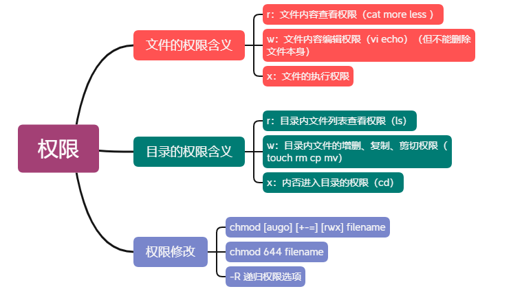
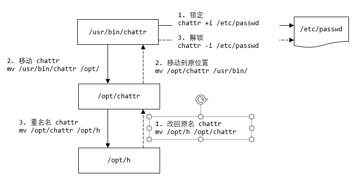

## Linux 面试题

### 问题1 分析日志 t.log（访问量）

> 分析日志 t.log（访问量），将各个 ip 地址截取，统计出现次数，并按从大到小顺序排序（腾讯）
>
> http://192.168.200.10/index1.html
> http://192.168.200.10/index2.html
> http://192.168.200.20/index1.html
> http://192.168.200.30/index1.html
> http://192.168.200.40/index1.html
> http://192.168.200.30/order.html
> http://192.168.200.10/order.html

```bash
cat t.txt | cut -d '/' -f 3 | sort | uniq -c | sort -nr
```


```bash
[root@wndexx interview]# vim t.txt
[root@wndexx interview]# cat t.txt 
http://192.168.200.10/index1.html
http://192.168.200.10/index2.html
http://192.168.200.20/index1.html
http://192.168.200.30/index1.html
http://192.168.200.40/index1.html
http://192.168.200.30/order.html
http://192.168.200.10/order.html
[root@wndexx interview]# cat t.txt | cut -d '/' -f 3
192.168.200.10
192.168.200.10
192.168.200.20
192.168.200.30
192.168.200.40
192.168.200.30
192.168.200.10
[root@wndexx interview]# cat t.txt | cut -d '/' -f 3 | sort
192.168.200.10
192.168.200.10
192.168.200.10
192.168.200.20
192.168.200.30
192.168.200.30
192.168.200.40
[root@wndexx interview]# cat t.txt | cut -d '/' -f 3 | sort | uniq -c
      3 192.168.200.10
      1 192.168.200.20
      2 192.168.200.30
      1 192.168.200.40
[root@wndexx interview]# cat t.txt | cut -d '/' -f 3 | sort | uniq -c | sort
      1 192.168.200.20
      1 192.168.200.40
      2 192.168.200.30
      3 192.168.200.10
[root@wndexx interview]# cat t.txt | cut -d '/' -f 3 | sort | uniq -c | sort -nr
      3 192.168.200.10
      2 192.168.200.30
      1 192.168.200.40
      1 192.168.200.20
```


> **cut**	在文件的每一行中提取片断
>
> 基本指令：`cut [选项] 文件`
>
> [选项]
>
> ​	-d  <字符>		以该字符作为分隔符。分隔符不能是 空格
>
> ​	-f    N		        输出指定位置的片段，从 1 开始。
>
> ​					  如果是 N-，输出第 N 个片段到最后一个片段
>
> ​					  如果是 N-M，输出第 N 个片段到第 M 个片段
>
> ​					  如果是 -N，输出第一个片段到第 N 个片段


> **sort**	对文本文件的行进行排序。将排序好的所有文件串写到标准输出上。默认从小到大
>
> 基本指令：`sort [选项] 文件`
>
> [选项]
>
> ​	-b     	忽略排序字段或关键字中开头的空格
>
> ​	-n    	 按照字符串的数值顺序比较,暗含 -b
>
> ​	-r     	 颠倒比较的结果


> **uniq**	删除排序文件中的重复行。从 INPUT (或 标准输入) 数据中忽略 (但是 保留 一行) ==连续==的相似行, 结果 送入 OUTPUT (或 标准输出)。
>
> 基本指令：`uniq [选项] [标准输入 [标准输出]]`
>
> ​	-c		在 行首显示出现的数目


### 问题2 统计连接到服务器的各个 ip 情况，并按连接数从大到小排序

```bash
netstat -an | grep ESTABLISHED | awk -F " " '{print $5}' | cut -d ":" -f 1 | sort | uniq -c | sort -nr
```


```bash
[root@wndexx interview]# netstat -an | grep ESTABLISHED
tcp        0      0 192.168.200.130:22      192.168.200.1:6699      ESTABLISHED
tcp        0     36 192.168.200.130:22      192.168.200.1:1405      ESTABLISHED
[root@wndexx interview]# netstat -an | grep ESTABLISHED | awk -F " " "{print $5}"
tcp        0      0 192.168.200.130:22      192.168.200.1:6699      ESTABLISHED
tcp        0     36 192.168.200.130:22      192.168.200.1:1405      ESTABLISHED
[root@wndexx interview]# netstat -an | grep ESTABLISHED | awk -F " " '{print $5}'
192.168.200.1:6699
192.168.200.1:1405
[root@wndexx interview]# netstat -an | grep ESTABLISHED | awk -F " " '{print $5}' | awk -F ":"  'print $1'
awk: cmd. line:1: print $1
awk: cmd. line:1: ^ syntax error
[root@wndexx interview]# netstat -an | grep ESTABLISHED | awk -F " " '{print $5}' | awk -F ":" 'print $1'
awk: cmd. line:1: print $1
awk: cmd. line:1: ^ syntax error
[root@wndexx interview]# netstat -an | grep ESTABLISHED | awk -F " " '{print $5}' | awk -F ":" '{print $1}'
192.168.200.1
192.168.200.1
[root@wndexx interview]# netstat -an | grep ESTABLISHED | awk -F " " '{print $5}' | cut -d ":" -f 1
192.168.200.1
192.168.200.1
[root@wndexx interview]# netstat -an | grep ESTABLISHED | awk -F " " '{print $5}' | cut -d ":" -f 1 | sort -nr
192.168.200.1
192.168.200.1
[root@wndexx interview]# netstat -an | grep ESTABLISHED | awk -F " " '{print $5}' | cut -d ":" -f 1 | sort
192.168.200.1
192.168.200.1
[root@wndexx interview]# netstat -an | grep ESTABLISHED | awk -F " " '{print $5}' | cut -d ":" -f 1 | sort | uniq -c
      2 192.168.200.1
[root@wndexx interview]# netstat -an | grep ESTABLISHED | awk -F " " '{print $5}' | cut -d ":" -f 1 | sort | uniq -c | sort -nr
      2 192.168.200.1

```


> awk	文本处理指令
>
> 基本语法：`awk -F 字符 '{处理程序}' 文件`
>
> 选项 
>
> ​	-F   <字符>	以该字符作为分隔符
>
> ​	'{处理程序}'       命令代码块。如 `print $5` 输出分割后的第 5 个片段，从 1 开始
>
> 说明：awk 的功能非常强大，需要详尽学习	


### 问题3 如果忘记了 mysql5.7 数据库的 ROOT 用户的密码，如何找回


- `vim /etc/my.cnf`，加入一句话 `skip-grant-tables`，即跳过权限表

  ```bash
  [root@wndexx interview]# vim /etc/my.cnf
  
  # For advice on how to change settings please see
  # http://dev.mysql.com/doc/refman/5.7/en/server-configuration-defaults.html
  
  [mysqld]
  #
  # Remove leading # and set to the amount of RAM for the most important data
  # cache in MySQL. Start at 70% of total RAM for dedicated server, else 10%.
  # innodb_buffer_pool_size = 128M
  #
  # Remove leading # to turn on a very important data integrity option: logging
  # changes to the binary log between backups.
  # log_bin
  #
  # Remove leading # to set options mainly useful for reporting servers.
  # The server defaults are faster for transactions and fast SELECTs.
  # Adjust sizes as needed, experiment to find the optimal values.
  # join_buffer_size = 128M
  # sort_buffer_size = 2M
  # read_rnd_buffer_size = 2M
  datadir=/var/lib/mysql
  socket=/var/lib/mysql/mysql.sock
  
  # Disabling symbolic-links is recommended to prevent assorted security risks
  symbolic-links=0
  
  log-error=/var/log/mysqld.log
  pid-file=/var/run/mysqld/mysqld.pid
  skip-grant-tables
  
  ```

  

- 重启 mysqld 服务

  ```bash
  service mysqld restart
  # 或
  systemctl restart mysqld
  ```

  

- 登录mysql，此时不再需要密码

  ```bash
  [root@wndexx interview]# systemctl restart mysqld
  [root@wndexx interview]# mysql -uroot -p
  Enter password: 
  Welcome to the MySQL monitor.  Commands end with ; or \g.
  Your MySQL connection id is 2
  Server version: 5.7.26 MySQL Community Server (GPL)
  
  Copyright (c) 2000, 2019, Oracle and/or its affiliates. All rights reserved.
  
  Oracle is a registered trademark of Oracle Corporation and/or its
  affiliates. Other names may be trademarks of their respective
  owners.
  
  Type 'help;' or '\h' for help. Type '\c' to clear the current input statement.
  
  mysql> 
  
  ```

  

- 更改 mysql 数据库的 user 表里 root 用户对应的的 authentication_string 值

  ```mysql
  # 1
  mysql> show databases;
  +--------------------+
  | Database           |
  +--------------------+
  | information_schema |
  | demodb             |
  | mysql              |
  | performance_schema |
  | sys                |
  +--------------------+
  5 rows in set (0.00 sec)
  
  
  # 2
  mysql> use mysql;
  Reading table information for completion of table and column names
  You can turn off this feature to get a quicker startup with -A
  
  Database changed
  
  
  # 3
  mysql> show tables;
  +---------------------------+
  | Tables_in_mysql           |
  +---------------------------+
  | columns_priv              |
  | db                        |
  | engine_cost               |
  | event                     |
  | func                      |
  | general_log               |
  | gtid_executed             |
  | help_category             |
  | help_keyword              |
  | help_relation             |
  | help_topic                |
  | innodb_index_stats        |
  | innodb_table_stats        |
  | ndb_binlog_index          |
  | plugin                    |
  | proc                      |
  | procs_priv                |
  | proxies_priv              |
  | server_cost               |
  | servers                   |
  | slave_master_info         |
  | slave_relay_log_info      |
  | slave_worker_info         |
  | slow_log                  |
  | tables_priv               |
  | time_zone                 |
  | time_zone_leap_second     |
  | time_zone_name            |
  | time_zone_transition      |
  | time_zone_transition_type |
  | user                      |
  +---------------------------+
  31 rows in set (0.00 sec)
  
  
  # 4
  mysql> desc user;
  ...
  | authentication_string  | text      | YES  |     | NULL      |       |
  ...
  
  
  # 5
  mysql> update user set authentication_string=password("root") where user='root';
  Query OK, 1 row affected, 1 warning (0.00 sec)
  Rows matched: 1  Changed: 1  Warnings: 1
  
  ```

  

- 刷新权限

  ```mysql
  flush privileges;
  ```


- 退出

  ```mysql
  exit;
  ```

  

- `vim /etc/my.cnf`，注释掉 `skip-grant-tables`

  ```bash
  [root@wndexx interview]# vim /etc/my.cnf
  
  # For advice on how to change settings please see
  # http://dev.mysql.com/doc/refman/5.7/en/server-configuration-defaults.html
  
  [mysqld]
  #
  # Remove leading # and set to the amount of RAM for the most important data
  # cache in MySQL. Start at 70% of total RAM for dedicated server, else 10%.
  # innodb_buffer_pool_size = 128M
  #
  # Remove leading # to turn on a very important data integrity option: logging
  # changes to the binary log between backups.
  # log_bin
  #
  # Remove leading # to set options mainly useful for reporting servers.
  # The server defaults are faster for transactions and fast SELECTs.
  # Adjust sizes as needed, experiment to find the optimal values.
  # join_buffer_size = 128M
  # sort_buffer_size = 2M
  # read_rnd_buffer_size = 2M
  datadir=/var/lib/mysql
  socket=/var/lib/mysql/mysql.sock
  
  # Disabling symbolic-links is recommended to prevent assorted security risks
  symbolic-links=0
  
  log-error=/var/log/mysqld.log
  pid-file=/var/run/mysqld/mysqld.pid
  # skip-grant-tables
  ```


- 重启 mysqld 服务

  ```bash
  systemctl restart mysqld
  ```

  

- 测试新密码登录

  ```bash
  [root@wndexx interview]# mysql -uroot -p
  Enter password: 
  Welcome to the MySQL monitor.  Commands end with ; or \g.
  Your MySQL connection id is 2
  Server version: 5.7.26 MySQL Community Server (GPL)
  
  Copyright (c) 2000, 2019, Oracle and/or its affiliates. All rights reserved.
  
  Oracle is a registered trademark of Oracle Corporation and/or its
  affiliates. Other names may be trademarks of their respective
  owners.
  
  Type 'help;' or '\h' for help. Type '\c' to clear the current input statement.
  
  mysql> 
  ```

  

### 问题 4 写出指令：统计 ip 访问情况，要求分析 nginx 访问日志（access.log），找出访问页面数量在前 2 位的 ip

```bash
cat access.log | awk -F " " '{print $1}' | sort | uniq -c | sort -nr | head -2
```


```bash
===== access.log ======
192.168.130.21 aaa.html
192.168.130.20 aaa.html
192.168.130.20 aaa.html
192.168.130.20 aaa.html
192.168.130.23 aaa.html
192.168.130.20 aaa.html
192.168.130.25 aaa.html
192.168.130.20 aaa.html
192.168.130.20 aaa.html
192.168.130.25 aaa.html
192.168.130.20 aaa.html
=======================
```


```bash
[root@wndexx interview]# vim access.log
[root@wndexx interview]# cat access.log 
192.168.130.21 aaa.html
192.168.130.20 aaa.html
192.168.130.20 aaa.html
192.168.130.20 aaa.html
192.168.130.23 aaa.html
192.168.130.20 aaa.html
192.168.130.25 aaa.html
192.168.130.20 aaa.html
192.168.130.20 aaa.html
192.168.130.25 aaa.html
192.168.130.20 aaa.html 
[root@wndexx interview]# cat access.log | awk -F " " '{print $1}'
192.168.130.21
192.168.130.20
192.168.130.20
192.168.130.20
192.168.130.23
192.168.130.20
192.168.130.25
192.168.130.20
192.168.130.20
192.168.130.25
192.168.130.20
[root@wndexx interview]# cat access.log | awk -F " " '{print $1}' | sort
192.168.130.20
192.168.130.20
192.168.130.20
192.168.130.20
192.168.130.20
192.168.130.20
192.168.130.20
192.168.130.21
192.168.130.23
192.168.130.25
192.168.130.25
[root@wndexx interview]# cat access.log | awk -F " " '{print $1}' | sort | uniq -c
      7 192.168.130.20
      1 192.168.130.21
      1 192.168.130.23
      2 192.168.130.25
[root@wndexx interview]# cat access.log | awk -F " " '{print $1}' | sort | uniq -c | sort -nr
      7 192.168.130.20
      2 192.168.130.25
      1 192.168.130.23
      1 192.168.130.21
[root@wndexx interview]# cat access.log | awk -F " " '{print $1}' | sort | uniq -c | sort -nr | head -n 2
      7 192.168.130.20
      2 192.168.130.25
# 或
[root@wndexx interview]# cat access.log | awk -F " " '{print $1}' | sort | uniq -c | sort -nr | head -2
      7 192.168.130.20
      2 192.168.130.25
```


### 问题5 使用 tcpdump 监听本机，将来自 ip 192.168.200.1，tcp 端口为 22 的数据，保存的输出到 tcpdump.log，用来做数据分析


```bash
# tcpdump 监听某个ip 和本机某个端口的通信
tcpdump -i ens33 host 192.168.200.1 and port 22 >> /opt/interview/tcpdump.log
```


```bash
[root@wndexx interview]# tcpdump -i ens33 host 192.168.200.1 and port 22 >> /opt/interview/tcpdump.log
tcpdump: verbose output suppressed, use -v or -vv for full protocol decode
listening on ens33, link-type EN10MB (Ethernet), capture size 262144 bytes
^C4 packets captured
7 packets received by filter
0 packets dropped by kernel
[root@wndexx interview]# cat tcpdump.log 
19:06:32.169765 IP wndexx.ssh > PC.ibm-res: Flags [P.], seq 1269973929:1269974117, ack 2131995627, win 1105, length 188
19:06:32.170111 IP PC.ibm-res > wndexx.ssh: Flags [.], ack 188, win 4105, length 0
19:06:46.620019 IP PC.ibm-res > wndexx.ssh: Flags [P.], seq 1:37, ack 188, win 4105, length 36
19:06:46.660685 IP wndexx.ssh > PC.ibm-res: Flags [.], ack 37, win 1105, length 0
```


### 问题 6 常用的 Nginx 模块，用来做什么

```bash
rewrite 模块			实现重写功能
access 模块			来源控制
ssl 模块				安全控制
ngx_http_gzip_module		网络传输压缩模块
ngx_http_proxy_module		实现代理
ngx_http_upstream_module 	实现定义后端服务器列表
ngx_cache_purge				实现缓存清除功能
```


### 问题7 如果你是系统管理员，在进行 Linux 系统权限划分时，应考虑哪些因素

- 首先阐述 Linux 权限的主要对象

  


- 根据自己的实际经验谈考虑因素

  - 注意权限分离。比如：工作中，Linux 系统权限和数据库权限不要在同一个部门

  - 权限最小原则（即：在满足使用的情况下最少优先）

  - 减少使用 root  用户，尽量使用普通用户 + sudo 提权进行操作

  - 重要的系统文件，比如 /etc/passwd，/etc/shadow，/etc/fstab，/etc/sudoers 等，日常建议使用 ==chattr==（change attribute） 锁定，需要操作时再打开

    

    ```bash
    # 锁定 /etc/passwd
    # 1.
    chattr +i /etc/passwd
    
    # 2. 将 chattr 文件移动到其它的目录并重名名，更加安全
    mv /usr/bin/chattr /opt
    mv /opt/chattr /opt/h
    # 或
    mv /usr/bin/chattr /opt/h
    
    
    
    
    # 解锁
    # 方法一
    # 1. 将 chattr 重命名后的文件移动到原位置并重新修改名字为 chattr
    mv /opt/h /opt/chattr
    mv /opt/chattr /usr/bin/
    # 或
    mv /opt/h /usr/bin/chattr
    
    # 2.
    chattr -i /etc/passwd
    
    # 方法二
    /opt/h -i /etc/passwd
    
    ```

    

    

    ```bash
    [root@wndexx ~]# useradd smith
    [root@wndexx ~]# userdel -r smith
    [root@wndexx ~]# chattr +i /etc/passwd
    [root@wndexx ~]# useradd scott
    useradd：无法打开 /etc/passwd
    [root@wndexx ~]# which chattr
    /usr/bin/chattr
    [root@wndexx ~]# mv /usr/bin/chattr /opt
    [root@wndexx ~]# chattr -i /etc/passwd
    -bash: /usr/bin/chattr: 没有那个文件或目录
    [root@wndexx ~]# find / -name chattr
    /opt/chattr
    [root@wndexx ~]# mv /opt/chattr /opt/h
    [root@wndexx ~]# /opt/h -i /etc/passwd
    [root@wndexx ~]# useradd scott
    [root@wndexx ~]# /opt/h +i /etc/passwd
    [root@wndexx ~]# useradd scott2
    useradd：无法打开 /etc/passwd
    [root@wndexx ~]# mv /opt/h /opt/chattr
    [root@wndexx ~]# mv /opt/chattr /usr/bin/
    [root@wndexx ~]# chattr
    Usage: chattr [-RVf] [-+=aAcCdDeijsStTu] [-v version] files...
    [root@wndexx ~]# chattr -i /etc/passwd
    [root@wndexx ~]# useradd scotty
    ```

    

  - 使用 SUID，SGID，Sticky 设置特殊权限

  - 可以利用工具，比如 ==chkrootkit==/==rootkit hunter== 检测 rootkit 脚本（rootkit 是入侵者使用工具，在不觉察的情况下建立入侵系统的途径）

    ```bash
    wget ftp://ftp.pangeia.com.br/pub/seg/pac/chkrootkit.tar.gz
    tar -zxvf chkrootkit.tar.gz
    cd chkrootkit-0.53/
    # 运行 chkrootkit 可执行文件，就会自动检测
    ./chkrootkit
    ```

    

  - 利用 工具 ==Tripwire== 检测文件系统完整性


### 问题8 权限操作思考题

> 权限操作思考题
>
> 1. 用户 tom 对目录 /home/test 有执行和读写权限，/home/test/hello.java 是只读文件，问 tom 对 hello.java 文件能读吗？能修改吗？能删除吗？
>
>    答：能读，不能修改，能删除
>
> 2. 用户 tom 对==目录== /home/test 只有==读写==权限，/home/test/hello.java 是只读文件，问 tom 对 hello.java 文件能读吗？能修改吗？能删除吗？
>
>    答：不能读，不能修改，==不能删除==
>
> 3. 用户 tom 对目录 /home/test 只有执行权限，/home/test/hello.java 是只读文件，问 tom 对 hello.java 文件能读吗？能修改吗？能删除吗？
>
>    答：能读，不能修改，不能删除
>
> 4. 用户 tom 对目录 /home/test 只有执行和写权限，/home/test/hello.java 是只读文件，问 tom 对 hello.java 文件能读吗？能修改吗？能删除吗
>
>    答：能读，不能修改，能删除


### 问题9 说明 CentOS7 启动流程，并说明和 CentOS6 相同和不同的地方


### 问题10 列举 Linux 高级命令，至少 6 个

```bash
# 网络状态监控
netstat

# 系统运行状态
top

# 查看硬盘分区情况
lsblk

# 查找指定文件
find

# 查看运行进程
ps -aux

# 查看服务启动状态
chkconfig

# 管理系统服务 
systemctl
```


### 问题11 Linux 查看内存、io 读写、磁盘存储、端口占用、进程查看 相关命令

```bash
# 查看内存
top

# io 读写
yum install iotop
iotop

# 磁盘存储
df -h

# 端口占用
[root@wndexx boot]# netstat -tunlp
Active Internet connections (only servers)
Proto Recv-Q Send-Q Local Address   Foreign Address    State       PID/Program name    
tcp        0      0 127.0.0.1:6011   0.0.0.0:*        LISTEN      75459/sshd: tom@pts 
tcp        0      0 0.0.0.0:3214     0.0.0.0:*        LISTEN      2203/perl           
...

# 进程查看
[root@wndexx boot]# ps -aux | grep sshd
root       1778  0.0  0.2 112984  4124 ?        Ss   09:04   0:00 /usr/sbin/sshd -D
root       4496  0.0  0.2 159676  6008 ?        Ss   09:06   0:04 sshd: root@pts/0
root      75442  0.0  0.2 159676  5944 ?        Ss   17:49   0:00 sshd: tom [priv]
tom       75459  0.0  0.1 159676  2484 ?        S    17:49   0:00 sshd: tom@pts/1
root      75738  0.0  0.2 159676  5932 ?        Ss   17:50   0:00 sshd: tom [priv]
tom       75744  1.1  0.1 161140  3968 ?        S    17:50   0:05 sshd: tom@notty
```


### 问题12 使用 Linux 命令计算 t2.txt 第二列的和并输出

> 使用 Linux 命令计算 t2.txt 第二列的和并输出
>
> 张三 40
>
> 李四 50
>
> 王五 60

```bash
cat t2.txt | awk -F " " '{sum+=$2} END {print sum}'
```


```bash
[root@wndexx opt]# cat t2.txt 
张三 40
李四 50
王五 60
[root@wndexx opt]# cat t2.txt | awk -F " " '{sum+=$2} END {print sum}'
150
```


### 问题13 shell 脚本里如何检查一个文件是否存在？并给出提示

```bash
if [ -f /opt/test.txt ]; then echo "存在"; else echo "不存在"; fi 
```


### 问题14 用 shell 写一个脚本，对文本 t3.txt 中无序的一列数字排序，并将总和输出

```bash
# {sum+=$0;print $0} 是处理每一行的代码
# 这里需要 print $0 把每一行打印出来，因为 sort -n t3.txt 的结果已经交给了 awk 处理
# 这里 $0 指该行所有字符；如果以 -F 分割后，$1 代表分割的第一个片段，...
# {print "和="sum} 	END后面的是最后执行的代码
# 类似地，BEGIN后面的是最先执行的代码
sort -n t3.txt | awk '{sum+=$0;print $0} END {print "和="sum}'
2
3
4
5
6
7
8
9
10
和=54
```


### 问题15 请用指令写出查找当前文件夹（/home）下所有的文本文件内容中包含字符 "cat" 的文件名称

```bash
[root@wndexx opt]# grep -r "cat" /home | cut -d ":" -f 1 | uniq
/home/tom2/.bash_history
/home/xh/.bash_history
/home/tom/.bash_history
```


### 问题16 请写出统计 /home 目录下所有文件个数和所有文件总行数的指令

```bash
# wc -l 统计行数
[root@wndexx test1]# find /home -type f | wc -l
114
[root@wndexx test1]# find /home -type f | xargs wc -l
       1 /home/tom2/.cache/abrt/lastnotification
      12 /home/tom2/.bash_profile
     140 /home/tom2/.viminfo
      55 /home/tom2/.bash_history
       2 /home/tom2/.bash_logout
      11 /home/tom2/.bashrc
      12 /home/xq/.bash_profile
       2 /home/xq/.bash_logout
      11 /home/xq/.bashrc
      12 /home/www/.bash_profile
       2 /home/www/.bash_logout
      11 /home/www/.bashrc
       0 /home/dg.txt
       1 /home/thh/a
       1 /home/fox/.cache/abrt/lastnotification
      12 /home/fox/.bash_profile
       0 /home/fox/.Xauthority
       8 /home/fox/.bash_history
       0 /home/fox/ok.txt
       2 /home/fox/.bash_logout
      11 /home/fox/.bashrc
       1 /home/xh/.cache/abrt/lastnotification
      12 /home/xh/.bash_profile
       0 /home/xh/.Xauthority
      29 /home/xh/.viminfo
      17 /home/xh/.bash_history
       2 /home/xh/.bash_logout
      11 /home/xh/.bashrc
       0 /home/ani/dg.txt
       1 /home/bj/.cache/abrt/lastnotification
      12 /home/bj/.bash_profile
       0 /home/bj/.Xauthority
      46 /home/bj/.viminfo
      31 /home/bj/.bash_history
       2 /home/bj/.bash_logout
      11 /home/bj/.bashrc
      12 /home/scotty/.bash_profile
       2 /home/scotty/.bash_logout
      11 /home/scotty/.bashrc
       0 /home/ttt/a.txt
       1 /home/test/hello.java
       0 /home/bbb/hello2.txt
       0 /home/bbb/hello.txt
       1 /home/m.sh
      12 /home/ts/.bash_profile
       2 /home/ts/.bash_logout
      11 /home/ts/.bashrc
       1 /home/aa.tar.gz
      12 /home/scott/.bash_profile
       2 /home/scott/.bash_logout
      11 /home/scott/.bashrc
       1 /home/info.txt
       1 /home/milan/.cache/abrt/lastnotification
      12 /home/milan/.bash_profile
       9 /home/milan/.bash_history
       2 /home/milan/.bash_logout
      11 /home/milan/.bashrc
       0 /home/test1/b.txt
       0 /home/test1/a
       1 /home/test1/a.txt
       7 /home/Hello.class
     369 /home/mycal
       1 /home/ss/.cache/abrt/lastnotification
      12 /home/ss/.bash_profile
       0 /home/ss/.Xauthority
      36 /home/ss/.viminfo
       5 /home/ss/.bash_history
       2 /home/ss/.bash_logout
      11 /home/ss/.bashrc
       0 /home/abc
       1 /home/jack/.cache/abrt/lastnotification
      12 /home/jack/.bash_profile
       0 /home/jack/.Xauthority
      81 /home/jack/.viminfo
      43 /home/jack/.bash_history
       2 /home/jack/.bash_logout
      11 /home/jack/.bashrc
       1 /home/jack/jack.txt
      76 /home/myprofile
       0 /home/a.txt
       1 /home/tom/.cache/abrt/lastnotification
      12 /home/tom/.bash_profile
       0 /home/tom/.Xauthority
       1 /home/tom/test/hello.java
     161 /home/tom/.viminfo
     133 /home/tom/.bash_history
       2 /home/tom/.bash_logout
      11 /home/tom/.bashrc
  299615 /home/myhome.zip
      12 /home/jerry/.bash_profile
       2 /home/jerry/.bash_logout
      11 /home/jerry/.bashrc
       5 /home/Hello.java
       2 /home/my.sh
       1 /home/apple.txt
       0 /home/abc.txt
       1 /home/mydate.txt
       1 /home/wk/.cache/abrt/lastnotification
      12 /home/wk/.bash_profile
       0 /home/wk/.Xauthority
       3 /home/wk/monkey.java
       1 /home/wk/test/t11/t1/aa
      35 /home/wk/.viminfo
      10 /home/wk/.bash_history
       0 /home/wk/ok.txt
       2 /home/wk/.bash_logout
      11 /home/wk/.bashrc
       9 /home/hello.txt
       1 /home/zwj/.cache/abrt/lastnotification
      12 /home/zwj/.bash_profile
      29 /home/zwj/.bash_history
       2 /home/zwj/.bash_logout
      11 /home/zwj/.bashrc
       0 /home/hello.zip
  301375 总用量
```


### 问题17 列出你了解的 web 服务器负载架构

- Nginx
- Haproxy
- Keepalived
- LVS


### 问题18  每天晚上 10 点 30 分，打包站点目录 /var/spool/mail ，备份到 /home  目录下（每次备份按时间生成不同的备份包，比如按照年月日时分秒）

```bash

```


